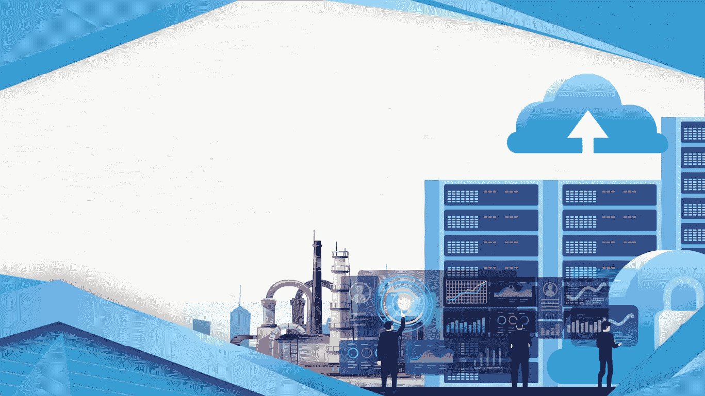

# 借助行业云重塑数字化转型

> 原文：<https://medium.com/codex/reimagining-digital-transformation-with-industry-clouds-baa9618faf37?source=collection_archive---------11----------------------->

如果不是因为商业竞争日益激烈，企业可能会抵制数字化转型。我们几乎觉得必须想出新的想法来提高我们的投资回报率，因为我们必须跟上竞争。因此，无论我们走到哪里，我们都在寻求创新。

追求数字化转型是当今企业面临的最大挑战之一。数字化转型很复杂，但这并不意味着不可能。利用行业云将帮助企业进行战略转型，并在竞争中保持领先地位。

# 了解行业云的采用

根据谷歌的说法，数字化转型涉及商业实践、文化和客户体验的创造或修改，以适应不断变化的商业和市场动态。这包括使用所有形式的公共、私有和混合云平台。数字化转型从根本上改变了一个公司的运营，也最大限度地利用了内部资源，为客户提供了价值。

云技术为变得更加灵活、协作和以客户为中心奠定了基础。各种规模的公司现在都可以利用行业云进行创新和逐步现代化，从而实现更加敏捷和可持续的现代化。支持云的业务解决方案还可以帮助企业标准化其竞争对手的关键现代化功能。通过这种比较，他们可以专注于使其业务在竞争中脱颖而出的能力。此外，公司可以专注于小规模的数字现代化，而不是冒险和昂贵地替换当前的遗留系统。

在公司中采用行业云的另一个关键因素是，成功采用云的公司更快地扩大规模，更容易创新，更快地将新功能推向市场，同时降低技术风险。行业云使保持竞争力成为可能，而不必从零开始进行数字革命。它在每个行业中不断涌现和发展。如今，企业在支持最新数字功能的同时，也开始采用更加灵活的工作方式。

# 采用行业云加速数字化转型的步骤

当您的企业使用行业云加速数字化转型时，请考虑以下因素。

## 1.决定您的数字战略，并确定您的差异化点

为了更成功地交付核心系统，请认识到您的数字战略中的优势，并在您的公司缺乏优势的地方采用行业云。为了增加价值，层特殊点的差异。在这样做的时候，考虑当前的业务流程是如何运作的，以及它们会如何因数字化而改变。在行业层面，寻找专业化的解决方案。

## 2.了解业务愿景和不断变化的环境

应该感知市场、技术、文化风险和机会，以关注哪些仍在分化，哪些已经商品化。如果你的行业转型战略让你接触到不同的公司或行业，要认识到风险。让网络领袖参与进来，创建早期战略，以降低风险，并实现促进信任的客户互动。

## 3.采用工程观点并利用合作模式

业务和 IT 领导应该通过组建敏捷的、有创造力的、以产品为中心的垂直工程 pod 团队来培养工程文化。即使有必要在组织之外寻找新的商业模式，也要考虑开发适应性解决方案的最佳策略。为内部和外部业务和技术操作建立共同的目标和基准。

总之，随着数字技术在可从任何地方访问的虚拟环境中全面重建流程、工具和体验，行业云为数字转型提供了额外的维度。

点击了解更多有关行业云如何推动数字化转型的信息[！](https://diginovation.multimatics.co.id/reimagining-digital-transformation-with-industry-clouds.aspx)