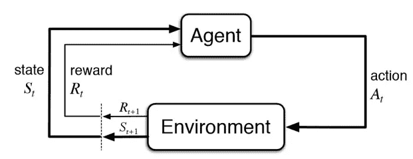

# 土拨鼠日强化学习

> 原文：<https://medium.com/codex/reinforcement-learning-by-groundhog-day-b82e897391fe?source=collection_archive---------0----------------------->

)**土拨鼠日是 1993 年制作的最受欢迎的喜剧电影之一。这部电影是关于一个天气预报员，菲尔·康纳斯(比利·穆雷)，被困在时间循环中，一次又一次地生活在同一天。这部电影不仅有趣，还带给我们对生活和幸福的真正意义的深刻见解。更重要的是，从一个*数据科学*的角度来看，这部电影提供了一个*强化学习* ( **RL** )模拟的完美设定。本文旨在通过将 RL 中的类似概念与这部电影联系起来，向没有任何数据科学背景的人解释 RL 是什么。这篇文章将只关注高层次的概念，而不是数学细节。看完这篇文章，你应该对 RL 有一个大致的印象，并可能在 RL 的指导概念下，对你的生活或他人产生一些哲学思考。**

## ****强化学习****

**现在普遍认为*强化学习*是除了*监督学习*和*非监督学习之外的机器学习的三个基本类别之一。****数据类型*** 和 ***训练目标*** 是描述这三种方法区别的两个最重要的因素。讨论不同机器学习策略的更多细节超出了本文的范围，相反，我们将只关注强化学习概念的介绍。**

**强化学习(在深度学习的帮助下)最近通过几个前沿项目(即 Alpha-GO、自动驾驶)获得了巨大的媒体关注。RL 的基本思想是通过**代理**与其周围**环境**的相互作用来优化**动作**，从而使累计**回报**最大化。下图将 RL 的关键概念描述为一个迭代过程。代理与其环境相互作用，并且在每个时间点它收集信息来更新**状态**和**动作**，以便实现最佳**奖励。**RL 模型训练过程通过对代理与模拟环境的交互进行编程来自动化该迭代过程，并且模型训练的输出在交互的任何时间点的任何状态下得出最佳动作决策。**

****

**RL 研究的最大挑战之一是仿真环境的开发，其中大多数都与[游戏](https://gym.openai.com/)有关。下面的视频展示了 Google 在 Atari the game 中进行 RL 训练的一个例子。在最开始的时候，底部的弹跳杆(代理)对环境的了解非常有限，在最初的几场比赛中错过了球。但经过 120 分钟的训练后，这个模型足够聪明，可以预测所有的着陆位置，并像一个真正优秀的人类玩家一样玩游戏。最令人印象深刻的是，在 240 分钟的训练后，这位代理人学会了在窗口的上部挖隧道，并通过反复弹跳球以更高的效率得分。**

## **土拨鼠日的 RL 模拟**

**游戏中的大多数模拟环境远没有我们现实生活中的复杂。想象一下，有一天我们可以呈现一个和我们真实生活环境一样复杂的模拟环境，以及一个类似人类的智能体。通过将这个人类代理与模拟环境进行交互来进行 ML 模型训练，可能会在现实生活中的任何时候为我们提供最佳决策。在现实中，我们不会在可预见的时间内看到这种情况发生，但在电影中，我们有一个很好的机会。*土拨鼠日*在模拟现实环境中提供了一个 RL 的完美例子。**

**气象员菲尔·康纳斯(Phil Connors)在这次 ML 模型训练中担任**代理人**，而*土拨鼠日*事件发生的宾夕法尼亚州小镇彭索塔尼(Punxsutawney)自然就是代理人在模型训练中互动的**环境**。训练的每一集都由那天的结束或者菲尔的死亡来定义。**

**如前所述，RL 模型通过调整训练中的参数来改进，以最大化累积奖励。首先，我们需要确定奖励是什么。在像 Atari 这样的游戏环境中识别奖励是很简单的，即在游戏中最大化累积分数。然而，给一个人的奖励下定义并不那么简单。请记住，奖励的定义至关重要，它会直接影响您的模特培训的总体目标。**

**菲尔在时间循环开始时感到害怕、沮丧和困惑，并有意将奖励定义为“尽快终止剧集”。结果，他在模型训练的多次迭代中竭尽全力自杀，直到他发现无论他在每一集中终止得多快，时间循环都不会消失。**

**接下来，菲尔将奖励重新定义为大多数人都希望拥有的正常奖励，即最大限度地实现人类的三个基本欲望，即生活供应商(金钱)、性(爱情)和名誉。他试图探索小镇(环境)的每个细节，并在每个训练集中不断调整他的行动，以实现他的有益目标。在训练过程的无数次迭代之后，Phil 实现了一个优化的模型，该模型每次都以最佳回报来指导他。最终，菲尔成了镇上最受欢迎的人，他的梦中情人也爱上了他。**

## **勘探和开发**

**作为人类，我们经常面临决策时刻。如果我们有一个优化的 RL 模型，可以告诉我们应该从事什么工作或者你的孩子应该去什么学校，那将是理想的，最终我们的决定将最大化个人在这个社会中成功和幸福的可能性。实现像土拨鼠日那样的模式当然不是一个现实的目标，因为我们每个人只有一次生命。但好消息是，我们实际上有一个 RL 模型，除了这个模型是完全由我们与周围真实世界的互动建立和训练的。我们的模型训练和*土拨鼠日*的最大区别如下。**

1.  ***土拨鼠日*模式的环境是孤立的、恒定的(感谢暴风雪阻断了所有进出的交通)，每一个行动都会相应地产生可复制的奖励结果。另一方面，我们的现实生活环境是动态变化的，这极大地影响了模型训练假设。**
2.  **电影中的时间循环违背了我们最基本的物理学理论，即时间总是朝着一个方向。因此，我们永远无法探索不同的行为同时产生的不同回报结果。**
3.  **土拨鼠日模型很大程度上假设代理人自己的身体状态不变(假设一个人在一天内不会发生大的变化)，而在现实生活中，我们自己的状态会随着时间的推移而变化。换句话说，随着时间的推移，我们会变得越来越老。**

**尽管我们在现实生活模型训练中讨论了所有的挑战，但我们确实比电影场景有一个优势，那就是更多的代理。即使我们没有办法回到过去找出不同行动的输出差异，我们可能会找到具有相似环境的相似代理，通过他们不同的行动来评估输出。这就是为什么我们仍然愿意相信，我们正在使用的模型与我们最近的个人经验或通过观察其他人的生活历史是近似优化的，以提供我们最好的决策。有些情况下，行动从未出现在我们之前的生活经历中(例如，成为第一个登陆火星的人)，这需要探索新的行动决策来评估回报。在 RL 模型训练中，我们有一个类似的概念叫做**探索**和**开发**的平衡。这个理论的关键概念是在利用以前的经验和探索新机会的基础上，找到你的决策的最佳组合。所以不要害怕尝试新事物，毕竟生活是一次旅行！**

**如果你学到了什么，请给这篇文章打 50 分。谢谢大家！**