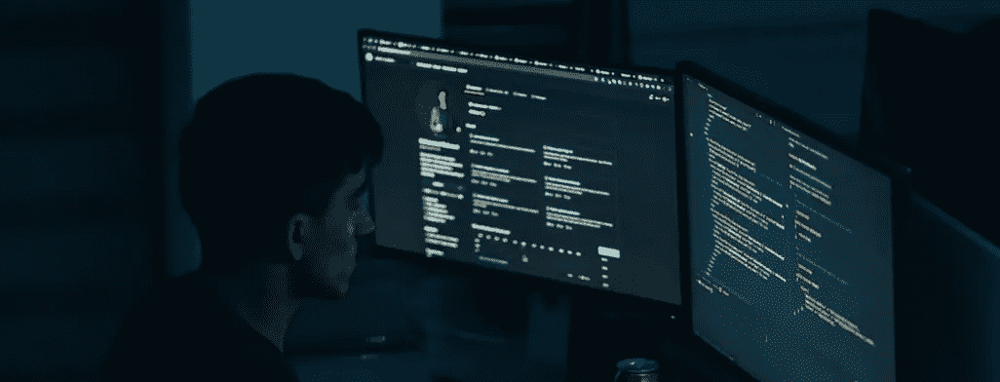
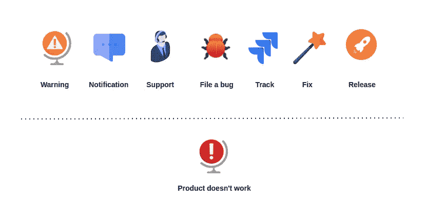

# 软件工程中的可靠性

> 原文：<https://medium.com/codex/reliability-in-software-engineering-b1c8286eefb7?source=collection_archive---------7----------------------->

## 软件工程

## 为不可靠的场景构建软件和过程

尽管软件行业已经见证了许多创新、成就、复杂的系统和经验丰富的老手，但与其他领域和实践相比，它仍然是如此年轻。

在某些情况下，构建软件本身可能是微不足道的，但是为了交付真正的一流质量，我们首先必须对其进行工程设计，这不仅仅是关于服务，还包括背后的团队和人为因素。

没有这一点，我们能否建立质量体系就成问题了。

# **软件可靠性**

可靠性是描述高质量软件的特征之一，它概括了好软件和坏软件之间的区别。

图片来源——【afgprogrammer@unsplash.com 

可靠的软件是一个容忍故障甚至无故障的系统。

它是一个组件在给定环境中给定时间内无问题运行的概率。

当我想到可靠的系统时，有一句话仍然适用:

> 可靠性是扳动开关，知道灯会亮。

可靠性不是另一个衡量标准，但它本身就是客户体验系统的方式。

没什么*静态*特色。它是动态的，因为系统可以承受各种情况下的故障，包括预期的和意外的。

> 弹性是方法，可靠性是结果。

没有弹性的系统是不可靠的，反之亦然。

根据你居住的地方，你可能会经常听到这两个词互换使用。尽管如此，它还是有一些不同之处。

一个软件系统的弹性实际上是通过它能承受多少威胁来衡量的，以及它能多快恢复。

给软件系统贴上可靠的标签要求我们确保组件的操作和设计都到位。

不管行业、公司规模、优先级和客户如何，每个人都希望他们的软件组件和平台能一直工作。

# 可靠性设计

设计和构建可靠的软件是每个相关人员的责任，无论是 UI/UX 设计师、产品经理、工程师、架构师，还是底层基础设施和硬件提供商。

为了使软件可靠，它必须首先被设计成:

*   最大限度减少故障
*   最小化故障的影响
*   确保正常运行时间

在预测和不可预测的情况下，组件都必须保持功能。

> 可靠的系统是为了值得信任而构建的。

在服务、组件或产品的设计阶段，我们已经开始努力提高可靠性。

设计缺陷经常会导致混乱和不必要的复杂性，并为脆弱的解决方案提供良好的基础。

在概念阶段，您可以利用两种可靠性模型:

*   软件可靠性目标设置
*   软件可靠性计划

将可靠性作为一个目标，在设计、构思和开发过程中回顾和分析决策，甚至在你开始运输产品之前，结果就会大大改善。

利用可靠性设计中使用的其他技术，例如:

*   团队设计评审
*   软件故障模式和影响分析
*   软件故障树分析
*   软件容错分析

"*可靠性设计*"本身就是一个模型，通常是*卓越设计*的一部分。

# 常见威胁

我们挥手承认共同的威胁，以便改进系统，并将其设计为具有适应性和准备减轻问题。

每个系统面临的一组常见威胁如下:

*   安全威胁
*   潜伏
*   严重依赖其他服务
*   军种间通信
*   发现
*   无反应性
*   未处理的问题和边缘情况
*   环境变化
*   硬件故障
*   表现和行为不一致

这是一个非常粗略的列表，可以达到一个相当的程度。

可靠性通常与软件系统中的一切对错有关。所有可能导致它失败的因素本质上都是威胁，从安全性、糟糕的设计和有限的硬件资源，到不正确和不可预测的问题。

根据经验，失败是由以下原因造成的:

*   被忽视的威胁分析
*   技术错误
*   过度工程和过度设计
*   基础设施错误
*   缺乏测试
*   低*适应发展变化的能力*

伟大的软件易于维护、简单、有效和健壮是有原因的。但它必须这样设计和建造。

缺乏从故障中恢复的能力也是一个主要因素，并且经常影响系统的可靠性。

# 克服障碍

成千上万次，我们所有人都遇到软件就是不工作。

它不会崩溃，不会抛出一个标志，通知你有一个错误——但是由于某种原因，它没有做它应该做的事情。这意味着不公平，糟糕的设计，以及对其行为的零预期，并大叫“*我不擅长我应该做的事情*”。

作者配图

可靠性也被设计到产品和流程中。

视角就是一切。首先，从用户的角度来看你的软件。使用它，尝试它——满足消费者的需求。

从技术的角度改进你的产品，但是接着在你的流程上工作，看看还有什么可以改进的。

始终分析您的软件、功能、威胁、错误、事件和问题。

从技术上讲，为了改进我们的软件，需要整合以下所有实践和概念:

*   记录
*   审计
*   基础设施指标
*   硬件资源指标
*   自定义用户指标
*   实时警报
*   分析学
*   死后分析
*   事故报告
*   事故管理

可靠的软件不是一天就能构建和验证的。可靠性是必须实现的，你设计、建造和改进系统的方式都是它的一部分。

## 故障模式和影响分析

有许多框架和模型可以帮助您克服问题、分析和改进您的解决方案。

其中之一是故障模式和影响分析。FMEA 是一个系统的、主动的框架，用于识别可能的故障及其影响。

这是一个检查组成系统的组件和部件的过程，让您识别故障原因和影响。

FMEA 是可靠性工程的核心任务。

许多公司和社区并没有这样的模型，但是却努力追求高质量、稳定性和可靠性。

它只是让你认识到:

*   什么会出错
*   为什么会出现故障
*   失败的影响和后果是什么

## 事件指标

故障、中断和错误——所有原因都会导致停机，并影响系统的可靠性。

必须跟踪与事件相关的指标。事故管理、检测、诊断、解决和预防都是工程部门的关键绩效指标。

就关键绩效指标而言，以下是其中几个:

*   给定时间段内创建的警报数量
*   给定时间段内发生的事件数量
*   平均故障间隔时间
*   平均确认时间
*   检测平均时间
*   平均解决时间

只有当你把这些都准备好了，你才能真正了解哪些部分可以改进，无论是每个团队、产品、服务，还是整个工程部门。

## 待命轮换

无论您有专门的支持团队，还是您的开发人员正在支持内部组件，您都需要随叫随到的轮换。

事实证明，这有益于您的软件质量和可靠性。

在随叫随到期间，对处理事件所花费的时间进行衡量也是一种非常有用的方法，可以获得更多的洞察力。

尽管如此，世界上所有的 KPI、度量和指标都不能取代*上下文*。事件是独特的，统计数据有时是陷阱。对事件进行上下文感知分析是必须的，通常只需要一点常识。

## 发信号

有指标来分析您的组件是很好的，甚至在客户注意到问题之前就有实时警报是令人惊讶的。

> 可靠性不仅存在于软件中，也存在于团队中。

为了向消费者提供可靠性，需要对问题进行警告和响应。缓解是关键—在问题爆发之前检测到它，您的客户甚至会注意到它，让您描绘出一幅完全不同的画面，并使您能够防止事故发生。

提醒是必须的。根据经验，您会惊讶于警报带来的好处。尝试一下，看看哪些渠道最适合您:

*   实时状态页面
*   电子邮件
*   短信
*   懈怠，团队，或者你使用的任何东西

许多成功的公司都具备这些条件。警报值得与监控一起成为公司范围内的举措。

## 六西格玛

为六个适马或 DFSS 设计是软件工程中的一种系统方法和模型，其目标是实现可靠性。这是一个产生高质量和改进质量的过程。

六个适马将使你拥有:

*   统计质量控制
*   系统方法
*   基于事实和数据的方法
*   基于项目和目标的焦点
*   客户导向

所有这些都是可靠软件的先决条件。这又允许你结合一个 DMAIC 循环，即设计-测量-分析-改进-控制。

软件可靠性有许多概念、因素和方面，但希望上面总结了它的一个好的部分。这个故事的目标是阐明一些已经确立的概念，同时也阐明一些鲜为人知的概念。软件可靠性只是工程学的一部分，但本质上，它是一门独立的科学。

无论你是工程师、建筑师、经理还是设计师，我希望你喜欢并发现这个故事很有趣。关注并订阅我的时事通讯，继续关注更多像这样的故事。

感谢您的阅读！🎉