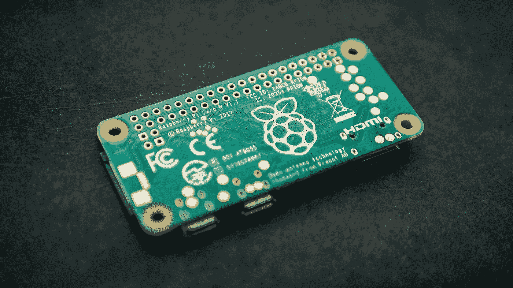

# 树莓 Pi 集群上的可靠 Kubernetes:简介

> 原文：<https://medium.com/codex/reliable-kubernetes-on-a-raspberry-pi-cluster-introduction-cbdca4e759fb?source=collection_archive---------4----------------------->

## [法典](http://medium.com/codex)

照片由[哈里森·布罗德本特](https://unsplash.com/@harrisonbroadbent?utm_source=medium&utm_medium=referral)在 [Unsplash](https://unsplash.com?utm_source=medium&utm_medium=referral) 上拍摄

我喜欢把自己想象成一个修补匠。我愿意成为我自己的系统管理员，非常乐意学习并花时间真正理解事物是如何协同工作的。我已经在一个小型 RPi 集群上运行了几年了，并且这个设置一直在不断发展。现在，我终于找到了一个位置，一切似乎都在自我管理，有一定程度的自我修复。今天我要和大家分享核心组件。

我将写一系列的文章来描述如何设置每个组件，以及如何最大限度地利用它。我还会分享我的设置的所有相关部分，这样你就可以按照你的意愿自己镜像它。

第 1 部分:简介
[第 2 部分:基础](https://scott-jones4k.medium.com/reliable-kubernetes-on-a-raspberry-pi-cluster-the-foundations-d9c792c27b75)
[第 3 部分:存储](https://scott-jones4k.medium.com/reliable-kubernetes-on-a-raspberry-pi-cluster-storage-ff2848d331df)
[第 4 部分:监控](https://scott-jones4k.medium.com/reliable-kubernetes-on-a-raspberry-pi-cluster-monitoring-a771b497d4d3)
[第 5 部分:安全](https://scott-jones4k.medium.com/reliable-kubernetes-on-a-raspberry-pi-cluster-security-ef62cca74d78)

# 库伯内特斯(k3s)

我整个集群的支柱是牧场主的 [k3s。这是一个轻量级发行版，在较低规格的硬件上运行得相对较好，比如 RPi。直到最近，我有一个仅运行 RPi 3B 的 2 节点集群，它(通常)处理得很好。我开始推动我在这些设备上运行的极限，所以我现在有了一个新的 RPi 4 8GB，现在我有了几天的计算能力！](https://rancher.com/docs/k3s/latest/en/)

# 特拉菲克

我的集群入口控制器是 [Traefik](https://traefik.io/traefik/) 。我喜欢它的一点是，它可以从反向代理和入口控制器中完成您需要的一切。在 Kubernetes 之前，我用它来代理一堆 docker 容器。它使用 LetsEncypt 处理我的所有 SSL，使用 Cloudflare 集成 DNS 挑战，这意味着我可以获得安全的 SSL 证书，而无需将我的服务暴露在互联网上。它有一个令人惊叹的用户界面，向我准确地显示了设置的内容及其状态。它还得到了强大的中间件支持，允许我添加一个默认的头集来提高安全性，还可以在我的任何运行系统中添加 oAuth 之类的东西。它的配置非常简单！

# 金属 LB

[MetalLB](https://metallb.universe.tf/) 是我的集群中相对较新的成员。我用它来创建面向外部的负载平衡器服务，作为我的集群的入口点。它使用 ARP 协议开箱即用，基本上意味着无论哪个节点被指定为服务的活动入口点，都会将其 mac 广告为可以服务 IP 的节点。如果该节点出现故障，下一个节点会继续 ARP 发布，并且可以无缝工作。这意味着无论我的服务在哪里运行，我的 DNS 和 http(s)流量都可以有一个静态 IP。

# 节点导出器

我需要能够跟踪的一件事是我的集群中每个节点的运行情况。为了使这些统计数据在集群中可用，我让[节点导出器](https://github.com/prometheus/node_exporter)在每个 RPi 上运行(在 Kubernetes 之外)。这为 Prometheus 提供了一个端点，让我可以实时访问系统指标以进行健康监控

# 普罗米修斯-格拉法纳公司

最后组成我核心集群的物品是[普罗米修斯](https://prometheus.io/)和[格拉夫纳](https://grafana.com/)。我收集了整个集群的大量统计数据——节点健康状况、针孔统计数据、我的家庭助理状态。这种设置使我能够非常容易地将这些可视化，并在必要时进行深入研究，以诊断集群中的潜在故障。您还可以通过这些设置一系列警报，但我还没有利用这一点。