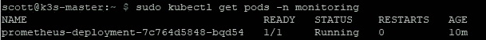
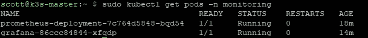
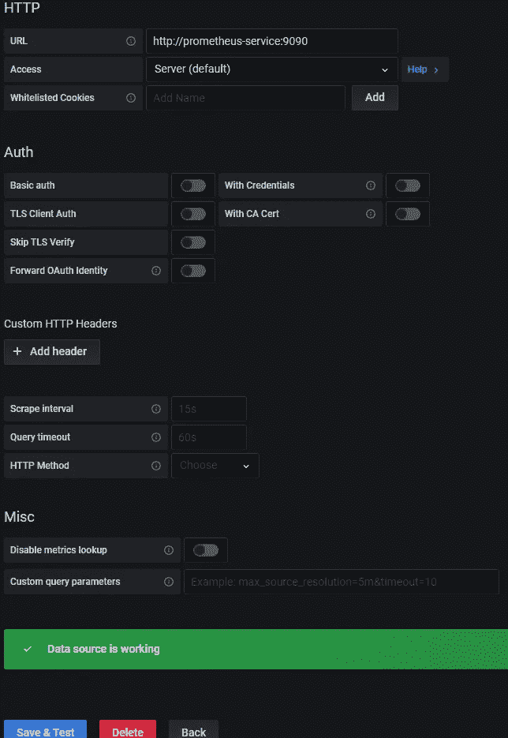
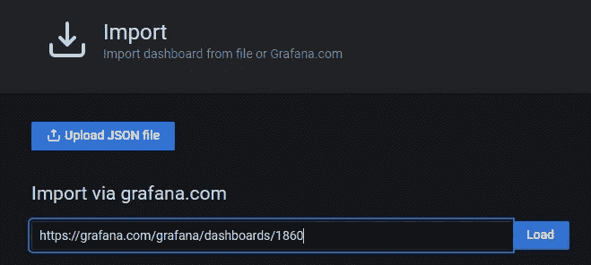
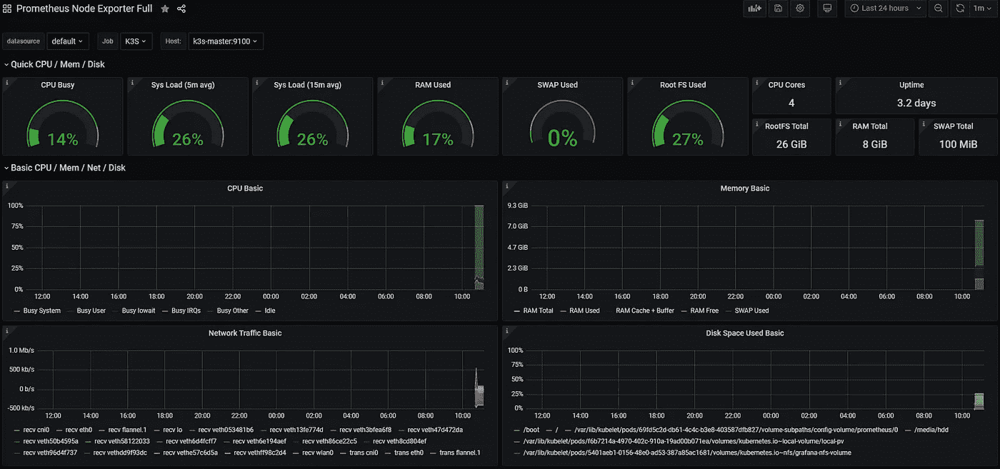

# 树莓 Pi 集群上的可靠 Kubernetes:监控

> 原文：<https://medium.com/codex/reliable-kubernetes-on-a-raspberry-pi-cluster-monitoring-a771b497d4d3?source=collection_archive---------0----------------------->

## [法典](http://medium.com/codex)


照片由 [Ibrahim Boran](https://unsplash.com/@ibrahimboran?utm_source=medium&utm_medium=referral) 在 [Unsplash](https://unsplash.com?utm_source=medium&utm_medium=referral) 拍摄

通过本系列的前几篇文章，您已经创建了一个在 RPis 上运行的 3 节点 k3s 集群。但是你怎么知道它有效呢？怎么知道一个节点在挣扎？或者更糟，下跌？监控对于我的集群的健康至关重要，它指出了需要改进的痛点。今天，我将介绍一下我是如何做到的，这样您就可以跟随您自己的团队了

[第 1 部分:简介](https://scott-jones4k.medium.com/reliable-kubernetes-on-a-raspberry-pi-cluster-introduction-cbdca4e759fb)
[第 2 部分:基础](https://scott-jones4k.medium.com/reliable-kubernetes-on-a-raspberry-pi-cluster-the-foundations-d9c792c27b75)
[第 3 部分:存储](https://scott-jones4k.medium.com/reliable-kubernetes-on-a-raspberry-pi-cluster-storage-ff2848d331df)
第 4 部分:监控
[第 5 部分:安全](https://scott-jones4k.medium.com/reliable-kubernetes-on-a-raspberry-pi-cluster-security-ef62cca74d78)

# 节点导出器

难题的第一个关键部分是能够导出关于每个节点的关键健康信息的方法。Node-Exporter 是一个出色的实用程序，你可以作为服务安装并保持运行，它能够以 Prometheus 能够接收的格式导出。您希望对集群中的每个节点都这样做。

首先，你需要下载并解压它。

```
$ curl -SL [https://github.com/prometheus/node_exporter/releases/download/v1.0.1/node_exporter-1.0.1.linux-armv7.tar.gz](https://github.com/prometheus/node_exporter/releases/download/v1.0.1/node_exporter-1.0.1.linux-armv7.tar.gz) > node_exporter.tar.gz && sudo tar -xvf node_exporter.tar.gz -C /usr/local/bin/ --strip-components=1
```

一旦我们有了它，我们需要将它设置为 systemd 服务，以确保它在重新启动后重新启动。创建文件`/etc/systemd/system/nodeexporter.service`:

```
**[Unit]** Description=NodeExporter**[Service]** TimeoutStartSec=0
ExecStart=/usr/local/bin/node_exporter**[Install]** WantedBy=multi-user.target
```

然后你需要注册它:

```
$ sudo systemctl daemon-reload \
&& sudo systemctl enable nodeexporter \
&& sudo systemctl start nodeexporter
```

# 普罗米修斯

我们现在需要配置和部署[普罗米修斯](https://prometheus.io/)到我们的集群。谢天谢地，这就像一个文件一样简单。创建 prometheus.yaml，如下所示:

```
apiVersion: v1
kind: Namespace
metadata:
  name: monitoring
  labels:
    app: prometheus
---
apiVersion: v1
kind: ConfigMap
metadata:
  name: prometheus-config
  namespace: monitoring
data:
  prometheus.yaml: |
    global:
      scrape_interval:     15s
      external_labels:
        monitor: 'k3s-monitor'
    scrape_configs:
      - job_name: 'prometheus'
        scrape_interval: 5s
        static_configs:
          - targets: ['localhost:9090']
      - job_name: 'K3S'
        static_configs:
          - targets: ['k3s-master:9100', 'k3s-node1:9100', 'k3s-node2:9100']
---
apiVersion: apps/v1
kind: Deployment
metadata:
  name: prometheus-deployment
  namespace: monitoring
  labels:
    app: prometheus
spec:
  replicas: 1
  selector:
    matchLabels:
      app: prometheus
  template:
    metadata:
      labels:
        app: prometheus
    spec:
      containers:
      - name: prometheus
        image: prom/prometheus
        volumeMounts:
          - name: config-volume
            mountPath: /etc/prometheus/prometheus.yml
            subPath: prometheus.yaml
        ports:
        - containerPort: 9090
      volumes:
        - name: config-volume
          configMap:
           name: prometheus-config
---
kind: Service
apiVersion: v1
metadata:
  namespace: monitoring
  name: prometheus-service
spec:
  selector:
    app: prometheus
  ports:
  - name: promui
    protocol: TCP
    port: 9090
    targetPort: 9090
```

以通常的方式应用它

```
$ sudo kubectl apply -f prometheus.yaml
```

这将为 Prometheus 设置我们的 scrape 配置，并将其部署到监控名称空间中的集群中。我们为集群中的其他 pod 创建了一个服务，以便能够访问它，但是我们没有给它一个负载平衡器或入口路由，因为我们明确地 ***不想*** 将它暴露在我们的集群之外。使用以下命令检查它是否启动并运行

```
$ sudo kubectl get pods -n monitoring
```

如果一切都成功了，您将得到如下所示的输出



成功运行普罗米修斯

现在我们有了整理所有数据的工具，我们需要能够显示它的工具。

# 格拉夫纳

[Grafana](https://grafana.com/) 是能够可视化我们集群中所有这些数据的完美工具。它支持 Prometheus，并且许多社区为您将要进行的许多标准监控创建了仪表板。

首先，我们需要创建清单文件 grafana.yaml

```
apiVersion: v1
kind: PersistentVolume
metadata:
  name: grafana-nfs-volume
  namespace: monitoring
  labels:
    directory: grafana
spec:
  capacity:
    storage: 1Gi
  volumeMode: Filesystem
  accessModes:
    - ReadWriteOnce
  persistentVolumeReclaimPolicy: Retain
  storageClassName: slow
  nfs:
    path: <<NFS-SERVER-PATH>>
    server: <<NFS-SERVER-CLUSTER-IP>>
---
apiVersion: v1
kind: PersistentVolumeClaim
metadata:
  name: grafana-nfs-claim
  namespace: monitoring
spec:
  storageClassName: slow
  accessModes:
  - ReadWriteOnce
  resources:
    requests:
      storage: 1Gi
  selector:
    matchLabels:
      directory: grafana
---
apiVersion: apps/v1
kind: Deployment
metadata:
  name: grafana
  namespace: monitoring
  labels:
    app: grafana
spec:
  replicas: 1
  selector:
    matchLabels:
      app: grafana
  template:
    metadata:
      labels:
        app: grafana
        name: grafana
    spec:
      securityContext:
        runAsUser: 1001
        runAsGroup: 1001
      containers:
      - name: grafana
        image: grafana/grafana
        imagePullPolicy: Always
        volumeMounts:
        - name: grafana-nfs-volume
          mountPath: "/var/lib/grafana"
      volumes:
      - name: grafana-nfs-volume
        persistentVolumeClaim:
          claimName: grafana-nfs-claim
---
apiVersion: v1
kind: Service
metadata:
  name: grafana-service
  namespace: monitoring
spec:
  selector:
    app: grafana
  ports:
  - port: 3000
    name: grafana
    protocol: TCP
    targetPort: 3000
---
apiVersion: traefik.containo.us/v1alpha1
kind: IngressRoute
metadata:
  name: grafana-route
  namespace: monitoring
spec:
  entryPoints:
    - websecure
  routes:
  - match: Host(`grafana.internal`)
    kind: Rule
    services:
    - name: grafana-service
      port: 3000
  tls:
    certResolver: cloudflare
```

您需要在上面的 yaml 中更新一些东西——它有持久的存储需求，因此需要更新以指向我们之前设置的 nfs 服务器的集群 ip。一旦你做到了这一点，应用它作为正常:

```
$ sudo kubectl apply -f grafana.yaml
```

当它成功启动时，列出 pod 将返回另一个正在运行的 pod

```
$ sudo kubectl get pods -n monitoring
```



获取 2 个正在运行的 pod 的输出

您现在应该能够转到 [https://grafana.internal](https://grafana.internal) 并看到一个正在运行的 grafana 实例


Grafana 登录页面

默认用户名和密码是 admin 和 admin。这需要改变，但是很明显，需要做一些事情来确保这一点——新用户、oAuth 等等。保护这个实例超出了本文的范围。

这里您要做的第一件事是创建一个新的数据源。在第一个仪表板上有一个按钮可以做到这一点。您想要一个 Prometheus 数据源，您唯一需要输入的是 URL — `http://prometheus-service:9090`。点击 Save & Test，您应该会看到一条成功消息



成功添加数据源

一旦我们有了数据源，我们需要一个仪表板来显示它。转到仪表板导入页面([https://grafana . internal/dashboard/import](https://grafana.internal/dashboard/import))。我们将使用 Prometheus Node Exporter Full dashboard([https://grafana.com/grafana/dashboards/1860](https://grafana.com/grafana/dashboards/1860))，所以请将它放在 dashboard import 框中，然后点击 load



导入我们的仪表板

选择您的 Prometheus 数据源并导入，这样我们就有了一个仪表板，我们可以用它来监视集群的状态。请务必将其标记为收藏，以便以后更容易找到。



工作仪表板

我们现在有了一种查看集群运行状况的方法，如果集群中出现任何问题，我们就可以开始诊断。这不是一个完整的画面，因为我们还没有特定于应用程序的指标，但是节点健康对于成为您自己的系统管理员来说是一个重要的进步！下一次，我们将了解安全性，并确保可以配置和锁定对您的集群上运行的东西的访问。