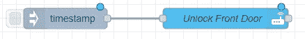

# Raspberry Pi 集群上的可靠 Kubernetes:安全性

> 原文：<https://medium.com/codex/reliable-kubernetes-on-a-raspberry-pi-cluster-security-ef62cca74d78?source=collection_archive---------2----------------------->

## [法典](http://medium.com/codex)


由[米奥斯兹·克兰诺夫斯基](https://unsplash.com/@speedoshots?utm_source=medium&utm_medium=referral)在 [Unsplash](https://unsplash.com?utm_source=medium&utm_medium=referral) 上拍摄的照片

有了一个完全正常工作的 k3s 集群，以及对其内容的仪表盘的访问，我们需要考虑锁定访问，特别是当我们想要将其他(潜在不安全的)应用部署到我们的集群时。

[第 1 部分:简介](https://scott-jones4k.medium.com/reliable-kubernetes-on-a-raspberry-pi-cluster-introduction-cbdca4e759fb)
[第 2 部分:基础](https://scott-jones4k.medium.com/reliable-kubernetes-on-a-raspberry-pi-cluster-the-foundations-d9c792c27b75)
[第 3 部分:存储](https://scott-jones4k.medium.com/reliable-kubernetes-on-a-raspberry-pi-cluster-storage-ff2848d331df)
[第 4 部分:监控](/codex/reliable-kubernetes-on-a-raspberry-pi-cluster-monitoring-a771b497d4d3)
第 5 部分:安全

# 问题是

任何人都可以通过该 URL 轻松访问我们最新部署的所有内容。如果只是在您的本地网络上，这还不算太坏(让我们暂时忽略人们可以访问您的本地网络的事实)，但是一旦您将它暴露在互联网上，您就将自己暴露在一个全新的蠕虫罐中。假设你像我一样运行一个系统，比如 Node-Red。默认情况下，它不提供身份验证。让我们假设你把它和你的家庭助理 T21 联系起来。这是安全的，对不对？它强迫你输入用户名和密码来访问它，或者像 Node-Red 这样的长期 API 令牌来访问它。等一下，这个怎么样？



红色节点中的可能流量

一个匿名用户可以建立一个连接到我的预配置的家庭助理服务(恰好支持实体上的自动完成)的流程，并在看到我有什么实体时，为自己创建一个一键点击的方式来打开我的前门。通过更多的工作，你还可以找到我住在哪里，以及房子什么时候是空的。我相信你能明白为什么这个需要被锁定！

# (一揽子)解决方案

保护这一点的一个非常简单的方法是将所有东西都放在某个 oAuth 系统后面。因为我已经把所有东西都绑定到我的谷歌账户上了，所以谷歌 OAuth 是解决这个问题的完美方案。这样，只有我(和我的家人)将能够访问这些系统，这意味着我不再公开我家的钥匙。暴露仪表板指标的风险要小得多，但是让我们回到我们在[第 2 部分](https://scott-jones4k.medium.com/reliable-kubernetes-on-a-raspberry-pi-cluster-the-foundations-d9c792c27b75)中暴露的 Traefik 仪表板。回头看看 traefik-dashboard.yaml，我们有这样一个:

```
apiVersion: traefik.containo.us/v1alpha1
kind: IngressRoute
metadata:
  name: dashboardsecure
  namespace: traefik
spec:
  entryPoints:
    - websecure
  routes:
    - match: Host(`traefik.yourdomainhere.com`)
      kind: Rule
      services:
        - name: api@internal
          kind: TraefikService
  tls:
    certResolver: cloudflare
```

# 警告

使用 Google 的 OAuth 系统，它要求我们为 SSO 提供商使用有效的顶级域。这是一个很好的实践，因为你可以控制 DNS 记录，而不必到处编辑主机文件。这也是为我们的系统获得有效的 LetsEncrypt 证书的先决条件。本文的其余部分假设您已经完成了这个设置。

# SSO 提供者

首先，我们需要为集群部署一个 SSO 提供者来处理身份验证。我们将把它放在 traefik-forward-auth.yaml 中

```
apiVersion: apps/v1
kind: Deployment
metadata:
  name: traefik-sso
  namespace: traefik
  labels:
    app: traefik-sso
spec:
  selector:
    matchLabels:
      app: traefik-sso
  template:
    metadata:
      labels:
        name: traefik-sso
        app: traefik-sso
    spec:
      containers:
      - name: traefik-sso
        image: thomseddon/traefik-forward-auth:2-arm
        imagePullPolicy: Always
        env:
        - name: PROVIDERS_GOOGLE_CLIENT_ID
          valueFrom:
            secretKeyRef:
              name: traefik-sso
              key: clientid
        - name: PROVIDERS_GOOGLE_CLIENT_SECRET
          valueFrom:
            secretKeyRef:
              name: traefik-sso
              key: clientsecret
        - name: SECRET
          valueFrom:
            secretKeyRef:
              name: traefik-sso
              key: secret
        - name: COOKIE_DOMAIN
          value: yourdomainhere.com
        - name: AUTH_HOST
          value: oauth.yourdomainhere.com
        - name: INSECURE_COOKIE
          value: "false"
        - name: WHITELIST
          value: <<[y](mailto:scott.jones4k@gmail.com)our.email@here.com>>
        - name: LOG_LEVEL
          value: debug
        ports:
        - containerPort: 4181
---
kind: Service
apiVersion: v1
metadata:
  name: traefik-sso
  namespace: traefik
spec:
  selector:
    app: traefik-sso
  ports:
  - protocol: TCP
    port: 4181
    targetPort: 4181
---
apiVersion: traefik.containo.us/v1alpha1
kind: Middleware
metadata:
  name: sso
  namespace: traefik
spec:
  forwardAuth:
    address: [http://traefik-sso.traefik.svc.cluster.local:4181](http://traefik-sso.traefik.svc.cluster.local:4181)
    authResponseHeaders: 
        - "X-Forwarded-User"
    trustForwardHeader: true
---
apiVersion: traefik.containo.us/v1alpha1
kind: IngressRoute
metadata:
  name: traefik-sso
  namespace: traefik
spec:
  entryPoints:
    - websecure
  routes:
  - match: Host(`oauth.yourdomainhere.com`)
    kind: Rule
    services:
    - name: traefik-sso
      port: 4181
    middlewares:
      - name: traefik-sso@kubernetescrd
  tls:
    certResolver: cloudflare
```

这里发生了很多事，但并不像看起来那么可怕。我们用于 SSO 的映像从环境变量中获取所有配置，因此我们需要设置它。我们的新服务有一个入口路径，这是我们以前遇到过的。这里的新事物是中间件。这个中间件利用了 Traefik 的 [forwardAuth](https://doc.traefik.io/traefik/middlewares/forwardauth/) 特性。在高层次上，我们所做的就是告诉 Traefik，当它运行这个中间件时，它需要访问我们的服务来检查身份验证。

我们还不能应用这个清单，因为它依赖于我们尚未创建的三个秘密— traefik sso secret、clientsecret 和 clientid。为此，我们需要前往[谷歌开发者控制台](https://console.developers.google.com/)。当你在那里时，点击侧面的凭证，并在顶部创建凭证(如果你还没有一个项目，你可能需要创建一个项目)。我们想要的是 OAuth 客户端 ID


创建新凭据

当你在那里时，你需要设置一个类型(Web 应用程序)、一个名称(这并不重要，但假设是 Traefik OAuth)和一个有效的重定向 URI([https://oauth.yourdomainhere.com/_oauth](https://oauth.yourdomainhere.com/_oauth))。剩下的就没必要了。


有效的示例设置

创建时，您将获得您的客户端 id 和我们的提供商所需的密码(注意:图像中的凭据是一次性的，从未使用过)


OAuth 客户端示例

一旦你有了这些，我们现在可以在 k3s 中创造我们的秘密

```
$ kubectl create secret generic traefik-sso \
--from-literal=clientid=XXX.apps.googleusercontent.com \
--from-literal=clientsecret=XXX \
--from-literal=secret="$(openssl rand -base64 128)" \
-n traefik
```

最后，一切就绪后，我们可以应用上面创建的清单了

```
$ sudo kubectl apply -f traefik-forward-auth.yaml
```

现在，当您转到 Traefik 仪表板并查看中间件时，您会看到一个新的中间件。


单点登录中间件

因此，现在应该已经全部就绪，但是没有任何东西在使用它。我们需要最终将它应用到我们的一条路线中，比如我们的仪表板示例。让我们更新 traefik-dashboard.yaml

```
apiVersion: traefik.containo.us/v1alpha1
kind: IngressRoute
metadata:
  name: dashboardsecure
  namespace: traefik
spec:
  entryPoints:
    - websecure
  routes:
    - match: Host(`traefik.yourdomainhere.com`)
      kind: Rule
      services:
        - name: api@internal
          kind: TraefikService
      **middlewares:
      - name: traefik-sso@kubernetescrd**
  tls:
    certResolver: cloudflare
```

请注意，添加了新的中间件部分。这告诉 Traefik 使用我们的新中间件。

最后，以通常的方式应用它

```
$ sudo kubectl apply -f traefik-dashboard.yaml
```

# 关键时刻到了

现在，所有这些都已连接并运行，继续在[https://traefik.yourdomainhere.com](https://traefik.yourdomainhere.com)点击您的仪表板。你应该看到的是谷歌账户登录页面。


Google 登录 Traefik

投入您的凭证，您将发现自己回到您的(现在安全！)仪表盘。

恭喜你！现在，您可以使用同一个 OAuth 来保护任何/所有端点，并保证您的 web 系统的安全。正如本文前面提到的，这一点的重要性是不可低估的。即使是最简单的仪表板也会泄露足够多的信息，如果落入坏人之手，可能会造成严重的损害。不要紧，如果你有机会向世界展示一个打开你大门的机制！