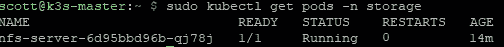

# 树莓 Pi 集群上的可靠 Kubernetes:存储

> 原文：<https://medium.com/codex/reliable-kubernetes-on-a-raspberry-pi-cluster-storage-ff2848d331df?source=collection_archive---------1----------------------->

## 药典


哈里森·布罗德本特在 [Unsplash](https://unsplash.com?utm_source=medium&utm_medium=referral) 上的照片

对于大型集群，功能带来了巨大的存储需求。但是我们如何迎合他们呢？我想保留自己数据的所有权，所以云存储立即被淘汰了。由于成本原因，拥有一个花哨的 NAS 设置也是不可能的。这让我的选择非常有限。

[第 1 部分:简介](https://scott-jones4k.medium.com/reliable-kubernetes-on-a-raspberry-pi-cluster-introduction-cbdca4e759fb)
[第 2 部分:基础](https://scott-jones4k.medium.com/reliable-kubernetes-on-a-raspberry-pi-cluster-the-foundations-d9c792c27b75)
第 3 部分:存储
[第 4 部分:监控](https://scott-jones4k.medium.com/reliable-kubernetes-on-a-raspberry-pi-cluster-monitoring-a771b497d4d3)
[第 5 部分:安全](https://scott-jones4k.medium.com/reliable-kubernetes-on-a-raspberry-pi-cluster-security-ef62cca74d78)

# 本地路径存储

K3s 附带本地路径存储功能。这意味着持久卷将存储在为其部署的节点上。这显然会导致一些意想不到的结果，因为对象在集群中移动。为了解决这个问题，K3s 要求您指定节点亲缘关系，这样您就可以确保它总是部署在同一个地方。

# NFS 存储

也许 RPi 群集中使用最广泛的选项是 NFS 存储。这依赖于位于某处的 NFS 服务器向网络提供文件。这意味着您有一个负责与文件交互的集中式服务，因此您的所有节点都可以与它对话，并获得相同的结果，无论它们在哪里运行。

# Longhorn 等人。

还有其他更复杂的集群存储机制，但在撰写本文时，对 ARM 架构的支持非常少。尤其是 32 位和 64 位 ARM。我可能会考虑在某个时候升级到一个更复杂的机制，但是现在，这些已经超出了范围。

# 我的解决方案

我不希望我的集群有任何外部依赖性。所以依靠外部 NFS 服务器是不可能的。但是把一个旋转起来作为我的集群的一部分是肯定的。我决定使用本地路径存储来运行 NFS 服务器。我不得不将它固定在一个特定的节点上，但这没关系——我想使用的硬盘被插入到一个 Pi 中。我创建了我的 NFS 服务器. yaml 如下

```
apiVersion: v1
kind: Namespace
metadata:
  name: storage
  labels:
    app: storage
---
apiVersion: v1
kind: PersistentVolume
metadata:
  name: local-pv
  namespace: storage
spec:
  capacity:
    storage: 500Gi
  accessModes:
  - ReadWriteOnce
  persistentVolumeReclaimPolicy: Retain
  storageClassName: local-storage
  local:
    path: <<PATH-TO-SHARE>>
  nodeAffinity:
    required:
      nodeSelectorTerms:
      - matchExpressions:
        - key: hdd
          operator: In
          values:
          - enabled
---
kind: PersistentVolumeClaim
apiVersion: v1
metadata:
  name: local-claim
  namespace: storage
spec:
  accessModes:
  - ReadWriteOnce
  storageClassName: local-storage
  resources:
    requests:
      storage: 500Gi
---
apiVersion: apps/v1
kind: Deployment
metadata:
  name: nfs-server
  namespace: storage
  labels:
    app: nfs-server
spec:
  replicas: 1
  selector:
    matchLabels:
      app: nfs-server
  template:
    metadata:
      labels:
        app: nfs-server
        name: nfs-server
    spec:
      containers:
      - name: nfs-server
        image: itsthenetwork/nfs-server-alpine:11-arm
        env:
          - name: SHARED_DIRECTORY
            value: /exports
        ports:
          - name: nfs
            containerPort: 2049
          - name: mountd
            containerPort: 20048
          - name: rpcbind
            containerPort: 111
        securityContext:
          privileged: true
        volumeMounts:
          - mountPath: /exports
            name: mypvc
      volumes:
        - name: mypvc
          persistentVolumeClaim:
            claimName: local-claim
      nodeSelector:
        hdd: enabled
---
kind: Service
apiVersion: v1
metadata:
  name: nfs-server
  namespace: storage
spec:
  ports:
    - name: nfs
      port: 2049
    - name: mountd
      port: 20048
    - name: rpcbind
      port: 111
  clusterIP: 10.43.184.230 # This is optional, but you can guarantee its IP if you set this.
  selector:
    app: nfs-server
```

以通常的方式应用它

```
$ sudo kubectl apply -f nfs-server.yaml
```

不过，现在还不能实际部署它。我们的节点选择器说它必须部署在一个标签为 HDD: enabled 的节点上。因此，让我们继续并标记包含您希望共享的路径的节点。

```
$ sudo kubectl label node k3s-master hdd=enabled
```

完成后，继续检查以确保 NFS 服务器已经启动

```
$ sudo kubectl get pods -n storage
```



正在运行的 NFS 服务器

一旦启动并运行，您就可以在其他持久卷中引用它，并对群集中的所有其他内容使用 NFS，这意味着所有其他内容都可以在任何地方运行。作为一个例子，你可以有这样的 yaml(剧透一下，这就是我们下一次将触及的确切存储！)

```
apiVersion: v1
kind: PersistentVolume
metadata:
  name: grafana-nfs-volume
  namespace: monitoring
  labels:
    directory: grafana
spec:
  capacity:
    storage: 1Gi
  volumeMode: Filesystem
  accessModes:
    - ReadWriteOnce
  persistentVolumeReclaimPolicy: Retain
  storageClassName: slow
  nfs:
    path: /grafana
    server: 10.43.184.230
---
apiVersion: v1
kind: PersistentVolumeClaim
metadata:
  name: grafana-nfs-claim
  namespace: monitoring
spec:
  storageClassName: slow
  accessModes:
  - ReadWriteOnce
  resources:
    requests:
      storage: 1Gi
  selector:
    matchLabels:
      directory: grafana
```

需要注意的一点是，上面的设置没有将 NFS 服务器暴露在集群之外。对我来说，这是一个有意识的决定，但对你来说，可能有你想这样做的原因。要公开它，您所要做的就是创建一个负载平衡器服务(就像我们上次看到的那样),将所有相关端口公开给该服务。

所以我们有它！本地持久存储，全部包含在您的集群中。全部仍归你所有，对可靠性影响有限。当然，我们仍然有单点故障，但这是通过将它放在单个主节点(另一个单点)上来管理的，因此我们仍然有一个故障点，而不是两个。下次当我们研究如何有效地监控我们的集群时，我们再见！