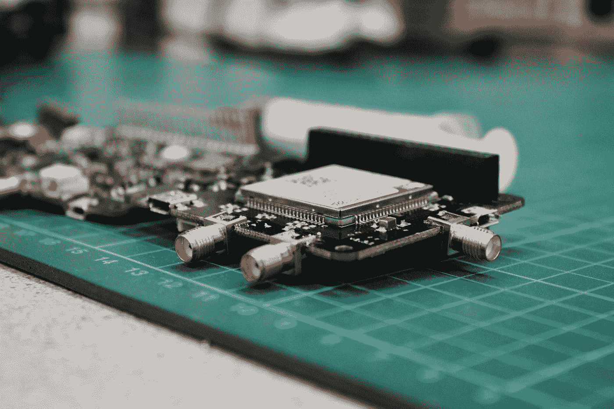
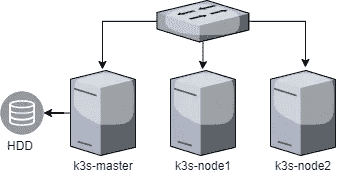
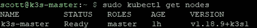
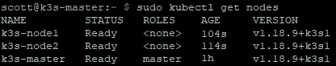
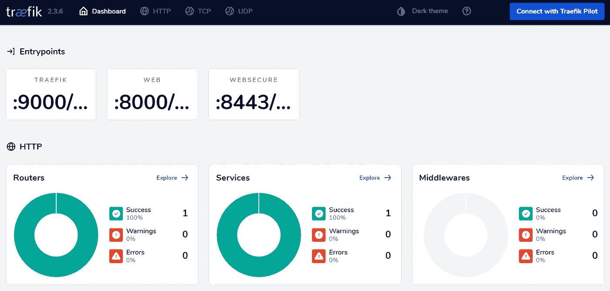

# 树莓 Pi 集群上的可靠 Kubernetes:基础

> 原文：<https://medium.com/codex/reliable-kubernetes-on-a-raspberry-pi-cluster-the-foundations-d9c792c27b75?source=collection_archive---------2----------------------->

## 药典



在 [Unsplash](https://unsplash.com?utm_source=medium&utm_medium=referral) 上由[路易斯·里德](https://unsplash.com/@_louisreed?utm_source=medium&utm_medium=referral)拍摄的照片

在我的[上一篇文章](https://scott-jones4k.medium.com/reliable-kubernetes-on-a-raspberry-pi-cluster-introduction-cbdca4e759fb)中，我给了你我集群中的内幕。现在，让我们来看看它是如何就位的。

[第 1 部分:简介](https://scott-jones4k.medium.com/reliable-kubernetes-on-a-raspberry-pi-cluster-introduction-cbdca4e759fb)
第 2 部分:基础
[第 3 部分:存储](https://scott-jones4k.medium.com/reliable-kubernetes-on-a-raspberry-pi-cluster-storage-ff2848d331df)
[第 4 部分:监控](https://scott-jones4k.medium.com/reliable-kubernetes-on-a-raspberry-pi-cluster-monitoring-a771b497d4d3)
[第 5 部分:安全](https://scott-jones4k.medium.com/reliable-kubernetes-on-a-raspberry-pi-cluster-security-ef62cca74d78)

# 五金器具

我正在运行一个由 3 个 rpi 组成的集群——1 个 Pi4 和 2 个 Pi 3B+。每个 rpi 都分别连接到一个电源和一个交换机。我没有任何花哨的 PoE 帽子，尽管这对我的装备来说是一个很好的改进。这里要提到的一个关键问题是存储—我们需要在集群中的某个地方使用集中式存储，我选择了外置硬盘，但是任何可挂载的存储都可以。此时，网络图相当简单。



集群网络拓扑

# 集群架构

正如您在拓扑图中看到的，我有一个主节点和两个额外的代理。这确实会在集群中引入单点故障—如果主节点失效，那么将没有任何东西可以管理集群。我已经接受了这个风险，因为我的硬盘也有单点故障。我通过确保两个故障点都在单个节点上来缓解这一问题，这意味着其他两个节点都不重要，可以从其中恢复。

# 设置主节点

在安装群集之前，您需要确保连接到节点的所有存储在启动时都已连接。如何做到这一点超出了本文的范围，但是有许多好的资源适合任何用例。此外，在安装 K3s 之前，应该在整个集群中设置所有主机名，否则，您可能会遇到一点麻烦。安装 K3s 是一个简单的命令

```
curl -sfL [https://get.k3s.io](https://get.k3s.io) | INSTALL_K3S_EXEC='server --no-deploy traefik --disable servicelb' INSTALL_K3S_VERSION="v1.18.9+k3s1" sh
```

这个代码片段将安装并启动 K3s，不需要 Traefik 和内置的负载平衡器。这使我可以更好地手动安装我想要的 Traefik 版本，并在以后安装 MetalLb。我还固定了版本，这样我就可以在整个集群中安装相同的版本。我最初有一个更高的版本，但这导致了 CPU 使用率飙升的问题，所以多亏了我的集群监控，我可以查明这一点。在我写这篇文章的时候，1.18.9+k3s1 是我在我的设置上已经证明稳定的最新版本。

检查集群是否启动和运行非常简单。这个命令将告诉您什么是启动的和连接的

```
sudo kubectl get nodes
```

如果有效的话，它应该会给你这样的东西



# 设置您的代理

您需要做的第一件事是从主服务器获取节点令牌。运行下面的命令来获取。

```
cat /var/lib/rancher/k3s/server/node-token
```

一旦有了这些，在您的每个节点上运行以下命令

```
curl -sfL [https://get.k3s.io](https://get.k3s.io) | K3S_URL=[https://<<MASTER-NODE-IP>>:6443](https://192.168.1.111:6443) K3S_TOKEN=<<NODE-TOKEN>> INSTALL_K3S_VERSION="v1.18.9+k3s1" sh -
```

在每个节点上完成该操作后，再次检查节点，输出应该会发生变化以反映这一点



您现在拥有了一个 3 节点集群！但是，在安装 Traefik 之类的入口控制器之前，它的外部使用是有限的。

# 集群外部的访问

最简单的方法是复制一份 kubeconfig 文件(位于/etc/rancher/k3s/k3s.yaml ),并在另一台机器上使用 kubectl，将它作为配置文件。请注意，您需要将服务器更新为集群主节点的 IP 地址，而不是 127.0.0.1。

# 安装 Traefik

我们需要设置的最重要的东西之一是入口控制器。谢天谢地，这真的很简单，多亏了一个叫做 [Helm](https://helm.sh/) 的工具。我们将使用 Helm 将 Traefik 安装到我们的集群中。您可以在值中指定很多东西，但是主要要查看的是我们的 HTTPS 证书的 TLS 设置和负载平衡器配置。其中每一项都是特定于您的设置的。对于我来说，我已经设置了一个特定的负载平衡器外部 IP，这样我知道我将总是获得相同的 IP 作为入口点，而不是依赖于自动分配。参见[此处](https://github.com/traefik/traefik-helm-chart/blob/master/traefik/values.yaml)了解一组基本默认设置。您可以复制一份，并根据您的情况进行更新。当你有了它，运行下面的命令

```
sudo kubectl create namespace traefik
helm repo add traefik [https://helm.traefik.io/traefik](https://helm.traefik.io/traefik)
helm repo update
helm install traefik traefik/traefik --namespace=traefik --values=traefik.values.yaml
```

现在应该为您设置好 Traefik 了。要进行检查，请运行以下命令来查看 pod 的状态，并查找 1/1 就绪的正在运行的 pod。

```
sudo kubectl get pods -n traefik
```

最后，为了允许访问，我们需要一个工作负载平衡器。您应该已经创建了一个负载平衡器服务，但是因为我们还没有为它提供任何服务，所以它将停留在挂起状态

```
sudo kubectl get svc -n traefik
```

# 安装金属 1b

这也很容易安装到您的集群中。有一个预先制作好的 YAML 文件，您可以直接将其应用到您的集群中，集群会完成大部分工作。

```
sudo kubectl apply -f [https://raw.githubusercontent.com/metallb/metallb/v0.9.3/manifests/metallb.yaml](https://raw.githubusercontent.com/metallb/metallb/v0.9.3/manifests/metallb.yaml)
```

唯一缺少的是您需要添加一个特定于集群的配置来实现负载平衡。我在 metallb.yaml 中创建了我的:

```
apiVersion: v1
kind: ConfigMap
metadata:
  namespace: metallb-system
  name: config
data:
  config: |
    address-pools:
    - name: address-pool-1
      protocol: layer2
      addresses:
      - 192.168.1.200-192.168.1.254
```

然后以标准的方式应用它

```
sudo kubectl apply -f ./metallb.yaml
```

这为我提供了一个负载平衡器设置，它将分发 192 . 168 . 1 . 200–192 . 168 . 1 . 254 范围内的 IP。我还从我的 DHCP 地址池中排除了这个范围，以确保不会出现网络冲突。最后，如果您再次查看 Traefik 的运行服务，您应该看到您的负载平衡器现在有了一个外部 IP，您可以在集群外部使用它来访问它。

# 一起测试

测试这一点的一个简单方法是在 Traefik 仪表板中添加一个入口路由。如果您没有任何 DNS 条目可以指向您的集群，您现在可以使用 hostfile 条目。对于生产级集群，这不应该保留，因为它会提供大量信息，并且不安全(默认情况下)。下面的 traefik-dashboard.yaml 将设置路由

```
apiVersion: traefik.containo.us/v1alpha1
kind: IngressRoute
metadata:
  name: dashboardsecure
  namespace: traefik
spec:
  entryPoints:
    - websecure
  routes:
    - match: Host(`traefik.internal`)
      kind: Rule
      services:
        - name: api@internal
          kind: TraefikService
      middlewares:
      - name: traefik-sso@kubernetescrd
  tls:
    certResolver: cloudflare
```

并再次以通常的方式应用它

```
sudo kubectl apply -f ./traefik-dashboard.yaml
```

然后，您应该能够通过 [https://traefik.internal](https://traefik.internal) 访问 Traefik 仪表板。它应该看起来像这样



默认 Traefik 仪表板

恭喜你！现在您已经有了一个工作的 Kubernetes 集群，可以为内部和外部请求提供服务了！下一次，我们将着眼于向我们开放的持久存储选项，以便我们能够部署具有存储需求的应用程序。