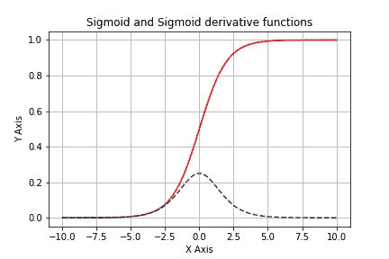
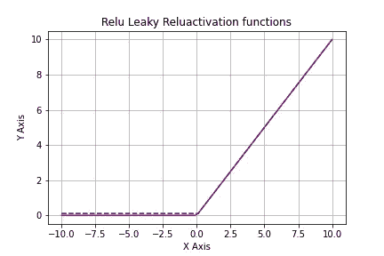

# 线性或非线性，这是个问题…

> 原文：<https://medium.com/codex/relu-rectified-linear-unit-linear-or-non-linear-that-is-the-question-2b18f419464?source=collection_archive---------3----------------------->


照片由[萨贾德·诺里](https://unsplash.com/@sajad_sqs9966b?utm_source=medium&utm_medium=referral)在 [Unsplash](https://unsplash.com?utm_source=medium&utm_medium=referral) 上拍摄

激活函数是神经网络的组成部分。它用于激活各层中的神经元或节点。隐藏层中使用的激活函数主要控制模块的学习。根据激活函数的输出值，在反向传播中进一步改进权重和偏差。输出激活函数决定了模型或网络将产生哪种类型的输出，无论是二分类、多分类还是多标签分类，它完全取决于我们在输出层选择的激活函数。

## ***线性激活功能的问题***

在回归问题的情况下，线性激活函数很有帮助，在回归问题中，模型必须预测真实值(不仅仅是 0/1 ),例如预测比赛得分或股票价格。但在卷积神经网络或多层感知器网络中，这是行不通的。在这个网络中，线性激活函数或多或少是无用的，因为节点的输出将是输入的线性函数。该功能不会帮助网络从数据中学习。因此，Sigmoid、tanh 函数等非线性函数是更好的选择。

## ***但是乙状结肠就足够好了吗？***

通常使用深层网络而不是浅层网络来训练模型。在任何网络中使用激活函数，并且在反向传播期间，计算节点的导数。现在对于一个更深的网络，一个名为“消失梯度”的问题可能会到来。类似 sigmoid 的激活函数将输入从大范围挤压到(0，1)范围。

```
 *f(x)=1/(1+e^(-x))*
```



图 1:Sigmoid 函数及其导数

因此，输入的巨大变化也会导致函数输出的微小变化。因此，梯度下降将接近于 0。对于浅层网络，这可能不是一个问题，因为我们没有这么多的层。但是对于深度网络，当我们在反向传播期间迭代各层并将激活函数的输出乘以权重时，梯度收敛到 0。

## ***ReLU 优于乙状结肠***

对于 ReLU(校正线性单位),曲线是弯曲的，而不是弯曲的，因此函数弯曲的地方不定义导数。这是一个问题，因为梯度下降需要所有点的导数，并且根据这些值，我们必须估计权重和偏差以进一步改进模型/网络。

## ***在 ReLU* 中修改**

虽然 ReLU 可以解决渐变消失的问题，但它提出了另一个问题，称为死 ReLU。这是因为 ReLU 函数的不连续性。值> 0 时 ReLU 的导数为 1，值<0 but the derivative at value=0 is unknown. Hence, a modified function is nowadays used which is known as LReLU. The change in the equation is we will use a value close to 0 instead of 0.

```
*f(x)=max(0.01*x,x)*
```



Fig(2): The difference between ReLU & LReLU

## **T5 时导数为 0 结论 **

虽然在很多地方我们看到 ReLU 被用作线性函数，但实际上不是。线性函数允许您将特征平面分成两半，但是 ReLU 的非线性可以在特征平面中创建任意形状。

## ***参考文献***

[1 . https://data science . stack exchange . com/questions/26475/why-is-ReLU-used-as-an-activation-function](https://datascience.stackexchange.com/questions/26475/why-is-relu-used-as-an-activation-function)

[2。https://machine learning mastery . com/choose-an-activation-function-for-deep-learning/#:~:text = Linear % 20 output % 20 activation % 20 function，而不是% 20 直接返回% 20 the % 20 value % 20](https://machinelearningmastery.com/choose-an-activation-function-for-deep-learning/#:~:text=Linear%20Output%20Activation%20Function,instead%20returns%20the%20value%20directly)。

[3。https://towardsdatascience . com/the-vanishing-gradient-problem-69 BF 08 b 15484](https://towardsdatascience.com/the-vanishing-gradient-problem-69bf08b15484)