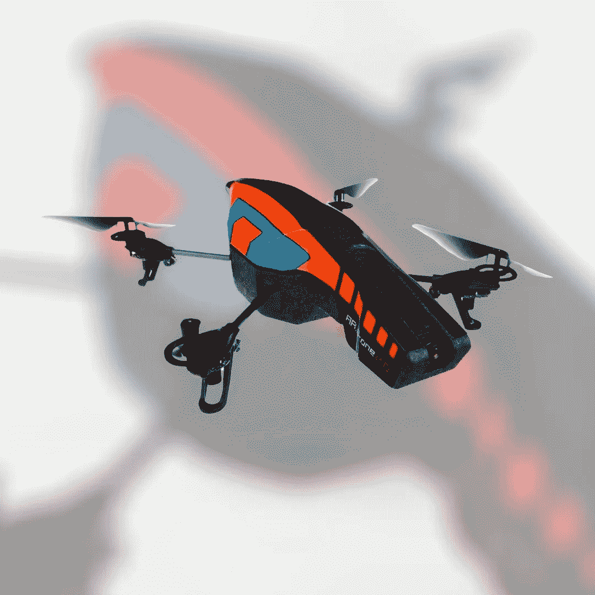

# 还记得我对无人机世界的介绍吗

> 原文：<https://medium.com/codex/remembering-my-introduction-to-the-world-of-aerial-drones-b275bcd2c4bc?source=collection_archive---------15----------------------->

## Parrot 在十年前是一个领导者！

我喜欢所有与无人机相关的东西，因为它仍然是一项处于发展阶段的技术。能够在极高的高度驾驶无人机，并在人们通常无法看到的角度通过视频或照片捕捉世界，这是值得一提的。我第一次尝试无人机飞行是由 Parrot 制作的模型。

Parrot AR 无人机 2.0(JC 媒体)