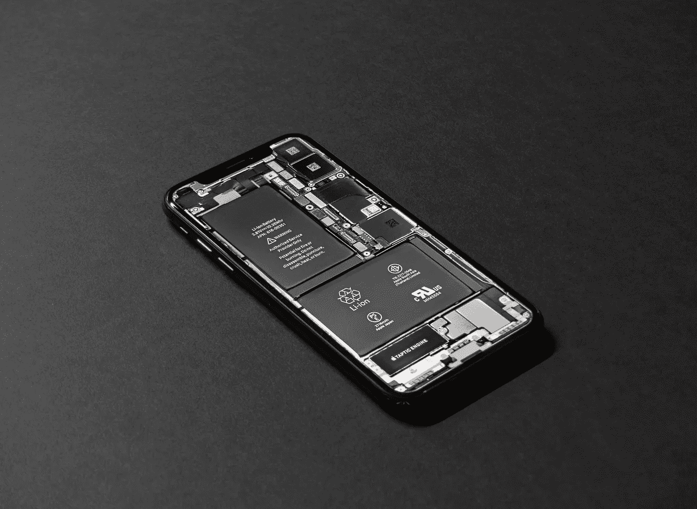

# 现代智能手机上的可拆卸电池

> 原文：<https://medium.com/codex/removable-batteries-on-modern-day-smartphone-c141f9beb26a?source=collection_archive---------12----------------------->

## 可拆卸电池消失背后的真相

泰勒·拉斯托维奇在 [Unsplash](https://unsplash.com/photos/rAtzDB6hWrU) 上的照片

十年前的一个回合，当你的手机没电或待机时，你做的第一件事就是把电池取出来。现在你不能这样做，因为大多数现代手机使用不可拆卸的电池。然而，许多消费者仍然希望这家智能手机制造商考虑恢复老派…