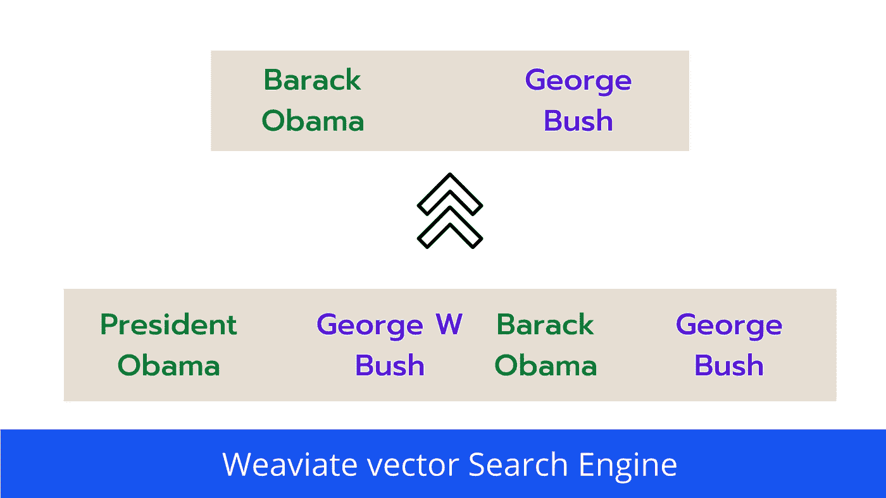

# 使用 Weaviate 去除语义搜索检索中的近似重复

> 原文：<https://medium.com/codex/removing-near-duplicates-in-semantic-search-retrieval-using-weaviate-b0b2b222f47a?source=collection_archive---------3----------------------->

## 轻松分组语义相似的文档

作者图片

在语义搜索中，我们针对给定的用户查询搜索文档数据库，并得到一组相关的文档。

无论我们是建立一个推荐系统还是问答系统，我们经常会得到重复的搜索结果…