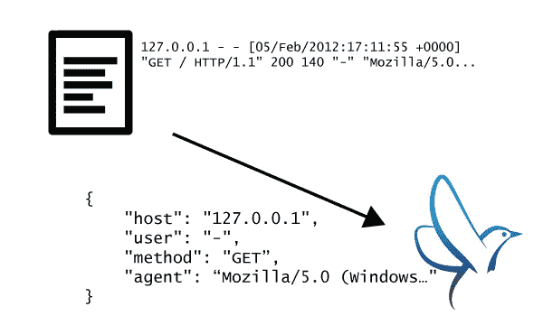

# 使用 Fluentd 重命名/删除日志字段

> 原文：<https://medium.com/codex/renaming-removing-log-fields-with-fluentd-53a00b9792a1?source=collection_archive---------6----------------------->

贷记:fluentd.org

> 注意:为了对 Fluentd 有一个基本的了解，请看下面的文章

 [## 在 Kubernetes 像魔鬼一样奔跑

### Fluentd 是一个开源数据收集器，它可以让您统一数据收集和消费，以便更好地使用和…

medium.com](/codex/running-fluentd-as-a-daemonset-in-kubernetes-95e96ed6130d)