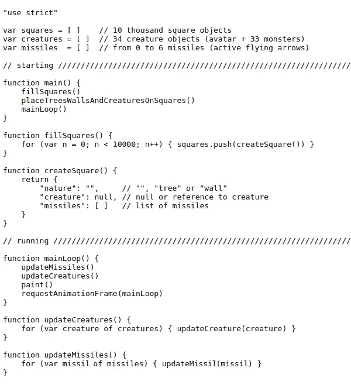
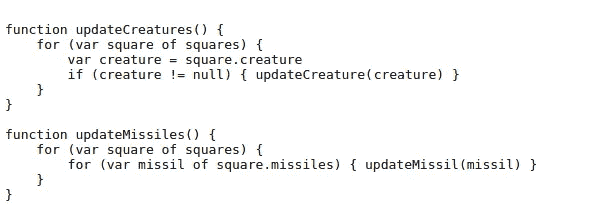
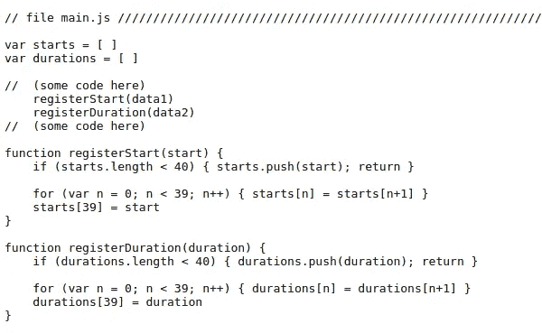
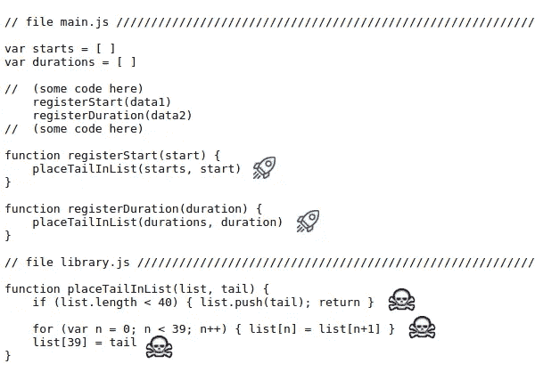
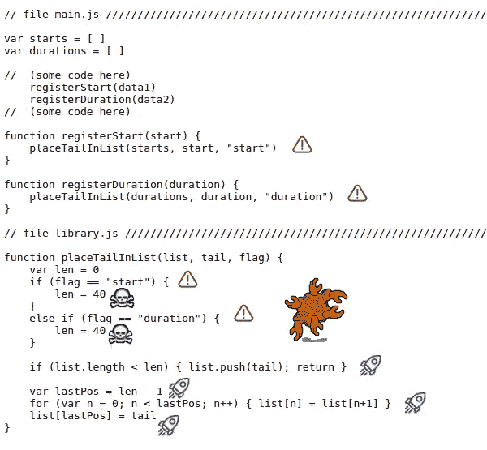
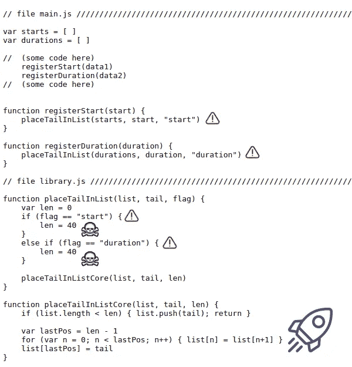
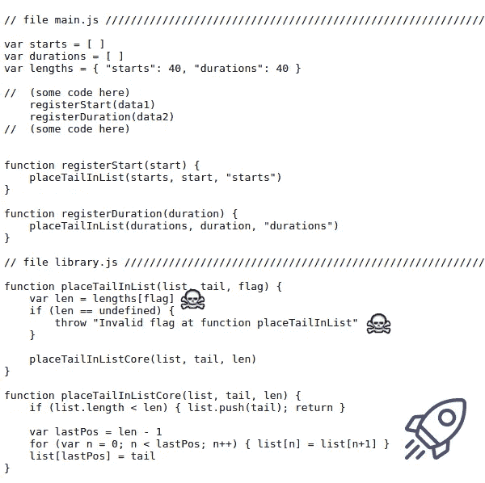
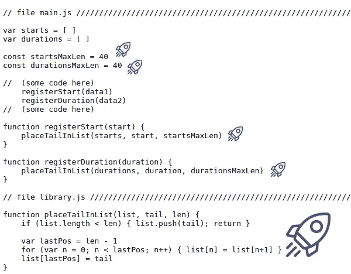
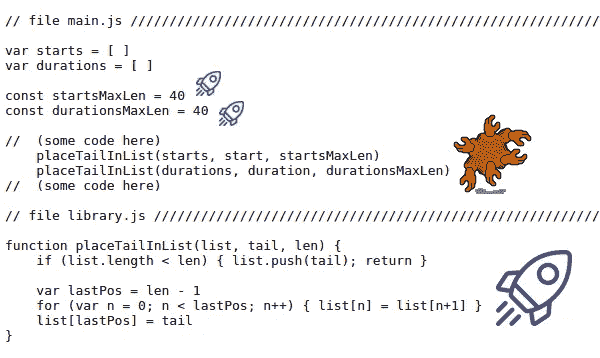

# 重复你自己——有时这是一件好事

> 原文：<https://medium.com/codex/repeat-yourself-sometimes-it-is-a-good-thing-141179c11dad?source=collection_archive---------1----------------------->

## DRY 原则可能会扰乱您的代码

来自不可能的多个人

在本文中，我们讨论了 DRY(不要重复自己)编程原则的使用。我们将研究一个不应使用干燥剂的情况。我们将看到遵循 DRY 原则的一步一步的代码重构，它显示了什么该做，什么不该做。

这里的所有代码都是过程化的 JavaScript。

# 干燥原则

在所有的编程原则中，综合各种原因，DRY 最吸引我。干是一个常见的名字，这表明它是什么。还有，DRY 是一见钟情短语的首字母缩写:不要重复自己。

可能是因为有道理(谁要双份工作？)如此容易，又容易记忆，我们往往高估了它。在不该用的时候用，没必要的时候用，或者用错了方法。

# 现实生活中的类比

这一部分是以防干已经成为你的一种信仰。

**举例 A**
想象一栋拥有 30 套公寓的豪华建筑。每套公寓有 4 间卧室，带独立浴室和两间公共浴室。也就是说每个公寓有 6 个卫生间。大楼内的浴室总数为 **180** (30 x 6)加上公寓外的一些浴室。这种类型的建筑有几个水箱？**两个**(一个常用一个备用)；不是 **30** 或 **180** 。

在世界各地，土木工程师和建筑师使用干式原理来定义每栋建筑只有两个水箱。但是他们 ***忽略了*** *在设置豪华公寓卫生间数量时的干燥原则*。

**例 B**
所有汽车都有 4 个轮子，但只有一个备胎。这似乎是合理的。对于阶梯轮胎，干燥是可以的。但是如果你在设计一辆汽车时将干燥原则的使用激进化，你将不会生产出一辆汽车，而是一辆独轮车。

**例子 C**特斯拉汽车公司决定违背干原则。他们创造了 Model S AWD，在 Model S 中增加了一个**额外的**引擎。他们的工程师担心增加汽车的重量会减少其行驶里程。发生了什么事？里程增加了，因为汽车变得更经济了。你可以在 www.fueleconomy.gov 的[和](https://www.fueleconomy.gov/feg/bymodel/2016_Tesla_Model_S.shtml)检查。

# 不要擦干它

考虑 2.5D 游戏机制的(过于简化的)代码如下。它的环境就像一个 100x100 的棋盘，意思是一万个方块。在广场上，我们放置了 2000 棵树和 5000 面墙，创造了一个迷宫。这个迷宫将由 33 个怪物和一个代表玩家的化身组成。神通必须用箭射死怪物:

过于简单的游戏代码

遵循干燥原则，我们会说列表*生物*和*导弹*对于列表*方块*来说是多余的。我们可以删除那些列表，直接从*方块*中读取生物和导弹，调整函数*更新生物*和*更新导弹*，这样:

替代代码

如果我们以这种方式修改代码，我们将会降低应用程序的性能。对于一款游戏来说，性能至关重要。

以前，要更新生物(或导弹)，我们需要迭代一个不超过 34 个元素的列表(箭头的情况下是 6 个)。现在，我们需要迭代一个包含 10，000 个元素(正方形)的列表，并且仍然要问 10.000 次正方形中是否有生物。

这是我们必须忽略干原则的情况之一。

# 把它擦干

考虑一个小型 web 应用程序:一个在绘制画布时监视浏览器性能的页面。这个代码示例是关于最近的信息存储在两个列表中的部分，每个列表有 40 个条目。

注意:这里的代码示例在每一个开头都没有“use strict”。js 文件。

原始代码(可接受)

上面的代码运行良好。它是以一种轻松的方式编写的，考虑到它是一个小的测试应用程序(1 个文件，不到 200 行)，这是可以接受的。

*寄存器开始*和*寄存器持续时间*功能之间的唯一区别在于名称。所以我们可以考虑对它们使用干燥原理。其实**干在这里没必要**(一个小代码里的两个小函数)。但是，让我们来看看会发生什么:

重构代码— 1(坏)

在我看来，应用 DRY 原则的正确方法是在一个库中创建辅助功能:一个特定的模块只为其他模块服务。让我们开始吧。

*main.js* 模块很棒。清晰多了。我们甚至不需要注释来理解一个*开始*或*持续时间*是如何注册的。我们知道该值将被放在各自列表的末尾。我们可以在眨眼之间检查每个功能！

在 *library.js* 文件中，我们为 helper 函数取了一个极好的名字: *placeTailInList* 。光是名字，我们就可能猜到它的内部机制。placeTailInList 只使用我们习惯的通用名称，如“n”、“List”和“tail”。简单。

然而，我们为未来的制造了一个**问题:如果不改变*持续时间*的长度，我们将无法改变*开始*的期望长度。让我们来解决这个问题:**

重构代码— 2(坏代码)

好消息:我们实现了*开始*和*持续时间*列表的独立性。我们能够消除**在 *placeTailInList* 的(底部)任意使用数字 40 和 39。**

坏消息:我们召唤了一个有着许多狂热之手的可怕生物:混乱。还有其他问题，但我们的重点必须是消除混乱:

重构代码— 3(坏代码)

通过将 *placeTailInList* 分成两个功能( **BOSS** 和 **WORKER** ，我们能够消除混乱！！

> boss 函数准备供 worker 函数使用的参数，worker 函数完全运行，忽略其上下文。

我们有一个缺点:我们使用了字符串形式的标志。它非常实用，但是很容易产生一个编译器和解释器都无法识别的错误。这种技术只适用于小程序。

我们有一个问题:boss 函数正在对每个列表的最大长度(40)进行假设。禁止对库函数进行假设。这是一个库函数的完整禁止列表:

1.  ***它不能读取全局变量***
2.  ***它不能写全局变量***
3.  ***不能调用其他模块的函数***
4.  ***它无法对上下文做出假设***

如果我们可以打破所有的规则，并且代码运行顺畅，为什么要有这么多的规则呢？因为违反这些规则会降低代码的可维护性，并且**更容易在未来版本中引发 bug**。

此外，如果不是 2 个列表(*开始*和*持续时间*)我们有 20 个列表要处理呢？我们的老板职能不会有一个干巴巴的外观。我们来纠正一下:

重构代码— 4(坏)

我们改进了 boss 函数( *placeTailInList* )。它现在可以处理任意数量的列表，而不需要修改。我们正在检查它收到的每个字符串标志。此外，我们将每个列表的最大长度(40)放在一个地方，可以全局访问。

我们有麻烦了。boss 函数正在读取一个全局变量(*长度*)，这对于库函数是禁止的。

我们还有一个问题。字符串标志的检查发生在运行时。我们正在降低应用程序的执行性能，以进行一项应该在编译时完成的检查。是时候进行更多的修复了:

重构代码— 5(好)

朋友，我们终于成功了！我们的代码如此之好，以至于我们不再需要 *library.js* 中的 boss 函数。

现在的代码比原来的更易读、更健壮、更易维护。它的行数比…哎呀！在所有的重构之后，我们的代码现在比原始代码多了 30% **行。它不是应该是干的吗？**

嗯……我们还有最后一张王牌。 *registerStart* 和 *registerDuration* 函数…它们的内容只是简单的一行。我们可以删除它们，把它们的内容直接放在它们被调用的地方。这将使代码更短。好吧，让我们试试:

重构代码— 6(坏)

哦不！我们又召集了混乱。似乎这两个只有一行的函数都有一个**重要的角色**:滤波器复杂度。现在我们已经将它们的复杂性(内部细节)直接抛给了它们的调用者…

我们必须退一步重构！

# 结论

这篇文章的第一大教训是“干不应该是个顾虑”。拥有可维护的代码是一个问题。拥有一个高性能的应用程序是一个问题。拥有一个没有被窃听的应用程序是一个问题。但是干…这不是一个问题。这是一种有时很好使用的技术。

这篇文章的第二个重要教训是，如果你要烘干，就用正确的方式烘干。如果你不打算用正确的方法擦干，那就不要开始。否则你会弄乱你的代码。

谢谢你。