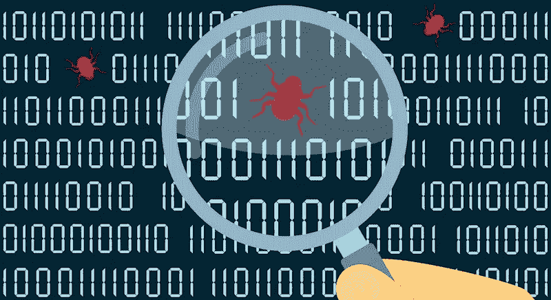

# 不到 15 分钟像专业人士一样报告安全漏洞！

> 原文：<https://medium.com/codex/report-a-security-vulnerability-like-a-pro-in-less-than-15-min-881ae4f00455?source=collection_archive---------11----------------------->

臭虫奖励计划已经成为安全产业的一个主要部分。它们为公司、政府机构甚至个人提供了发现其软件和网络漏洞的机会。反过来，这些组织可以利用这些信息来改进他们的产品和服务，以满足愿意为其付费的客户的需求。

**1。简介**

此报告的目的是概述给定系统中发现的漏洞，并提供解决这些漏洞的建议。这可以通过提供每个漏洞的详细信息及其对组织的影响来实现。

**2。执行摘要**

行动纲要

执行摘要是对您的发现的简要概述，并以易于阅读的方式进行解释。它应包括:

主要问题是什么？

主要发现是什么？

你是怎么发现漏洞的？(例如，用户输入或 web API)

此漏洞会产生什么影响？

我们如何修复这个漏洞？

我们如何向利益相关者/受众报告这一漏洞

**3。报告时间表**

时间线是按照时间顺序展示报告的好方法。它可以包括:

发现日期(或首次报告日期)，

报告日期(您报告问题的日期)，以及

修正或解决日期(如适用)

**4。漏洞详情**

漏洞详细信息

在本节中，您需要详细描述该漏洞，并说明其对您组织的网络安全状况的影响。您还必须提供关于有权访问它的用户如何利用或修复它的信息(例如，通过恶意代码)。

**5。材料&证据链接**

材料和证据链接将帮助您找到原始报告，以及任何其他可能有用的信息。如果您的漏洞报告中有视频演示，我们也会在这里链接它！

**6。漏洞的影响**

您还应该考虑这些漏洞的影响。每个漏洞的影响是什么？他们有多坏？你如何利用他们？此漏洞可能会带来什么后果，这对您的公司意味着什么？

**7。概念证明(POC)**

概念证明(POC)是一种用于展示漏洞影响的工具。它也被称为漏洞，可用于测试目的，但创建一个并不总是容易的。

要创建有效的 POC，您需要:

了解您的目标平台是如何工作的，以及它的安全需求是什么。

决定哪种利用最有效；和

根据这些因素制定一个计划。

**8。参考文献**

如果您发现软件中存在漏洞，通知供应商是非常重要的。如果供应商对此一无所知，他们可能没有时间来修复它。

如果您已经填写了报告的这一部分，但仍然无法找到任何参考资料或证据链接，请尝试使用不同的词或搜索词(例如，“软件安全性”)再次搜索。你可能漏掉了什么！

希望你对如何为未来即将到来的漏洞披露项目准备一份专业报告有一个坚实的想法。

一个很好的开始方式是简洁明了。如果你在写一封电子邮件，确保它不包含任何打字错误或语法错误；如果你写在纸上，不要使用太多的缩写；如果你亲自(或在网上)做演示，确保每个人都能明白你在说什么，而不必先问问题！

在准备你的报告时，一个很好的经验法则是:尽量不要在文件本身的每个段落/部分/项目中重复两次以上(除非特别要求)。此外，确保这份报告中的任何信息在网上其他地方都没有——特别是考虑到这些类型的节目现在变得如此受欢迎！

有了这些步骤，你现在就可以准备好你自己的漏洞报告了，在最坏的情况下，起草报告的过程几乎不需要 15 分钟。做一份高质量的报告是这里的关键。

总之，为了准备一份专业的漏洞报告，遵循这些步骤是很重要的。此外，您可以将这些工具用作自己报告的示例: