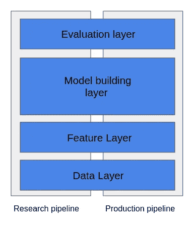

# 数据科学中的再现性

> 原文：<https://medium.com/codex/reproducibility-in-data-science-1dab858107f0?source=collection_archive---------11----------------------->

## RIP:再现性就是力量

在机器学习项目中经常被忽视的是，如果你想建立和部署一个机器学习模型，再现性是一个关键的组成部分。

在本文中，我们将了解什么是可重复性，为什么它很重要，以及我们如何实施它。


[杰瑞米·托马斯](https://unsplash.com/@jeremythomasphoto?utm_source=unsplash&utm_medium=referral&utm_content=creditCopyText)在 [Unsplash](https://unsplash.com/s/photos/computer-science?utm_source=unsplash&utm_medium=referral&utm_content=creditCopyText) 上拍照

# 一、什么是再现性？

> 再现性是精确复制机器学习模型的能力，使得相同的输入数据给出相同的输出。[1]

这在以下几种情况下很有用:

*   将您的模型与其以前的版本进行比较
*   为了确保在开发环境中创建的模型的结果与在生产环境中运行的模型相同
*   用于审计
*   …

但是为了更好地理解这种情况，让我们从更大的角度来看。当你从事机器学习项目时，你通常不是在一个简单的模型上工作，而是在一个流水线上工作:


作者的典型机器学习管道

根据我们考虑的环境，这个管道可能会有所不同

事实上，创建和开发机器学习管道涉及整个项目中的多个不同环境。它通常(不总是)包括:研究环境、开发环境和生产环境:

*   在研究环境中，数据科学家分析数据，构建模型，并对它们进行评估，以确保它们产生预期的结果。因此，他们建立了第一个机器学习管道。
*   之后，软件开发人员在开发环境中复制相同的机器学习管道
*   在最后一步，模型进入生产环境。

现在，就可重复性而言，这种情况非常具有挑战性，我们将在第 3 部分中看到。但是现在，让我们深入了解为什么我们必须确保我们的模型是可复制的

# 二。为什么要确保再现性？

如果你还没有被说服，这里列出了为什么你必须建立一个可重复的机器学习管道:

*   它消除了重新运行时的变化。例如，许多参数依赖于随机初始化(如神经网络的权重)，因此可再现性确保我们的性能变化是合理的
*   管道中有很多随机性:数据集的洗牌、漏层、ML 框架的变化、特征工程……最终，会涉及到很多随机过程，并且您的模型从一个培训会议到另一个培训会议可能会有明显的不同
*   我们的生产和研究渠道应该预测同样的投入同样的产出。所以我们确切地知道我们将什么模型部署到生产中。
*   如果不能复制以前的结果，就很难确定新模型是否真的比以前的模型更好
*   …

# 二。如何保证再现性？

我们将一起经历一个机器学习项目的生命，这样我就可以描述哪些是常见的再现性问题，以及我们如何解决它们。

开始吧！我们已经通过创建研究管道开始了我们的机器学习项目，我们希望我们的模型结果是一致的。因此，我们必须确保我们管道的每一步都是可重复的。


按作者

*   数据收集:即使数据库(或数据源)不断更新/更改，训练集也必须相同。要解决这个问题，请保存训练数据的快照，并在 SQL 查询中使用 ORDER BY 等关键字对结果进行排序。如果我们不在更新的数据上进行训练，我们可能会看到性能下降，因为我们不再处理有代表性的数据样本(参见[概念漂移](https://en.wikipedia.org/wiki/Concept_drift)和[数据漂移](https://www.explorium.ai/blog/understanding-and-handling-data-and-concept-drift/)
*   特征工程:为了确保这一步是可重复的，关键是要确保你的数据是可重复的。这还取决于您使用哪些函数来预处理您的要素。其中一些有一些随机成分，例如用随机值替换丢失的数据。在这种情况下，您必须修改函数，使其对于相同的输入始终给出相同的输出
*   模型训练:许多 ML 模型依赖于训练中的随机性，如神经网络的权重初始化。如果您使用的是 scikit-learn，通过固定参数“random_state”的值来设置种子:

```
model = RandomForestClassifier(max_depth=100, random_state=42)
```

*   记录超参数、使用的特征及其顺序。不要忘记保存您的模型及其版本

现在我们有了一个可重复的研究管道，严肃的事情开始了。我们必须确保管道可以从一个环境复制到另一个环境。因此，如果给研究管道或生产管道相同的输入，它应该给出相同的输出。它意味着:

*   对每个管道采用相同的训练数据。数据科学家可能在研究环境中使用一个训练数据集，但通常，试图在生产环境中实现模型的程序员不会访问相同的数据。
*   取一个有代表性的样本。如果用于训练模型的样本不能代表生产环境中提供的数据。这两种环境要么以某种方式过滤其输入，要么创建模型的数据科学家不完全了解业务系统将如何使用模型。
*   用不同的编程语言编写不同的管道。如果软件工程师必须用另一种编程语言重新实现一个代码，流水线之间的错误和差异的可能性就会增加。如果程序员和数据科学家自始至终使用相同的语言，因此使用相同的代码，他们可以避免大部分错误。

每一点都需要解决，以实现跨管道的再现性。

> 请注意，在生产/开发流程中，您仍然必须通过在培训课程中始终采用相同的数据来使每一步都具有可重复性，修正您的模型的随机性……就像我们对研究流程所做的那样

应对所有这些挑战的一个好方法是跨环境复制管道，如下所示:



灵感来自[https://train data . medium . com/how-to-build-and-deploy-a-reproducible-machine-learning-pipeline-20119 c0ab 941](https://trainindata.medium.com/how-to-build-and-deploy-a-reproducible-machine-learning-pipeline-20119c0ab941)

因此，我们的管道共享由数据、特征、评分和评估层组成的基础设施。通过这种方式，我们知道我们在每个管道中的处理方式完全相同，因为模块/步骤是相同的:

*   数据层提供对数据源的访问，这些数据源将用于在研究和开发环境中训练模型
*   模型构建层构建模型并生成预测。
*   最后，评估层评估模型的性能，并将其与任何其他模型进行比较

这种跨环境的复制可以通过容器或虚拟机来完成，以确保硬件、文件系统和软件版本是相同的

**结论:**可再现性是精确复制模型的能力，它对于每个严肃的机器学习项目都至关重要，因为它使我们能够将模型与其以前的版本进行比较，并以适当的方式将模型部署在其他管道中。然而，说起来容易做起来难，因为在流水线的每一步(数据收集、模型构建等等)，甚至在不同的流水线上，都必须加强可再现性

这就对了。请记住，这不是你能找到的再现性问题的完整列表，但它应该给你一个很好的主题概述！

感谢阅读！

文章:

[1] : P. Sugimura，F. Hartl，构建可复制的机器学习管道(2018)。从 https://arxiv.org/ftp/arxiv/papers/1810/1810.04570.pdf[取回](https://arxiv.org/ftp/arxiv/papers/1810/1810.04570.pdf)

[2] : P .典狱长。机器学习可复制性危机(2018)。检索自:[https://Pete warden . com/2018/03/19/the-machine-learning-reproducibility-crisis/](https://petewarden.com/2018/03/19/the-machine-learning-reproducibility-crisis/)