# 研究数据分析师实习:NASCE 数据库

> 原文：<https://medium.com/codex/research-data-analyst-internship-nasce-database-15e4e3bbfff0?source=collection_archive---------10----------------------->


在完成萨拉托加计划的 MySQL 和 Python 数据库后，这是我第一次真正使用该数据库管理系统(被特斯拉、网飞、Airbnb 和 T2 等其他几家大型科技公司使用),我发现了 MySQL 与 MS Access 相比如何脱颖而出的几个方面，MS Access 是我之前唯一的数据库体验。我也知道还有很多领域需要我去探索，我只是对 MySQL 的能力略知皮毛，即使只有[社区版](https://www.mysql.com/products/community/)。因此，我非常期待探索使用 MySQL 的新方法。

在完成了我关于风能的最后一个项目后，我开始为国家服务和社区参与评估(NASCE)开发 MySQL 数据库。这个数据库覆盖的范围更广，但真正的挑战是，与我之前构建的数据库相比，它的规模要大得多。与此同时，我上次使用的技术需要在很大程度上改进，如果这意味着在实习结束时完成这个项目。刚刚完成了最后一个项目，我只有不到一半的实习时间来建立这个数据库，并添加目前在 Google Sheets 上的所有数据。

从上次使用 MySQL 开始，我就为自己设定了具体的改进目标。这包括:

*   当涉及到数据可视化和查询时，进一步提高我的技能。
*   提高数据准备和输入数据库的效率，旨在使信息技术的更多方面自动化。
*   弄清楚我是否能够创建 MySQL 表单和报表。

除了弄清楚如何创建表单和报告之外，我能够完成这些目标中的每一个，因为经过进一步的研究，我意识到唯一的方法是通过 PHP，我以前没有任何这方面的经验，并且由于我实习的时间限制，我决定在我的下一次实习中学习这种编程语言。

**表的详细信息&属性:**

对于 Google Sheets 上给定的数据集，我注意到主要的区别在于学院/大学以及它们所属的合作组织。当涉及到学校时，我需要包括他们的姓名、位置、社区中心的名称、社区中心和学校的一般联系信息(电子邮件和电话号码)、过去的交往历史、与学校的沟通、NASCE 提供的服务报价、下一届管理信息和学校协会。对于合作伙伴组织，我需要包括他们的姓名、联系信息(电子邮件和电话号码)、与组织的通信以及合作关系的历史。在所有这些需要包含的信息中，我发现最令人困惑的是学校附属关系和协会之间的区别。在与我的主管交谈后，她解释说，所有协会都可以成为合作伙伴，而合作伙伴是指 NASCE 与之合作或达成协议的人。所以这意味着一所学校可能是一个协会的一部分，但 NASCE 以前可能没有与该协会合作过。

**为确定数据库结构而建立的模型:**

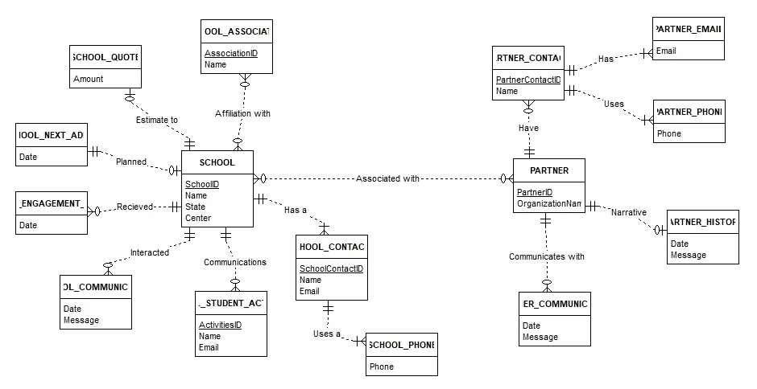

ER 助手中的 ER 图

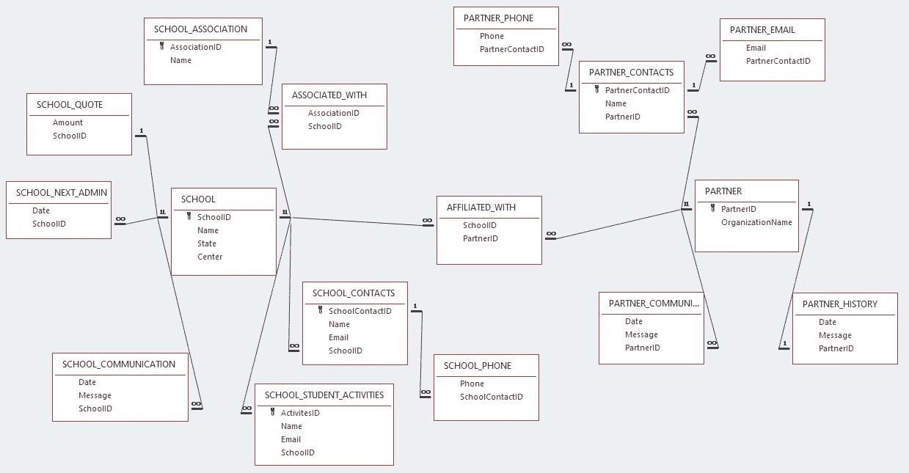

表关系— MS Access

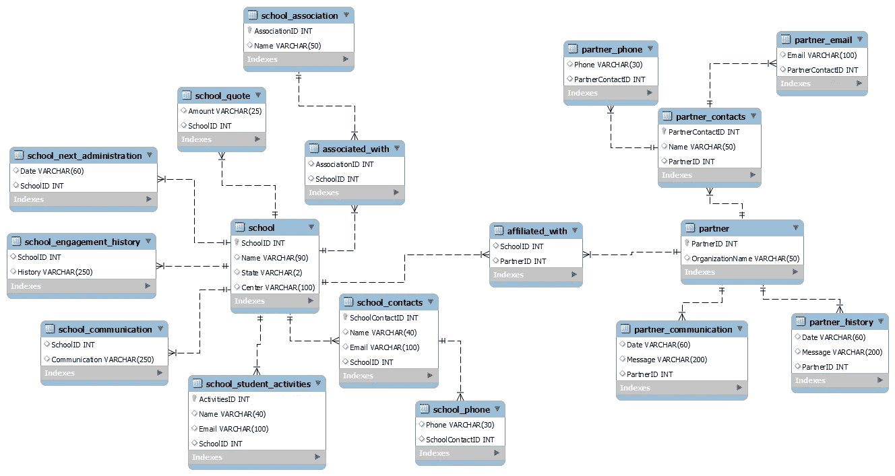

EER 图— MySQL 工作台

**命令行测试:**

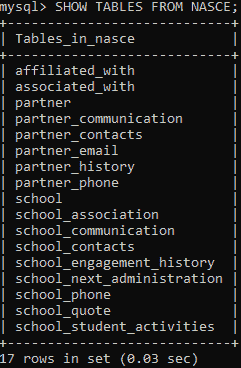

所有的数据库表

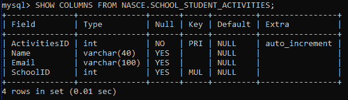

表的特定属性的详细信息

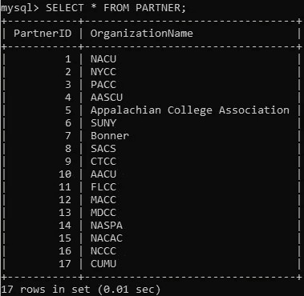

特定表中的数据

**MySQL/Python 连接器创建和访问表:**

```
mycursor = db.cursor()mycursor.execute(“CREATE TABLE SCHOOL_CONTACTS( \ SchoolContactID int AUTO_INCREMENT PRIMARY KEY, \ Name VARCHAR(40), \ Email VARCHAR(100), \ SchoolID int, \ FOREIGN KEY(SchoolID) REFERENCES SCHOOL(SchoolID)”)mycursor.execute(“DESCRIBE SCHOOL_CONTACTS”) for x in mycursor: print(x)
```

**画面可视化:**

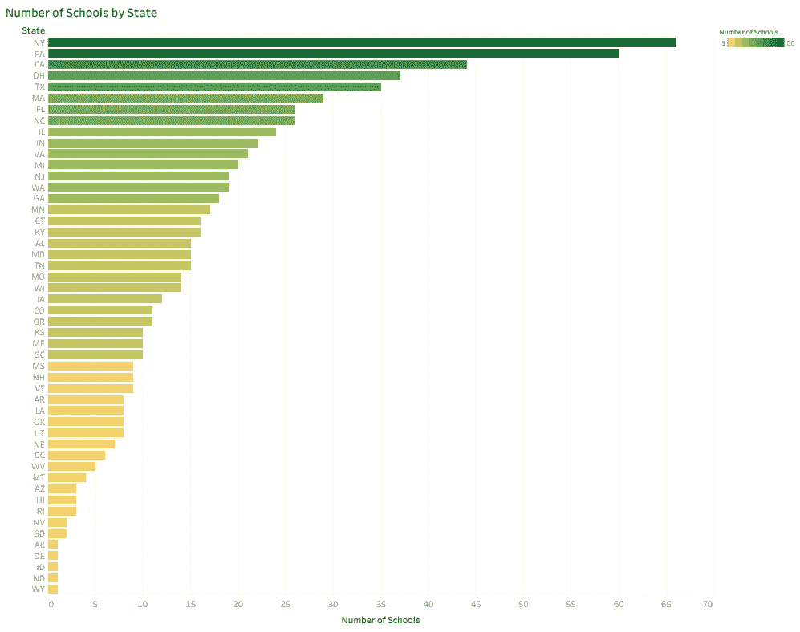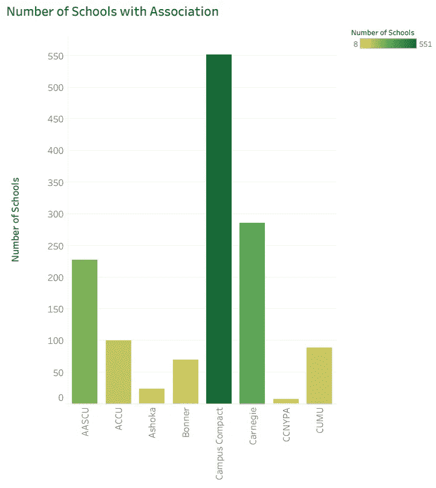

## **创建数据库的主要过程:**

自从上次使用 MySQL 命令行客户端创建萨拉托加计划数据库以来，它就无法正常工作。当我输入密码时，命令行会立即关闭。使用工作台和 Python MySQL 连接器也是如此。


MySQL 连接器/Python 无法连接到数据库

我发现 Python 中的这个错误消息对于确定如何解决这个问题非常有用。要解决这个问题，其实很简单。我只需要进入 windows 上的服务应用程序，运行 MySQL80 服务。这样做之后，我现在可以毫无问题地连接到 MySQL 命令行了。

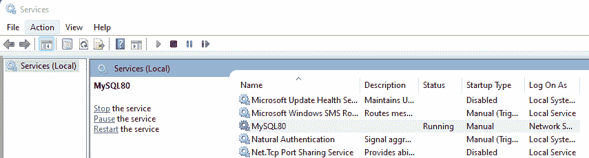

Windows 服务管理器

我决定通过 MySQL 命令行和工作台来创建表和属性，而不是使用 Python SQL 连接器。这样做的原因是，为了创建 EER 图，我遇到了将以前的数据库导入 MySQL Workbench 模型的问题。为了解决这个问题，我必须将我在 Python 中创建的每个查询修改为纯 SQL，这样才能正常工作。

这就是我如何通过命令行创建新的数据库和第一个表，并进行测试以确保我成功地做到了这一点。

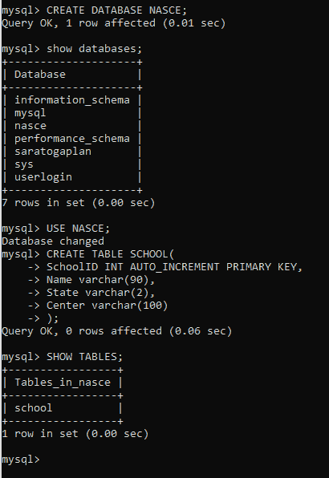

创建和访问数据库和表

在此之后，我决定在工作台中构建其余的表，因为我发现构建数据库要高效得多。如果您在工作台中犯了错误，这是一个更快的修复方法，并且您可以以更容易的方式一次运行多个查询。下面是在 Workbench 中创建各种表格的样子:

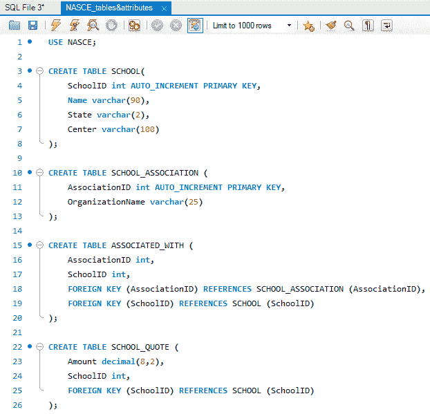

MySQL 工作台查询

Action Output 面板显示了 MySQL 中服务器和工作台之间的通信:

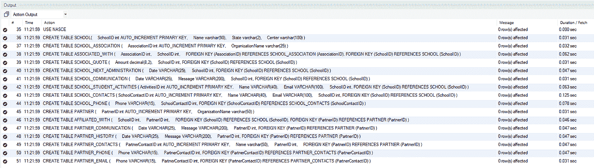

MySQL Workbench 中的操作输出显示

在电子表格文件中，我将两个表(学校和合作伙伴)中的信息分解为我在数据库中创建的表的数量，并相应地将它们拆分。因为每一列都占用相同的空间，无论在一个单元格中是空白的还是多个数据点，这使得在我复制列以创建新表时很容易在不同列之间排列数据。我还可以在 Excel 中使用逻辑来说明，如果某个名称显示为代表学校或合作伙伴 X，它将自动转换为与该特定名称对应的外键。这为数据输入节省了大量的时间，并无疑使过程更加自动化！因为主键从 1 开始自动递增，所以我在此基础上为主键创建了一个列，这样每一个主键都会递增 1，这也大大加快了这个过程！

我使用了 find and replace 工具来获取大多数具有一对多关系的表的 ID。例如，使用学校关联表，我将找到第一个关联第一次出现的时间，并将其复制到 find 中，同时没有任何内容被替换。这将删除该关联的所有实例，我将把它存储在第一个 ID 号中，并继续这样做。这个过程非常快，可能最多花几分钟，而如果我手动更改每个记录，将需要几个小时才能完成，因为原始学校表中有大约 800 条记录。这是现在浓缩的信息:

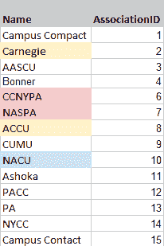

从原始数据浓缩成唯一值后

对于其他表，比如学校联系人，在匹配从 student 表中复制的姓名、电子邮件和学校 ID 外键之后，我首先逐个删除数据列。但是，我发现，当对整个数据集使用过滤工具时，我可以删除所有姓名和电子邮件列为空的行，这意味着这些学校的联系信息尚不存在，需要在将来与这些学校交流时获取。在将所有数据放入数据库后，我使用 null 关键字在表上运行 SQL 查询，以便找到缺少这些信息的学校。

对于在一个单元格中有多个条目的列，我在 Excel 中使用了[左右函数](https://www.learnexcelnow.com/excel-left-and-right-functions/)。这些方法将字符串分割成特定字符或序列或字符左侧或右侧的子部分。因为我遇到的大多数公式都是用分号分隔的，所以这是使用这些公式的一个例子:

```
=LEFT(C5,FIND(“;”,C5)-1) =RIGHT(C5,LEN(C5)-FIND(“;”,C5))
```

准备输入 MySQL 数据库的最具挑战性的表是 ASSOCIATED_WITH 和 AFFILIATED_WITH 表。这些表中的每一个都连接了数据库中存在的两个多对多关系。我发现最有效的方法是为每个外键创建一个单独的列，用于每个单元格有多个数据点的数据库，这仍然需要花费大量的时间来解决和实现。例如，对于 ASSOCIATED_WITH 表，我确定需要使用 [ISNUMBER](https://exceljet.net/formula/cell-contains-specific-text) 函数。然而，这只会返回 true 或 false，这取决于单元格中是否存在特定的子字符串，所以我需要将它嵌套在 if 语句中。这方面的一个例子是:

```
 =IF(ISNUMBER(SEARCH($V$4,E4))=TRUE,$W$4,””)
```

这意味着在搜索子字符串之后，如果找到了，那么在这个实例中将返回单元格$W$4，如果没有找到，那么将返回一个空字符串。这样做之后，每个外键都有自己的列，所以我必须弄清楚如何将所有信息放在一个列中，以便数据可以正确地导入 MySQL。要做到这一点，我发现的最简单的方法是创建一个单独的选项卡，其中包含每个外键和主键的信息，这仍然需要一段时间。现在，仍然有许多随机的空白单元格，我不得不删除这些行，因为这意味着主键没有指定的外键。为此，我简单地突出显示了两列中的所有数据，并对数据创建了一个过滤器，然后对其进行排序，最后能够轻松地删除所有行，因为它们都被移到了底部。为每个单独的外键做了这些之后，我将它们堆叠起来，这样就只有两列(一个主键，一个外键)，这样我就可以将它们导入 MySQL。

在研究了如何将大量已经格式化的数据导入 MySQL Workbench 后，我发现[表数据导入向导](https://dev.mysql.com/doc/workbench/en/wb-admin-export-import-table.html)是最有效的方法。为了说明这一点，我使用了以前在 MySQL 中创建的 school 表，以及我保存为 CSV 文件的 Excel 格式数据，该文件表示我希望存储在该表的数据库中的数据。

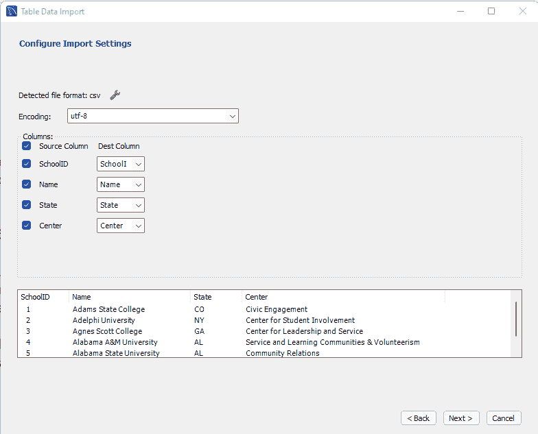

MySQL 工作台数据导入向导

在点击几次“next”之后，如果成功的话，导入的结果会显示特定表中存在多少新记录。为了测试数据是否可见，简单的查询 SELECT * FROM STUDENTS 允许这样做，结果是:

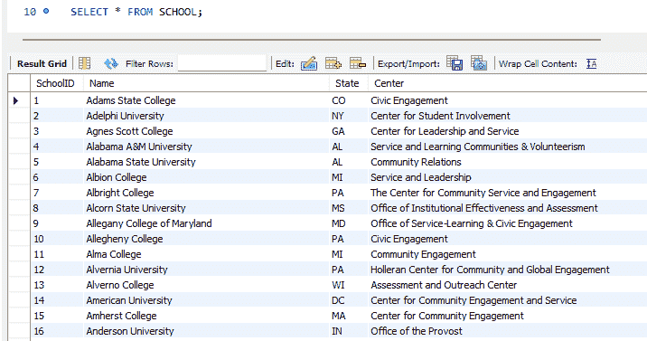

从表中访问数据

**TLDR 版本:**在解决如何自动化数据输入过程方面有了重大改进。在这个项目之前，我只知道如何一条一条地添加记录，但在了解了许多将数据格式化为 CSV 文件的技术并了解了 MySQL Workbench 数据导入向导之后，这个过程变得更加高效。与工作台相比，我发现在创建这个数据库时，使用 Python MySQL 连接器会花费更长的时间。对于我创建的下一个数据库，我的计划将包括找出利用 Python 的不同方法，比如创建脚本来帮助自动化数据准备过程。

**作品引用:**

“500 个 Excel 公式示例。” *Exceljet* ，[https://exceljet.net/formulas.](https://exceljet.net/formulas.)

"格式化你的作品。" *Tableau 桌面和 Web 创作帮助*，Tableau Software LLC，[https://Help . Tableau . com/current/pro/Desktop/en-us/formatting . htm .](https://help.tableau.com/current/pro/desktop/en-us/formatting.htm.)

拉森昆西。"如何在媒体中显示代码块." *Medium* ，FreeCodeCamp，2017 年 12 月 27 日，[https://Medium . com/free-code-camp/how-to-add-code-to-Medium-and-get-syntax-highlighting-d 699761 a 5883。](/free-code-camp/how-to-add-code-to-medium-and-get-syntax-highlighting-d699761a5883.)

马卡蒂，马特。"如何在 MySQL Workbench 中创建数据库、添加表和导入数据." *YouTube* ，YouTube，[https://www.youtube.com/watch?v=OnXB3ZRrOW0&t = 503s。](https://www.youtube.com/watch?v=OnXB3ZRrOW0&t=503s.)

马卡蒂，马特。"如何在 Mysql Workbench 中制作和使用 ERD/EER 图." *YouTube* ，YouTube，【https://www.youtube.com/watch?v=tEhGIYN4vic】T2&t = 1s。