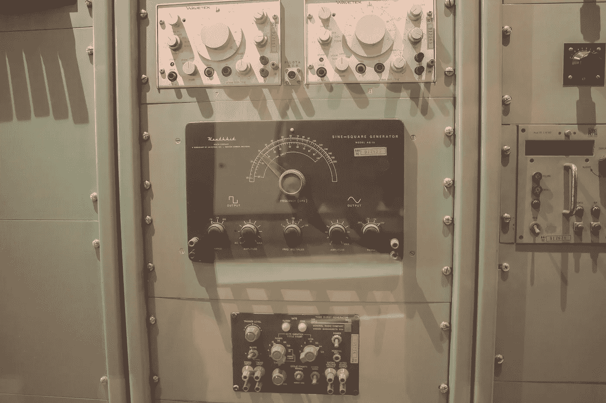

# 基于计算机科学中复杂性类 BQP 的研究论文第二部分

> 原文：<https://medium.com/codex/research-papers-based-on-the-complexity-class-bqp-in-computer-science-part-2-b8af1cf467e3?source=collection_archive---------17----------------------->

黛安·皮凯蒂诺在 [Unsplash](https://unsplash.com/s/photos/old-computer?utm_source=unsplash&utm_medium=referral&utm_content=creditCopyText) 上拍摄的照片

1.  **论量子计算机的信息论经典验证(**[**arXiv**](https://arxiv.org/pdf/2105.05942.pdf)**)**

**作者:** [Ayal Green](https://arxiv.org/search/?searchtype=author&query=Green%2C+A)

**摘要:**量子启发的协议例如[AAV13，AG17]试图实现单证明者交互协议，其中经典机器可以以信息论安全的方式验证量子计算。我们定义了一族看起来很自然的用于验证量子计算的协议，并推广了这些已知的协议，即[AAV13，AG17]中的协议。我们证明了来自这个家族的任何协议都必然需要一个非常强大的证明者，就像[LFKN92]和[Sha92]的经典协议一样。使用我们的分析，我们也暗示了人们可以尝试实现一个协议的可能方式，其中证明者可以是较弱的，即量子计算机(即 BQP 机器)

**2。多层量子搜索并包含 NP 进入 BQP(**[**arXiv**](https://arxiv.org/e-print/2004.11347)**)**

**作者:**[王晓婷](https://arxiv.org/search/?searchtype=author&query=Wang%2C+X)

**摘要:**在这项工作中，我们提出了一种多层量子搜索方法，该方法产生了标准 Grover 算法的指数加速。作为直接应用，任何 NP 问题都可以在只有多项式门复杂度的量子电路上有效地解决。特别地，这种多层搜索能够以指数级加速解决因子分解问题，提供了 Shor 算法的替代方案。我们的结果表明，量子电路的指数加速是普遍存在的，Grover 的搜索比已经证明的要强大得多。在与单层查询复杂度的二次最优性不矛盾的情况下，Grover 搜索的巨大潜力被这样的多层搜索设计充分释放。

**3。量子强指数时间假说(**[**【arXiv】**](https://arxiv.org/pdf/1911.05686.pdf)**)**

**作者:** [哈里·布赫曼](https://arxiv.org/search/?searchtype=author&query=Buhrman%2C+H)，[苏哈斯里·帕特罗](https://arxiv.org/search/?searchtype=author&query=Patro%2C+S)，[弗洛里安·斯佩尔曼](https://arxiv.org/search/?searchtype=author&query=Speelman%2C+F)

**摘要:**强指数时间假说(SETH)是复杂性理论领域常用的猜想。它指出，CNF 公式不能用穷举搜索的加速来分析可满足性。这个假设和它的变体产生了一个富有成果的研究领域，细粒度的复杂性，获得了 P 中许多问题的(大部分是严格的)下界，这些问题的无条件下界很难找到。在这项工作中，我们引入了量子强指数时间假说的框架，作为 SETH 的量子类似物。使用 QSETH 框架，我们可以将黑盒问题上的量子查询下界转化为 BQP 许多问题的条件量子时间下界。作为一个例子，我们通过为编辑距离问题提供ω(n 1.5)的条件量程时间下限来说明 QSETH 的使用。我们还表明，基于正交向量问题的最近的有用工作证明方案的基于 n2 SETH 的下界适用于假设 QSETH 的量子计算，保持验证者和证明者之间的二次间隙

**4。量子计算的交互式证明(**[**arXiv**](https://arxiv.org/pdf/1704.04487.pdf)**)**

**作者:**

**摘要:**人们普遍认为 BQP 严格包含 BPP，这引发了根本性的问题:如果我们不能有效地计算量子系统行为的预测，我们如何测试它们的行为？换言之，量子力学是可证伪的吗？在加密设置中，如何让未来不可信的量子计算公司的客户确信其量子计算的正确性？为了回答这些问题，我们定义了量子证明者交互证明(QPIP)。在标准的交互式证明中，证明者是计算无界的，而在这里，我们的证明者在 BQP，代表一台量子计算机。验证机模拟了我们目前的计算能力:它是一台 BPP 机器，只能访问几个量子位。我们的主要定理大致表述为:“BQP 的任何语言都有一个 QPIP，它也对证明者隐藏了计算”。我们提供了两个证明，一个基于依赖于随机 Clifford 旋转的量子认证方案(QAS ),另一个基于使用多项式码的 QAS(BOCG+06 ),结合安全多方计算方法。这是 2008 年报告的工作的期刊版本(ABOE08 ),并在 ICS 2010 中展示；这里我们已经完成了细节，并使证明严谨。一些证明需要大的修改和更正。值得注意的是，多项式 QPIP 是容错的说法被删除。与 BFK08 中的原始版本大约同时，独立报告了类似的结果(使用不同的方案)。最初的独立作品(ABOE08，BFK08)引发了对盲可验证量子计算的长期研究，我们在这里对其进行了调查，并与各种密码问题进行了联系。重要的是，使结果容错以及完全消除量子通信需求的问题仍然存在。