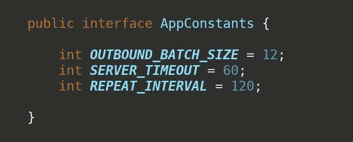
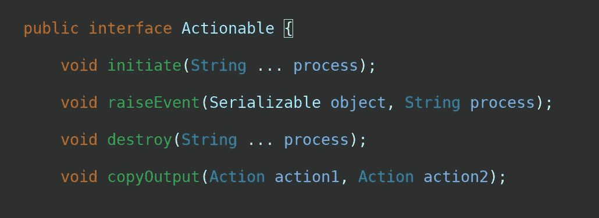
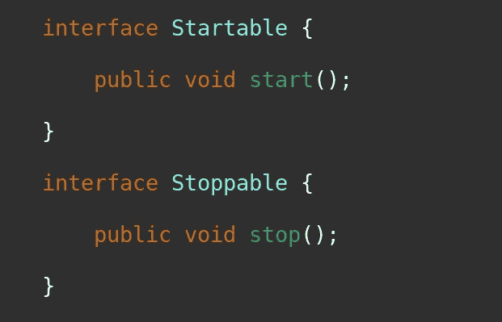
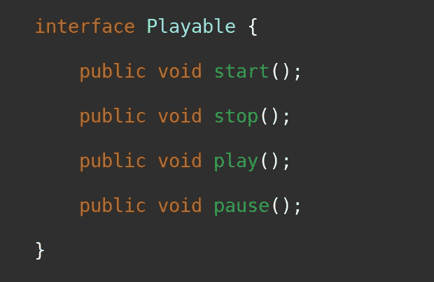

# 抵制使用这样的界面

> 原文：<https://medium.com/codex/resist-using-an-interface-like-this-c27e30c4871d?source=collection_archive---------6----------------------->

接口是面向对象编程语言中最突出的特征之一。它们展示了抽象和多态的本质。它们允许实现行为灵活性和运行时多态性。它们是许多设计模式的基础，包括但不限于策略和状态设计模式。

虽然接口几乎无处不在，但我们往往会过度使用它们，从而影响应用程序的可维护性。下面列出了一些应该避免的与接口相关的设计决策。

# 常数库

接口的主要目标是以预定义方法签名的形式强制执行一个契约，它的所有实现都必须遵循这个契约。这个契约产生了一个清晰的、定义良好的集成机制。虽然在接口中具有与实现相关的某些常数以及方法是有意义的；没有方法的接口不能实现它的主要目标。

常数的接口

应该避免使用一个接口作为一个常量库，因为这样会很难理解该接口在应用程序中的作用。像 enum 这样的结构最适合这样的需求。

# 上帝界面

一个接口不仅仅是任何其他的构造，它是一种能力。当一个类实现一个接口时，它就能够执行在那个特定接口中列出或声明的行为。

> “关注点分离”的原则是每个方法只负责一件事，同样的原则也适用于接口和类。在同样的上下文中，接口应该被开发成向一个类提供单一的能力。

如果我们查看一个类的实现细节，这个类实现了一个足够通用的接口，那么它必须提供该接口中所有列出的方法的定义，即使这些方法中的一些是不需要的。这就带来了关于泛型接口可能增加的附加值的问题。上帝接口给了一个实现类太多的能力，这是一个坏主意，因为所有这些能力都不是我们想要的，但是我们必须处理它们。

具有不同能力的界面

> 拥有与特定用例相关的精益接口总是一个好的实践。

# 次级接口

功能太少的界面也不是一个好主意。只提供一半功能并迫使实现依赖另一个补充接口才能真正发挥功能的接口是应该避免的。

看似相关联的接口相互补充

> 一个接口必须为一个类提供所有必要的行为来实现某种能力，而不需要依赖第二个接口。

自给自足的界面

# 到处都是接口

与抽象对话允许修改底层实现或用另一个替换它而不被发现。当应用程序的两个部分通过接口而不是具体实现连接时，它们都不知道另一部分的底层架构。这使得使用多态性和更新或改变构造的行为变得非常容易，而不会在编译期间破坏任何东西。

虽然有争议的是拥有接口使得集成更容易，但是为每个类拥有接口并不是一个好主意。如果对接口的需求背后没有具体的原因，那么它通常只是一些不必要的样板代码，例如，如果你正在编写一个其他人会使用的库，那么将接口作为交互点是有意义的，但是为 rest 控制器或实用程序类编写接口就没有多大意义了。

> 这是我最近写的一本关于设计模式的书的链接。希望你会觉得有用。

 [## 面向 Java 开发人员的软件设计模式:专家主导的构建可重用软件的方法和…

### 面向 Java 开发人员的软件设计模式讨论了软件设计的基础，以及公认的…

www .亚马逊. in](https://www.amazon.in/Software-Design-Patterns-Java-Developers/dp/9391392474)