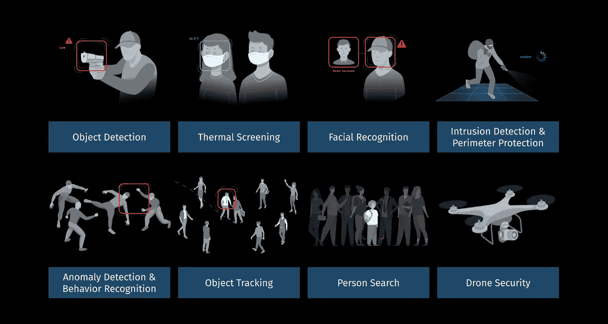

# 物理威胁检测解决方案中负责任和有道德的人工智能

> 原文：<https://medium.com/codex/responsible-and-ethical-ai-in-physical-threat-detection-solutions-b83fefd0c6af?source=collection_archive---------26----------------------->

Scylla.ai 提供: [Scylla —领先的物理威胁检测解决方案](https://www.scylla.ai/?utm_campaign=AIEthics&utm_source=TonyRhem)

介绍

人工智能(AI)提供了使机器能够学习的机制。使用机器学习的人工智能系统可以检测海量数据中的模式，并对复杂、相互依赖的系统进行建模，以产生提高决策效率的结果*。*使用人工智能(特别是机器学习)来提供物理威胁检测解决方案是基于来自摄像头的数据和算法解释数据的能力。这些数据来自于摄像头清晰可见的能力，以及软件收集图像数据的能力和算法解释数据以确定是否存在威胁的能力。与任何人工智能解决方案一样，必须有一个负责任的、合乎道德的方法来实现它，并且有一个标准来指导这个方法是必不可少的。

为了将人工智能道德付诸实践，有几个关于人工智能的国际标准包括道德成分，经济合作与发展组织(OECD)的人工智能标准是一个组织在制定自己的人工智能政策和标准时应该考虑的标准。经合组织发布的人工智能国际标准为人工智能的实施提出了一般要求，重点是遵守道德和人类福祉。经合组织基于人工智能价值的公共政策和国际合作原则和建议旨在成为政府、组织和个人设计、开发和实施人工智能系统的指导原则。这些指导原则的目的是确保人工智能的公众和用户的最大利益是首要的，并确保设计、开发和实施人工智能系统的个人对 OECD 人工智能标准负责。根据经合组织秘书长安吉尔·古里亚的说法，这些原则“将成为可信人工智能的全球参考点，以便我们能够以一种为所有人提供最佳结果的方式利用它的机会”。[【我】](#_edn1)

经合组织 AI 基于价值的原则

根据 OECD 人工智能基于价值的原则，人工智能应通过推动包容性增长、可持续发展和福祉来造福人类和地球；人工智能系统的设计应尊重法治、人权、民主价值观和多样性，同时适用适当的保障措施，以确保公平和公正的社会；围绕人工智能系统应该有透明度和负责任的披露，特别是当它们与公众接触时；人工智能系统必须在其整个生命周期中以稳健、安全和可靠的方式运行，同时访问和管理潜在风险[【ii】](#_edn2)。开发、部署或操作人工智能系统的组织和个人应该按照人工智能基于价值的原则对其正常运行负责。我们必须记住，当谈到人工智能时，我们既需要负责任的使用，也需要负责任的设计。

建立道德的人工智能实施方法

建立一个负责任和道德的人工智能方法的第一步是通过一个组织的人工智能政策和标准。如前所述，采用国际人工智能政策，如经合组织，将是实现这一目标的关键。下一步是在你的人工智能解决方案中应用数据伦理策略来识别和使用数据。根据经合组织人工智能标准，应用数据伦理将改善收集的数据。提高数据的道德性，将提高解释数据的算法的道德性。 [Murat Durmus，(AISOMA AG 首席执行官)](https://www.amazon.com/Murat-Durmus/e/B08Z6KN7P7%3Fref=dbs_a_mng_rwt_scns_share)指出“数据伦理是指对与数据相关的正确和错误行为的概念进行系统化、辩护和推荐”。他确定了伦理数据的七个方面，包括

(1)从明确的用户需求和公共利益出发，

(2)了解相关的法律法规，

(3)使用与用户需求相称的数据，

(4)了解数据的局限性，

(5)使用稳健的实践，在你的技能范围内工作，

(6)让你的工作变得透明和负责任，

(7)负责任地嵌入数据使用。[【第三期】](#_edn3)

开发人工智能应用必须以人为中心。以人为本的人工智能应用支持它所服务的人们的包容性和福祉，并尊重以人为本的价值观和公平。以人为中心的人工智能应用程序的设计、开发和实施必须透明、可靠和安全，并对产生的结果和决策和/或人工智能应用程序影响的决策负责。像任何其他应用程序一样，AI 应用程序必须在应用程序的生命周期中受到监控。建立证据基础指标和 KPI 来持续评估人工智能应用对于确保您的人工智能标准、指南和原则得到满足非常重要。

确保开发符合伦理的人工智能应用程序的一个经常被忽视的方面是建立一个多样化的人工智能产品开发团队。一个多样化的团队将会给这个计划带来“思想的多样性”。由具有不同文化背景的人组成的多元化团队涵盖多个学科，如知识管理、数据科学/分析师/架构师/工程师、机器学习、业务和领域主题专家以及变更管理，将为正在开发的产品带来具有不同视角和创新的跨职能团队。

Scylla:人工智能在物理威胁检测解决方案中的应用

Scylla 是一家由人工智能驱动的物理威胁检测解决方案公司，成立于 2018 年，业务遍及全球，包括美国，在德克萨斯州奥斯汀设有办事处，正在提供一种以道德人工智能为核心的整体威胁检测解决方案。Scylla 使用人工智能来分析来自固定和便携式摄像机的数据。然后，它处理获取的数据，以生成有关视频流中包含的活动的有意义的信息。Scylla 解决方案识别目标的行为特征，包括面部识别，以确定潜在的威胁。最后，Scylla solution 将通过网络和移动渠道向执法响应单位提供有关威胁的信息，以促进适当的响应[【iv】](#_edn4)。

Scylla 解决方案由最先进的算法提供支持，使急救人员和安全团队能够通过一个集中的仪表板即时识别和检测安全威胁。集中的仪表板使人处于监控系统结果的循环中，并根据接收到的信息做出决策。一旦启动警报和检测流程，Scylla 的威胁检测仪表板将会打开，显示安全人员的统计指标，增强对当前威胁的情报，并显示所有重要信息，这些信息经过编辑后将提供给负责安全的最终用户。

Scylla 行为识别系统可以从监控摄像头观察和检测各种异常事件和行为，例如烟雾和火灾，以及可能导致入店行窃和打架的异常消费者行为。当 Scylla 观察你的视频流时，一旦发现可疑物体，就会发出警报并上报给你的安全人员。当人工智能的预测与现实相符时(即，感兴趣的对象被正确识别，所寻求的动作被检测到等)，警报被分类为真实警报。).误报是警报被错误触发的情况。Scylla ODS 背后精心设计的人工智能和机器学习，可以满足任何级别的生产级工业标准，包括国际人工智能标准。

Scylla 的预防性威胁检测解决方案基于计算机视觉算法，威胁检测基于视觉内容分析。该算法在其训练中利用不同的数据集。这些数据集使该算法能够识别和检测摄像机中的各种对象，包括人、各种武器和车辆。这一功能使 Scylla solution 能够通过提供更准确的面部识别来限制错误匹配的数量，从而解决关键的面部识别问题。

“锡拉”在他们的解决方案中加入了道德规范

Scylla 物理威胁检测解决方案符合许多人工智能标准建立的基于价值的原则和道德人工智能实施方法。Scylla 专注于使用其先进的人工智能视频分析来保护人类生命。作为一个组织，Scylla 明白使用人工智能伴随着明智和道德地使用这些能力的责任。“锡拉”有意制定算法培训、产品设计和营销决策，以确保根据其使命和道德规范使用道德人工智能。

“锡拉”成功地解决了道德人工智能的核心原则。这些核心原则包括(1)对社会负责和有益；(2)避免产生或加强不公平的偏见；(3)进行建造和安全测试；(4)对人负责；以及(5)纳入隐私原则。[【v】](#_edn5)[【VI】](#_edn6)

以下说明了 Scylla 是如何遵循这些原则的:

1.对社会负责并有益。

新技术的扩展范围越来越触及整个社会。Scylla AI technologies 的发展考虑了其在提供 AI 解决方案方面的社会责任。

2.避免制造或强化不公平的偏见。

人工智能算法和数据集可以反映、强化或减少不公平的偏见。Scylla 认识到了这一点，并在其人工智能解决方案中提供了无偏见的数据集。“锡拉”旨在避免对人们造成不公正的影响，尤其是与敏感特征相关的影响，如种族、民族和性别。

3.被制造和测试安全。

Scylla 开发并应用了强有力的安全和安保措施，以避免产生伤害风险的意外结果。Scylla 根据他们在人工智能开发中的道德原则和最佳实践来设计他们的人工智能系统，包括在客户站点部署后监控它们的运行。

4.对人负责。

Scylla 设计他们的人工智能解决方案，并提供适当的反馈和相关的解释。Scylla 人工智能解决方案是在适当的人工指导和控制下设计、开发和实施的。

5.纳入隐私原则。

“锡拉”在开发和使用他们的人工智能解决方案时包含并遵守隐私原则。Scylla AI 解决方案的设计、开发和实施都带有隐私保护措施，并对数据的使用提供适当的透明度和控制。

“锡拉”也致力于人权，从用于训练他们模型的数据集开始。Scylla 特意建立了种族和性别平衡的数据集，以消除人脸识别中的偏见。隐私是一项基本人权。收集信息时，需要按照法律要求使用、存储和管理信息。“锡拉”不储存任何个人数据。不会存储任何素材或图像。在出于隐私原因不允许人脸识别的司法管辖区，Scylla 的个人搜索可用于根据一般外貌搜索某人。“锡拉”故意不使用他们的软件来识别任何民族或种族。“锡拉”不会向侵犯人权的任何一方出售软件。“锡拉”对他们所有软件的最终用途进行尽职调查。最重要的是，Scylla 从他们的首席执行官那里得到了非常明确的指示，只将他们的 AI 软件出售给那些将它用于合法目的的组织。

有关 Scylla 如何在其解决方案中融入负责任和有道德的人工智能的更多信息，请访问在线研讨会: [Scylla 北美销售副总裁 Kris Greiner 主持的 Scylla —安全、有道德和有效的下一代人工智能，用于物理安全](https://www.youtube.com/watch?v=FKLON-eGtWY&utm_campaign=AIEthics&utm_source=Tony%20Rhem)。

[【我】](#_ednref1) OECD (2019)。OECD 人工智能委员会建议书，OECD/LEGAL/0449。从 http://legalinstruments.oecd.org[取回](http://legalinstruments.oecd.org)

[【ii】](#_ednref2)OECD(2019)。社会中的人工智能，经合组织出版，巴黎，[https://doi.org/10.1787/eedfee77-en.](https://doi.org/10.1787/eedfee77-en.)

[【iii】](#_ednref3)缪拉·杜尔穆斯(2020)。数据伦理:需要考虑的 7 点。检索自[https://www . LinkedIn . com/pulse/data-ethics-7-points-consider-Murat-dur mus](https://www.linkedin.com/pulse/data-ethics-7-points-consider-murat-durmus)

[【四】](#_ednref4)《锡拉》(2021)。白皮书:关于 Scylla AI 物理威胁检测解决方案各模块性能的报告

谷歌的人工智能原理(2021)。从 https://ai.google/principles/[取回](https://ai.google/principles/)

[【VI】](#_ednref6)国防部采用人工智能伦理原则(2020)。检索自[https://www . defense . gov/news room/Releases/Release/Article/2091996/DOD-adops-ethical-principles-for-artificial-intelligence/](https://www.defense.gov/Newsroom/Releases/Release/Article/2091996/dod-adopts-ethical-principles-for-artificial-intelligence/)