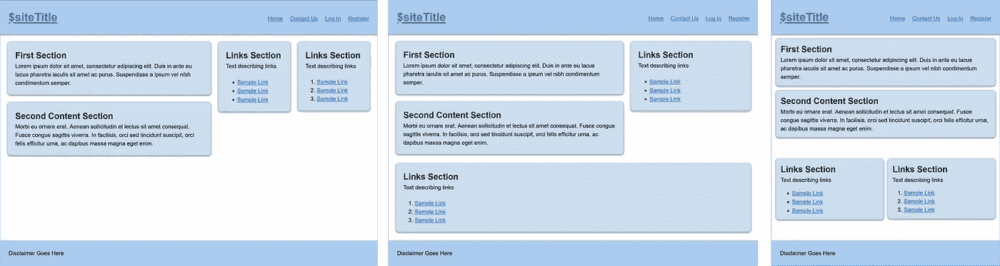

# 没有媒体询问的响应性布局！

> 原文：<https://medium.com/codex/responsive-layouts-without-media-queries-5d7fd989be72?source=collection_archive---------3----------------------->

我的一个朋友曾经开玩笑说

> HTML 已经有反应了。设计师才是搞砸这一切的人。

这是一个奇怪的想法，但基本上是正确的。如果你用适当的语义标记编写普通的 HTML，流和自然包装行为会给你一个至少在现有的每一个 u a 上都可用的页面。这是…