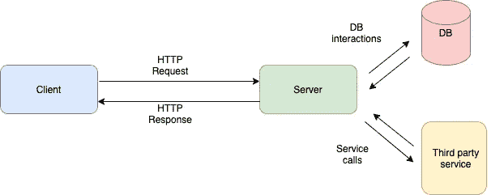
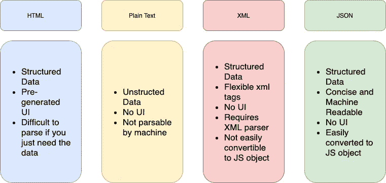
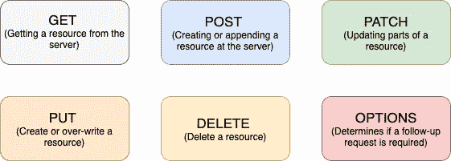

# 5 分钟内讲解 REST APIs

> 原文：<https://medium.com/codex/rest-apis-explained-in-5-mins-b8f83399c6cf?source=collection_archive---------6----------------------->

关于什么是 REST API，已经有了这么多的技术定义。但是，大多数定义都不太好理解。这篇帖子试图用简单的英语解释什么是 REST API，它解决了什么痛点。

web 应用程序的基本架构

# 背景

使任何 web 应用程序工作的一种方法是在服务器端创建数据嵌入 UI，并将整个 UI 以 HTML 的形式传递给客户端。人们可以使用像 EJS 或 PUG 这样的模板语言在后端服务器上生成 HTML 代码。

然而，并不是每个客户端都希望得到 HTML 模板形式的响应。想想不使用 HTML 的移动应用程序。我们可能希望像谷歌地图那样为第三方应用程序创建服务 API。人们对他们的用户界面一无所知。一个人只需要数据，客户端被期望在自己生成的接口中填充这些数据。

移动应用程序可能想使用 Java、Swift、Objective C 等不同的库。Web 应用程序可能想要使用 Angular.js、Vue.js 或 React.js，因此，在后端决定 UI 可能不是一个好的决定。此外，第三方应用程序的服务 API 不需要用户界面，它们只需要数据。

此外，现在 SPAs(单页应用程序)也在客户端使用。他们不期望 URL 会因为 UI 的改变而改变。这使得用户体验很差。他们只需要使用浏览器呈现的 javascript 来改变 UI。你四处点击，然后你不要等待页面刷新。数据交互和填充在后台进行。

因此，到目前为止，我们所理解的问题是 UI 和数据需要解耦，以便数据可以跨多个客户端平台使用。

后端需要不同类型的响应。我们需要传输数据而不是 UI。我们让客户端(移动设备、SPA、第三方应用程序)来处理数据。

# REST(表象状态转移)。

客户机-服务器体系结构由请求、响应和资源组成。资源是请求操作的 HTTP 请求的目标。它可以是数据库中的条目、图像、文档或任何东西。客户端通过 HTTP 请求对资源进行操作，并期望得到一个响应，给出关于在资源上执行所需操作的信息。

现在，以哪种格式期待来自服务器的数据。下图显示了不同类型的数据格式，这些数据格式可以通过具有其独特特征的 API 响应来呈现。

不同类型的数据格式

最适合 REST APIs 的数据格式是 JSON (Javascript 对象符号)。这使得人们可以获得简洁的结构化数据，并且易于机器和人阅读。此外，它可以很容易地转换成 JS 对象，JS 最终会在浏览器中运行。

我们从之前的知识中知道，什么是 API(应用编程接口)。它是信息提供者和信息使用者之间的契约，有一套定义和协议。换句话说，如果你想与计算机或系统交互以检索信息或执行某项功能，API 可以帮助你传达你希望系统做什么，以便它能够理解并完成请求。

现在让我们理解什么是 API 端点。API 端点是 HTTP URL 和 HTTP 动词的组合。HTTP 动词定义了请求的性质。请求会给资源带来什么变化？它只是获取资源、创建资源、修改资源、替换资源等等吗？

由此，得到[https://example.com？user_id=1](https://example.com?user_id=1) 是一个端点。它表示我们想从代表 example.com 服务器的 url 中获取 user_id 为 1 的资源。
下面的信息图展示了不同的 HTTP 动词及其用例。

HTTP 动词

使用正确的动词使 API 端点更容易预测。虽然，这只是惯例问题。您可以使用任何动词，并在服务器上执行您选择的代码。您可以发出 GET 请求，在数据库中创建一个条目。这是完全可能的。但是这只会给客户造成混乱，因为他无法预测 API 端点的行为。

现在我们来定义一下。当客户端通过 RESTful API 发出请求时，它会将资源状态的*表示从客户端传输到服务器。状态可以表示关于客户的信息，即客户是谁，他被授权做什么，他请求在服务器上获得或改变哪个资源，他想要在服务器上做什么改变等等。*

服务器事先不知道客户是谁，何时请求任何资源。每个请求都与前一个请求断开连接，并且在服务器端不维护任何用户会话。在维护与用户相关的信息(尤其是与用户身份相关的信息)至关重要的情况下，客户端会在 auth 报头中使用 JWT 令牌来对自身进行认证和授权。令牌再次存储在客户端，而不是服务器。服务器只生成或验证令牌，但从不存储它。因此，REST API 完全是无状态的。

REST 约定充分利用头部来传输关于资源的元数据。所有的授权令牌、在条款或格式方面期望什么样的响应等都通过请求和响应报头来传递。

最后总结一下，以下是 REST 架构的主要原则:

*   由客户机、服务器和资源组成的客户机-服务器体系结构，通过 HTTP 管理请求
*   [无状态](https://www.redhat.com/en/topics/cloud-native-apps/stateful-vs-stateless)客户端-服务器通信，这意味着 get 请求之间不存储任何客户端信息，每个请求都是独立的，互不关联的。
*   统一接口:明确定义的 API 端点，以及请求和响应数据结构。人们能够在客户机请求中准确地定义资源的状态。
*   分层系统:服务器可能会将 HTTP 请求转发给其他服务器，而客户端对此没有可见性
*   简化客户端-服务器交互的可缓存数据。服务器发送给客户端的数据可以被缓存，一旦过期，可以再次请求该数据
*   按需编码(可选):在请求时从服务器向客户机发送可执行代码的能力，扩展了客户机的功能。然而，它很少被使用。

# 结论

宁静的建筑是当今最受欢迎的建筑。很多人使用，很多人谈论，但是现在很好理解。这篇文章试图用最简单的语言解释 REST 原则。如果你喜欢这篇文章，并发现它是相关的，请在媒体上给一些掌声，并与相关人士分享。非常感谢你阅读这篇文章！！