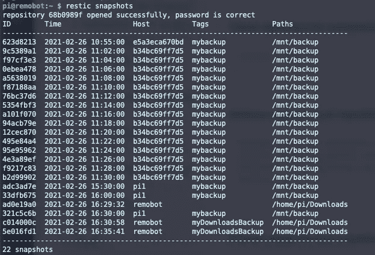

# Restic 备份 II —实际应用

> 原文：<https://medium.com/codex/restic-backup-ii-in-action-d8bad3d9e034?source=collection_archive---------2----------------------->

## [法典](http://medium.com/codex)

查看 restic 的运行情况

# TL；速度三角形定位法(dead reckoning)

这篇博文是关于 restic 的四篇博文中的第二篇，restic 是一个简单、漂亮、功能极其丰富的文件备份解决方案。我展示了 restic 在实际应用中的样子，简要概述了它的核心功能，比如备份、处理备份报告任务、找到正确的文件以及恢复它们。

# restic 博客文章系列