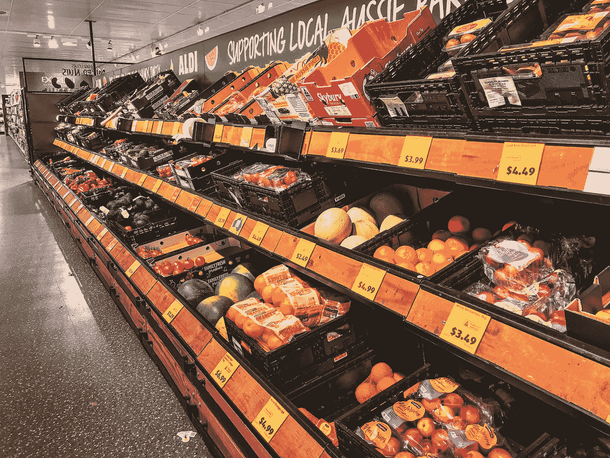

# 使用沃尔玛数据进行零售分析—第 1 部分

> 原文：<https://medium.com/codex/retail-analysis-with-walmart-data-part-1-5fe1c81e9617?source=collection_archive---------2----------------------->

沃尔玛 45 家门店的机器学习模型分析与构建

在 [Unsplash](https://unsplash.com?utm_source=medium&utm_medium=referral) 上由[Marques Thomas @ querysprout . com](https://unsplash.com/@querysprout?utm_source=medium&utm_medium=referral)拍摄的照片

很难预测任何零售商店的需求，因为每天都会有特定的事件和假期影响销售。我们有沃尔玛 45 家商店的销售数据。在第 1 部分中，我将一步一步地告诉你如何着手这个项目。您将学习执行基本的统计任务以获得洞察力，在第 2 部分，您将学习如何在机器学习算法的帮助下处理不可预见的需求。让我们开始吧。

## **数据集描述**

沃尔玛全年都会举办几次促销活动。这些降价发生在突出的假日之前，四个最大的假日是超级碗、劳动节、感恩节和圣诞节。包含这些假期的周在评估中的权重是非假期周的五倍。这项比赛的部分挑战是在缺乏完整/理想的历史数据的情况下，模拟降价对这些假日周的影响。位于不同地区的 45 家沃尔玛商店的历史销售数据可用。

> **(1)导入所需的库和数据集—**

***导入所需的库和数据集***

> **(2)更改“日期”列的数据类型—**

我们正在更改“日期”列的数据类型，因为它是一个对象类型。

***改变“日期”列的数据类型***

这里，数据集没有任何空值。因此，我们已经准备好进行基本的统计工作。

> **(3)统计任务—**

哪家商店的销售额最高？

为了找出最大销售额，我将创建一个名为“total_sales”的新变量。然后按店铺分组，求出每个店铺的周销售额总和。这会给我带来最大的销售额。商店 20 的最高销售额为 301，397，792 美元。你也可以找到最低销售额。

**最高销售额**

哪家商店的标准差最大，即销售额变化很大。此外，找出均值对标准差的系数。

要找出最大标准偏差，请创建一个新变量，然后按商店对其进行分组，并找出标准偏差。 **Store-14 的最大标准差= $317，569.949。**下一题求均值对标准差的系数，**均值对标准差的系数= 15.71%。**

**最大标准差**

**均值到标准差**

*c . 2012 年第三季度，哪家店铺的季度增长率较高？*

首先，找到 Q2 的销售额，然后是第三季度的销售额，去掉差额，然后找到增长率。**在 2012 年第 3 季度，没有一家商店出现季度增长。**

**2012 年第三季度增长率**

*D .一些节假日对销售有负面影响。找出所有商店销售额高于非假日季节平均销售额的假日。*

我们有 4 个节日活动，(1)超级碗:2010 年 2 月 12 日，2011 年 2 月 11 日，2012 年 2 月 10 日，2013 年 2 月 8 日，(2)劳动节:2010 年 9 月 10 日，2011 年 9 月 9 日，2012 年 9 月 7 日，2013 年 9 月 6 日，(3)感恩节:2010 年 11 月 26 日，2011 年 11 月 25 日，2012 年 11 月 23 日，2013 年 11 月 29 日，(4)圣诞节:2010 年 12 月 31 日，30 日

现在计算每个事件的假日事件销售额，然后找出非假日销售额。我发现**感恩节的销售额(1471273.43 美元)高于非节日销售额(1041256.38 美元)。**

**节日活动销售**

**非假日销售和比较**

e .提供每月和学期的单位销售额，并给出见解。

现在，绘制一个月的周销售额条形图，以了解哪个月的销售额最高，然后我绘制一个年的周销售额条形图，以了解哪一年的周销售额最高。

**月度周销售额**

**年度周销售额**

我得出了一些感悟——**(1)2010 年销量最高，2012 年销量最低。(2)12 月份的周销售额最高。(3)2011 年的周销量最高。**

瞧，你已经完成了基本的统计任务，我希望你喜欢用沃尔玛数据进行零售分析的第 1 部分。在下一部分中，您将学习如何建立一个统计模型来预测需求。

在这里找到我的 Kaggle 笔记本*。*

* [## Python vs R

### 了解 Python 和 R 之间基本区别的终极指南

medium.com](/codex/python-vs-r-72d025abe089)  [## 特征选择

### 选择最重要的特征并舍弃其余的最有效的方法

medium.com](/codex/feature-selection-3da61dcabb3c) 

感谢您的阅读！如果您关注我或与他人分享这篇文章，我将不胜感激。最美好的祝愿。

## 你会支持 awesome❤️*