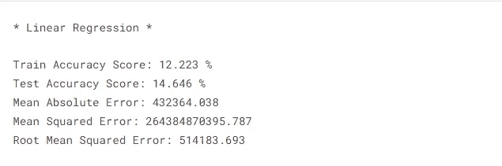

# 使用沃尔玛数据的零售分析—第二部分

> 原文：<https://medium.com/codex/retail-analysis-with-walmart-data-part-2-21934aeb0d77?source=collection_archive---------9----------------------->

为沃尔玛的 45 家商店建立机器学习模型

马库斯·温克勒在 [Unsplash](https://unsplash.com?utm_source=medium&utm_medium=referral) 上的照片

很难预测任何一家零售店的需求，因为每天都会有特定的事件和假期影响销售。我们有沃尔玛 45 家商店的销售数据。在第 1 部分中，我已经介绍了如何逐步实现这个项目。您已经学习了获得洞察力所需执行的基本统计任务，现在在第 2 部分中，您将学习如何在机器学习算法的帮助下处理不可预见的需求。让我们开始吧。找到下面的第 1 部分。

 [## 使用沃尔玛数据进行零售分析—第 1 部分

### 沃尔玛 45 家门店的机器学习模型分析与构建

medium.com](/codex/retail-analysis-with-walmart-data-part-1-5fe1c81e9617) 

## 数据集描述

沃尔玛全年都会举办几次促销活动。这些降价发生在突出的假日之前，四个最大的假日是超级碗、劳动节、感恩节和圣诞节。包含这些假期的周在评估中的权重是非假期周的五倍。这项比赛的部分挑战是在缺乏完整/理想的历史数据的情况下，模拟降价对这些假日周的影响。位于不同地区的 45 家沃尔玛商店的历史销售数据可用。在这里找到我的 Kaggle 笔记本*。*

*在第 1 部分中，我们导入了库，分析了数据，然后回答了统计任务。现在是时候建立一个模型并预测每周的销售额了。*

*大多数机器学习算法在存在异常值的情况下效果不佳。因此需要检测并去除异常值。*

> *异常值增加了数据的可变性，从而降低了统计能力。因此，**排除异常值会使您的结果变得具有统计意义**。*

## *模型结构*

*首先，定义因变量和自变量。这里，商店、燃料价格、CPI、失业、日、月和年是自变量，周销售额是因变量。现在，该训练模型了。从 sklearn.model_selection 导入 train_test_spit，对 80%的数据进行训练，对剩下的 20%的数据进行测试。*

*我们需要对数据进行标准化，因为我们希望将所有要素归入一个通用范围，而不会扭曲值范围的差异。*

**

***列车测试拆分和标准化***

*我们使用了 4 种不同的算法来了解使用哪种模型来预测每周销售额。*

## *(1)线性回归*

**

***线性回归(输出)***

**

***回归剧情***

## *(2)随机森林回归量*

**

***随机森林回归量(输出)***

**

***回归图***

## *(3)决策树回归器*

**

***决策树回归器(输出)***

**

***回归图***

## *(4)近邻*

**

***knarest 邻居(输入)***

**

***回归图***

> *我还做了交叉验证，这是一种评估 ML 模型的方法，涉及在可用输入数据的子集上训练大量 ML 模型，并在数据的互补子集上评估它们。交叉验证可用于检测过度拟合，或泛化模式的失败。*

**

***线性回归 CV***

**

***随机森林回归 CV***

**

***决策树回归 CV***

**

****最近邻 CV****

> *这里，我们使用了 4 种不同的算法来了解使用哪种模型来预测每周销售额。线性回归不是一个合适的模型，因为它的精确度很低。然而，随机森林回归给出了几乎 **95%** 的准确度。因此，它是预测周销售量的最佳模型。*

*感谢您的阅读！如果您关注我或与他人分享这篇文章，我将不胜感激。最美好的祝愿。*

## *你会支持 awesome❤️*

* [## Python vs R

### 了解 Python 和 R 之间基本区别的终极指南

medium.com](/codex/python-vs-r-72d025abe089)*