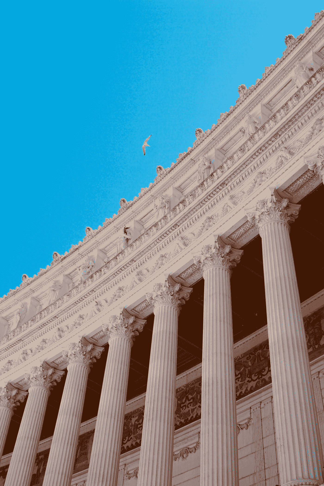

# 反思数据治理

> 原文：<https://medium.com/codex/rethinking-data-governance-c15fc41fc7fa?source=collection_archive---------10----------------------->

李·杰夫斯的照片在 [Unsplash](https://unsplash.com?utm_source=medium&utm_medium=referral) 上|数据治理存在的真正原因是为了让我们能够建立真理的普遍来源。

如今，当数据治理在会议上被提及时，随之而来的通常是一波疯狂的哈欠和手臂伸展。我承认这看起来很乏味。我希望在本文结束时，您会重新思考数据治理的想法，并将其重新评估为业务战略的核心要素。

> 据 [IDC](https://www.idc.com/) 称，未来 5 年，治理、风险和合规性领域的投资将超过 20 亿美元。[1]

在研究这个主题之前，我认为数据治理只影响少数专家。我现在重新思考的是糟糕的数据治理的爆炸半径。组织中的每个成员都会消耗数据。无论你是销售经理、高级主管还是毕业的开发人员，你都是数据消费者。数据治理渗透到组织的所有层。如果做得不好，整个组织都会感受到糟糕的数据治理。

## 建立共同点

我将“数据治理定义为对数据资产的管理行使权力和控制。”[2]换句话说，数据治理是组织在实现法规遵从性的同时管理和保护其数据的方式。在数据法规、业务策略和其他形式的合规性的背景下看待数据治理非常重要。例如，一家软件公司将启动一项专注于 [GDPR](https://gdpr.eu/) 合规性的数据治理计划。金融机构可能更关心 FATCA 协议和巴塞尔协议 III 的合规性。[3]

## 数据治理为什么存在？

数据治理存在的真正原因是我们可以建立普遍的真理来源。还记得你的英语老师警告你*用具体的证据来支持你的观点吗*？那是因为证据加强了你论点的完整性。人们更相信由准确可靠的数据支持的论点。您可以看到为什么数据治理会提高组织数据的信任度和完整性。[4]

## 你如何知道真相的来源是可靠和准确的？

那是人们进来的地方！没有人，数据治理就什么都不是。像 CDO、数据管家、数据治理委员会和数据消费者这样的角色都有这份工作。我们需要组织中的人作为决策者来推动组织数据的一致性。我们需要人们定义哪些数据源可以产生准确的信息，哪些流程可以提取数据，以及需要定义哪些指标来衡量数据治理和数据质量。

## 关键要点:

1.  数据治理对我们所有人都很重要，并且影响着我们所有人。这不再是专家们争论的神秘话题。
2.  数据治理是组织在实现法规遵从性的同时管理和保护其数据的方式。
3.  数据治理为组织带来了更大的信任和弹性。它创造了一个持续的[组织！](https://www.amazon.co.uk/Built-Last-Successful-Visionary-Essentials-ebook/dp/B0058DRSHW)

数据治理创造了一个更加信任和有弹性的组织。

# 结论

数据治理是组织管理和保护其数据的方式。这会带来更大的信任和诚信。人们对他们的组织过程有更大的信任。人们对他们的系统更有信心。人们更加信任彼此。这反过来产生了更大的责任。它最终会建立一个更加信任和有弹性的组织。

## 脚注和参考文献:

[1] [国际数据公司](https://www.idc.com/)

[2]根据 *TechTarget* 的说法，数据治理是

对企业中使用的数据的可用性、可用性、完整性和安全性的全面管理。一个完善的数据治理计划包括一个治理机构或委员会、一组定义好的程序和一个执行这些程序的计划。

简而言之，数据治理包括人员、流程和技术协同工作的方式，以实现对已定义和商定的数据策略的可审计合规性

一个真正成功的治理策略不仅要解决所涉及的工具，还要解决人员和过程。

[3]客户关于治理的问题通常涉及 3 个风险因素:

*   保护数据
*   法规和合规性
*   可见性和控制

[4] " [数据治理:权威指南](https://learning.oreilly.com/library/view/data-governance-the/9781492063483/titlepage01.html) " —埃夫伦·埃里尤雷克、尤里·吉拉德、瓦利亚帕·拉克什马南、安妮塔·基本古奇-格兰特和施巧灵·阿什当撰写的《实施数据信任的人员、流程和工具》