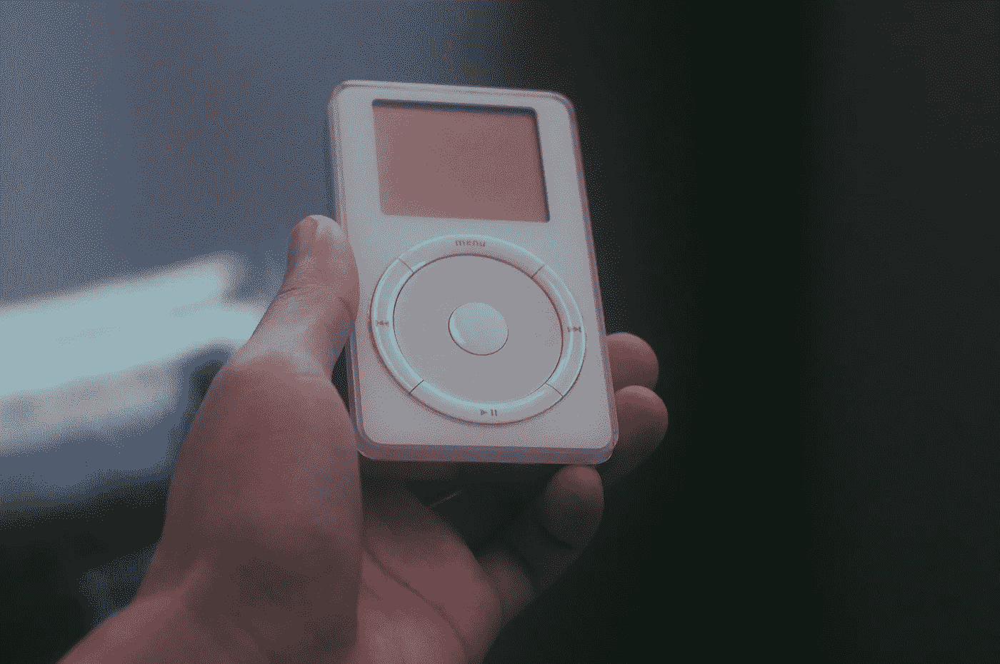

# 复古技术:iPod

> 原文：<https://medium.com/codex/retro-tech-the-ipod-a25067feebd2?source=collection_archive---------20----------------------->

## 你口袋里的世界

照片由[漫画复数](https://unsplash.com/@asobarks)上的 [Unsplash](https://unsplash.com/photos/LFeuBkKn9_A)

一个 pple 项目 P-68，扬琴，是 iPod 的代号，当时这款传奇音乐播放器还在研发阶段。2001 年 9 月 iPod 发布后，它成为年轻人的世界现象和文化特征。后来，几乎每个 iPod 系列都成为最热门的商品，包括 iPod Classic、iPod Mini、iPod Color、iPod Video、iPod Nano 和 iPod Touch。