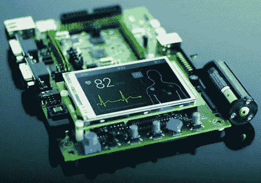

# 使用 QEMU 对裸机内核映像进行逆向工程——第 1 部分

> 原文：<https://medium.com/codex/reverse-engineering-bare-metal-low-level-kernel-images-with-qemu-getting-started-c705b7b14d35?source=collection_archive---------5----------------------->



来自[https://olayiwolaayinde . medium . com/why-learn-embedded-systems-87 bbf 5a AFD 04](https://olayiwolaayinde.medium.com/why-learn-embedded-systems-87bbf5aafd04)

**本教程是裸机逆向工程系列的一部分**

自从我拆开了几部 Android 手机后，我对嵌入式系统的好奇心开始增长。虽然我不是嵌入式系统，但我知道手机最终会取代电脑；因此，我想更多地了解他们。那时我开始学习 ARM，并发现它们和嵌入式设备有许多相似之处。在那之后，我开始了比赛:我开始学习关于嵌入式设备的一切知识。

**什么是嵌入式系统？—** 嵌入式系统是一种尽可能高效、经济地服务于单一目的的设备。最常见的例子是物联网设备(如相机)。通常这需要软件只运行需要的东西；因此，需要嵌入式操作系统(例如嵌入式 Linux)。

我决定探索的第一套嵌入式系统是 Raspberry Pis，因为我已经有了一些使用它们的经验(专门针对基于 hackathon 的项目，而不是逆向工程或二进制开发)。它也是一个非常完善的系统，这使得学习它的某些方面是如何工作的更加容易(包括软件和硬件)。最后，它使得为它寻找开发工具变得更加容易，包括模拟器，这样我就可以随时随地进行我的项目。

你也不一定要从覆盆子馅饼开始...还有其他像 Beaglebone 设备，路由器，相机，等等。然而，对于本教程，我将主要关注树莓 Pi 0。

在进一步阅读之前，你应该知道一些基本的事情:

*   串行通信:这是通常用于调试输入和输出的信号。通常，这需要将电缆连接到引脚上；然而，使用 QEMU，我们可以将它模拟为 stdin/stdout。
*   引脚:这是嵌入式系统发送信号的方式(串行、JTAG 等)。
*   工具链:这是我们编译代码的方式。我们将经常进行交叉编译(因为我们在本教程中假设我们没有任何 ARM 硬件)。你可能听到的工具链是 **eabi、gnueabi 和 gnueabi-hf** 。对于本教程，我们将只考虑 **eabi** ，因为它是裸机工具链(例如，没有操作系统)。有关 gnueabi 和 gnueabi-hf 的更多信息，请点击此处。

首先，我们需要某种 Linux 平台。为此，我使用了 Ubuntu 20.04，但是你可以选择任何你想要的与我下面列出的软件兼容的发行版。在您的发行版中，我们需要安装以下软件:

*   GDB 多元建筑— `**sudo apt install gcc-multiarch**`
*   qemu(我在这个演示中用的是 5.2)——【https://www.qemu.org/download/#source】
*   **一个逆向工程工具(我推荐 **Ghidra** ，不过这是个人喜好)**
*   **可选项:gcc-arm-none-eabi — `**sudo apt install arm-none-eabi-gcc**`**

**为此，我们将与 qemu-system-arm 合作(它也是 qemu-system-aarch64 的一部分)。它有许多不同的设备已经默认支持和其他你可以做的。关于使用 qemu-system-arm，有一些重要的事情需要注意。首先，您将需要指定如何读取输出和写入输入(特别是对于串行)。因为我们没有使用实际的硬件，所以我们不能使用引脚作为与设备交互的方式。例如，假设我们想要模拟一个名为 **kernel.img** 的内核，我们需要运行以下命令来运行它:**

```
**- qemu-system-aarch64 -M raspi0 -kernel kernel.img -serial null -serial stdio**
```

**如果我们想做同样的事情，但我们可以连接到 GDB，我们可以运行以下命令:**

```
**- qemu-system-arm -M raspi0 -kernel kernel.img -serial null -serial stdio -S -gdb tcp::4269 -boot c**
```

**这个命令具体做的是打开一个我们可以通过 gdb-multiarch 连接的 gdb 服务器，并以这种方式与之交互。为了连接到它，我们运行以下命令。**

```
**- gdb-multiarch
- add-symbol-file kernel.elf <addr> — Run this command if you have an elf file for your kernel, otherwise, it is optional. 
- target remote localhost:<port>**
```

**我强烈建议将它作为 gdb 脚本文件。这样，你也可以让 gdb 更容易管理。这里有一些关于 GDB 脚本的不错的教程:**

**[https://www.adacore.com/gems/gem-119-gdb-scripting-part-1](https://www.adacore.com/gems/gem-119-gdb-scripting-part-1)T12[https://www.adacore.com/gems/gem-120-gdb-scripting-part-2](https://www.adacore.com/gems/gem-120-gdb-scripting-part-2)**

**您也可以使用 GEF 进行调试；但是，您需要运行以下命令:**

```
**gdb-gef-multiarch (or however you bring it up on the console)
set architecture arm 
add-symbol-file kernel.elf <addr>
gef-remote -q localhost:<port>**
```

**现在我们有了执行代码的环境，有几种方法可以评估内核。除了 GDB，我们还需要一个反汇编/反编译程序，比如二进制忍者或者 Ghidra。这将有助于我们对内核进行逆向工程，尤其是准系统程序。准系统软件是指软件直接在没有操作系统功能的硬件上运行。这有时甚至没有像 **stdio.h 或 stdlib.h** 这样的标准库。因此，我们将没有符号，除非我们有一个 ELF 文件。即使这样，如果使用标准库，反编译程序和反汇编程序也有可能无法识别它们。**

**最后，学习如何阅读 ARM 汇编代码至关重要。大多数嵌入式系统使用 ARM 架构；然而，有些人仍然使用 MIPS，在极少数情况下，使用 Power PC。您想要熟悉的一些术语:**

*   **呼叫约定**
*   **序言**
*   **尾声**
*   **登记**
*   **记忆**

**在继续学习之前，你应该做的一个很棒的教程是 Azeria。它有七个部分，你将能够开始学习如何逆转和利用基于 ARM 的代码。**经历这一切！**链接:【https://azeria-labs.com/writing-arm-assembly-part-1/】T4**

**您可能需要考虑的其他一些事情:**

*   **开始学习一些 **Python** ，你会经常用它来开发和逆向工程脚本(这会让你的生活变得简单很多)。**
*   **获取 **pwntools** ，这将帮助你开发，它支持 arm 和 aarch 64—[https://docs.pwntools.com/en/latest/](https://docs.pwntools.com/en/latest/)**
*   **获取 **angr** :这将帮助你发现漏洞，并对重复性任务进行逆向工程——https://docs.angr.io/**

**现在你已经准备好了！你现在应该做的是尝试解决 CTF 挑战，或者对你感兴趣的内核进行逆向工程。稍后，我将回顾一些你可能已经错过的重要概念(我是通过艰难的方式学到的)。**