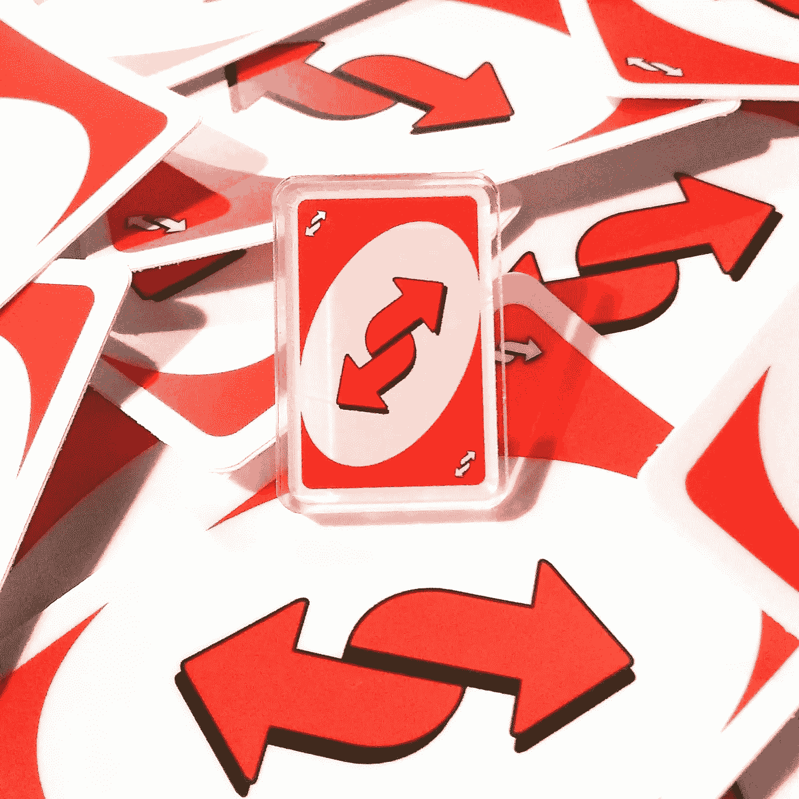
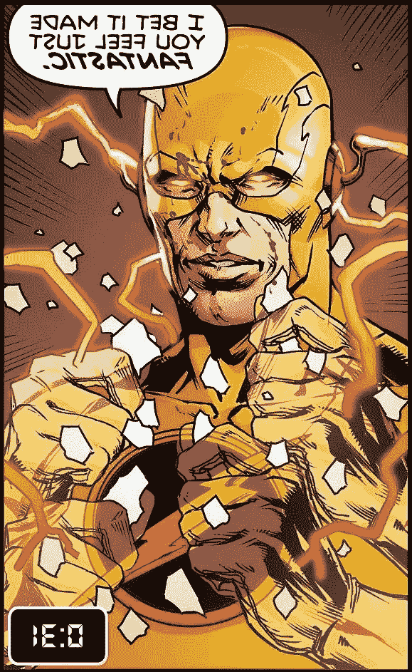

# JavaScript 上的反向字符串

> 原文：<https://medium.com/codex/reverse-string-on-javascript-d6a4e0ce8c68?source=collection_archive---------7----------------------->


图片由 Unsplash 提供

你有没有试过从镜子里读一本打开的书，上面有反过来的字母？我的确尝试过读反信，也许你也是。当他们还是孩子的时候，更多的人也试着从镜子里阅读打开的书。我们都是好奇的孩子，我们没有 YouTube 或 Tik Tok，所以我们有足够的时间在镜子前发现字母看起来是反的。

你知道谁也很好奇吗？下一个你要进行技术面试的招聘经理可能会问你这个问题；"你能反转一根绳子吗？"在几个月前的模拟技术面试中，面试官要求我创建一个反转字符串的函数。众所周知，反向字符串算法是技术访谈中讨论最多的算法之一。

所以让我们深入其中，用 JavaScript 以不同的方式反转一些字符串。

# 用 For 循环反转

首先，让我们通过使用一个`for`循环来看看代码，看看我们将要做的所有一行程序背后的逻辑。如果在另一个代码中要求这样做，这也将有助于解决问题。

```
function reverseWordsForLoop(str) {
  let newString = ""

  for (let i = str.length - 1; i >= 0; i--) {
    newString += str[i];
  }
  return newString;
}
```

正如您在 for 循环中看到的，`i`起点代表字符串的最后一个字符。只要`i`变长或等于 0，`i`就会递减。对于每次迭代，最后一个字符将被添加到`newString`，形成我们想要的结果反转字符串。

所以如果我们打电话。

```
reverseWordsForLoop(“loop”)
```

我们有一个游泳池。


来自 swimmingpool.com

# 反向串一行

既然我们已经尝试了使用传统的`for`循环进行反转，那么让我们继续做一些 JavaScript 技巧。首先，我们用一行代码反转一个单字字符串。

```
function reverseString(str) {
  return str.split('').reverse().join('')
}
```

我们要做的是使用以下方法返回一个字符串:

*   `split()`返回一个新数组。
*   `reverse()`反转新数组。
*   `join()`将新数组的所有元素连接成一个字符串。

这样，我们会打电话；

```
reverseString(“look”)
```

把罗伯特·库尔·贝尔从库尔一伙手里抓回来。


# 颠倒词序

假设我们只想颠倒单词而不是字母。我们还可以克服任何额外的空格，返回不带任何空格的字符串，并以相反的顺序返回字母。这是我们要写的完成任务的函数。

```
function reverseWordsOrder(str) {
  return str.split(' ').filter(word => word !== "").reverse().join(' ')
}
```

这里，我们补充一下。在 split 方法之后过滤，在这种情况下，我们将使用 word 作为参数，但是如果你想让代码更短一点，你可以使用任何字母。我们将过滤掉不等于空白的所有内容，并继续我们到目前为止所做的其余工作。

那样的话，你可以用反卡以任何你想要的方式赢得一场 Uno 游戏；

```
reverseWordsOrder(“Win my reverse card Uno”)
```



[Uno 卡逆转我的胜利](https://www.etsy.com/listing/941438151/uno-reverse-card)

# 颠倒句子中的每个单词

我们最后的练习将会是一个完整的句子。

```
function reverseWordsLetters(str) {
  return str.split(' ').map(el => el.split('').reverse().join('')).join(' ')
}
```

在这种情况下，我们在 split 之后调用的方法是。使用 split 调用创建的数组的每个元素。在关闭括号后，让我们再次调用 join，这样我们将得到想要的字符串。

**注意:**我知道这可能会令人困惑。我建议删除一些方法并运行代码来理解函数是如何工作的。

写任何一句话，都会像从镜子里看漫画书一样。

```
reverseWordsLetters("I bet it made you feel just fantastic")
```



反向闪光是 DC 漫画公司的财产

现在我们知道如何反转一个字符串，让我们继续学习新的算法和技巧，以留下深刻印象，并获得一些漂亮的单行解决方案。

编码快乐！

# **概述**

1.  反向算法介绍。
2.  用 For 循环反转。
3.  与单行函数相反。
4.  颠倒词序。
5.  颠倒完整的句子。

# 参考

1.  MDN 网络文档，[反向](https://developer.mozilla.org/en-US/docs/Web/JavaScript/Reference/Global_Objects/Array/reverse)