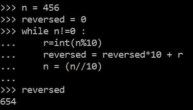

# 在 Python 中以不同的方式反转不同的对象

> 原文：<https://medium.com/codex/reversing-different-objects-in-different-ways-in-python-c81c386ee386?source=collection_archive---------6----------------------->

## [法典](http://medium.com/codex)

由[山姆·巴伯](https://unsplash.com/@milltownphotography?utm_source=unsplash&utm_medium=referral&utm_content=creditCopyText)在 [Unsplash](https://unsplash.com/s/photos/reverse?utm_source=unsplash&utm_medium=referral&utm_content=creditCopyText) 上拍摄的照片

你好，我们将探讨 python 中反转对象(字符串、列表、…)的各种方式。

## **用 reverse()方法反转列表**

该方法不接受任何参数，也不返回任何内容。它只是颠倒了原来的列表。

代码 1

## **用 reversed()函数反转列表**

它返回一个迭代器对象，这样我们可以以相反的顺序遍历列表。它不会改变原始列表。

我们可以使用 list comprehension(在图中)或 list()函数来创建原始列表的反向列表作为新列表。

代码 2

对于使用迭代但在内部使用的 list()函数，我们应该写 x=list(r)。我们应该注意，如果我们再次对 r 应用这两种方法中的一种，我们会得到一个空列表。

代码 3

这是因为 r 是一个迭代器，所以在执行上述语句时，python 会在每个迭代中使用 next(r)来访问 r 中的值。

使用 iter()函数，我们可以从列表中创建一个迭代器。

代码 4

## **通过反转子集来反转列表**

这将返回列表的副本。

代码 5

## **使用 NumPy 库反转列表**

NumPy 是一个用于线性代数的 python 库。我们可以使用它的 flip()方法来反转一个用 NumPy 创建的列表(数组)。它返回一个新的数组。

代码 6

## **用 reversed()函数反转字符串**

代码 7

## **用反转子集反转字符串**

代码 8

## **用 NumPy 库沿所选轴反转矩阵**

我用 2D 矩阵证明了这一点。我前面提到的 flip()方法有第二个可选参数，可以是 None、integer 或 tuple of integers。使用它可以沿所需的一个或多个轴翻转。

默认情况下，axis=None 将翻转输入数组的所有轴。如果 axis 是整数元组，则对元组中指定的所有轴执行翻转。

代码 9

如果你对此感到困惑，沿 0 轴是指在**垂直**方向上沿行和考虑最外层括号的项目。沿轴 1 是指在**水平**方向沿立柱并考虑第二最外层支架的物品。

有关 3D 示例，请参考文档中的链接:

[https://numpy . org/doc/stable/reference/generated/numpy . flip . html](https://numpy.org/doc/stable/reference/generated/numpy.flip.html)

## **反转一个整数**

在这个例子中，如果你跟踪循环的每一次迭代，你会发现循环内部的过程很简单。(纸笔可以帮忙)

代码 10

## **用**反转子集来反转一个元组

代码 11

## 用 reversed()函数反转元组

代码 12

## 反转字典中的每个键值对

代码 13

感谢阅读。祝你平安。如果你喜欢它，请按拍手选项。