# 综述——CoGAN:耦合生成对抗网络(GAN)

> 原文：<https://medium.com/codex/review-cogan-coupled-generative-adversarial-networks-gan-273f70b340af?source=collection_archive---------8----------------------->

## [法典](http://medium.com/codex)

## 通过权重共享，为相同的输入生成不同域中的相关输出，优于 [CGAN](/@sh.tsang/review-cgan-conditional-gan-gan-78dd42eee41)

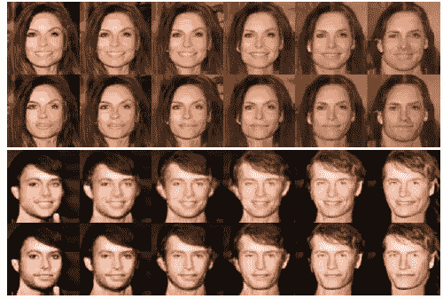

**脸代带笑和不带笑**

在这个故事中，回顾了三菱电机研究实验室(MERL)的**耦合生成对抗网络(CoGAN)** 。

> 本文研究从数据中学习多域图像的联合分布的问题。

在本文中:

*   **单个输入向量可以通过多个******加权共享产生不同域的相关输出。****
*   **可能的应用:产生彩色图像和深度图像，其中这两个图像高度相关，即描述相同的场景，或者具有不同属性(微笑和非微笑)的相同面部的图像。**

**这是一篇发表在 **2016 NIPS** 的论文，被引用超过 **1100 次**。( [Sik-Ho Tsang](https://medium.com/u/aff72a0c1243?source=post_page-----273f70b340af--------------------------------) @中)**

# **概述**

1.  ****耦合生成对抗网络****
2.  ****实验结果****

# ****1。耦合生成对抗网络(CoGAN)****

**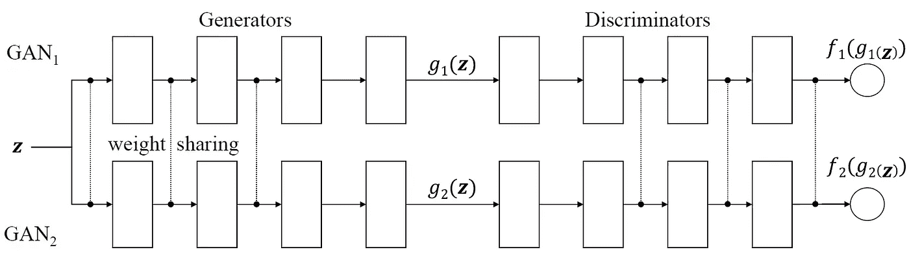**

****耦合生成对抗网络****

*   **上图所示的 CoGAN 是为**学习两个不同域中图像的联合分布而设计的。****
*   ****它由一对**[**GAN**](/@sh.tsang/review-gan-generative-adversarial-nets-gan-e12793e1fb75)**s—**[**GAN**](/@sh.tsang/review-gan-generative-adversarial-nets-gan-e12793e1fb75)**1 和**[**GAN**](/@sh.tsang/review-gan-generative-adversarial-nets-gan-e12793e1fb75)**2**组成；每个人负责合成一个领域的图像。**

> **通过权重共享，经过训练的 CoGAN 可以用于合成成对的对应图像——成对的图像共享相同的高级抽象，但具有不同的低级实现。**

## **1.1.发电机**

*   ***g* 1 和 *g* 2 均被实现为多层感知器(MLP):**

**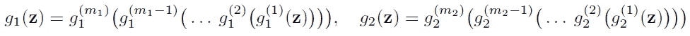**

*   **其中 *g* ( *i* )1、 *g* ( *i* )2 为 *g* 1、 *g* 2、 *m* 1、 *m* 2 为 *g* 1、 *g* 2 中的层数。**
*   **通过多层感知器操作，生成模型逐渐将信息从更抽象的概念解码为更具体的细节。**
*   ****第一层解码高层语义** **最后一层解码低层细节。****
*   **最后一层没有强制约束。**

> **想法是**强制 *g* 1 和 *g* 2 的第一层具有相同的结构并分担重量。****
> 
> **通过权重共享，这对图像可以共享相同的高级抽象，但是具有不同的低级实现。**

## **1.2.鉴别器**

*   **判别模型将输入图像映射到概率得分，估计输入来自真实数据分布的可能性。**
*   ****判别模型的第一层提取低级特征，而最后一层提取高级特征。****
*   **与生成器类似，**最后一层是重量共享的。****

> **但是后来发现它对合成图像的质量没有多大帮助。但是仍然使用重量分配。**
> 
> **这是因为**鉴别器中的权重共享约束有助于减少网络**中的参数总数，尽管这对于学习联合分布并不重要。**

## **1.3.学问**

*   **在游戏中，有两个队，每个队有两名球员。**

**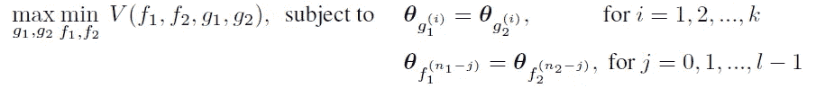**

*   **类似于 [GAN](/@sh.tsang/review-gan-generative-adversarial-nets-gan-e12793e1fb75) ， **CoGAN 可以通过具有交替梯度更新步骤的反向传播来训练。****

> **基本上，交替梯度更新步骤是逐个训练 2 个鉴别器，然后交替地逐个训练 2 个生成器。**

*   **对于不同的应用，例如数字生成和面部生成，网络架构是不同的，如下所述。**

**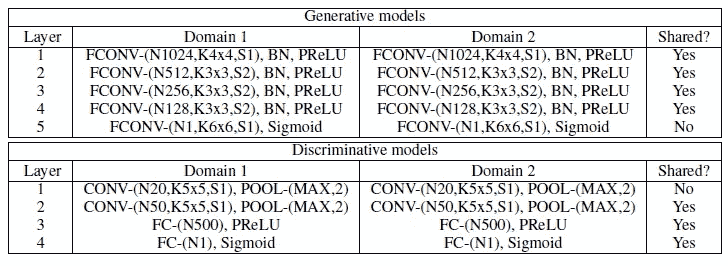**

****数字生成的网络架构****

**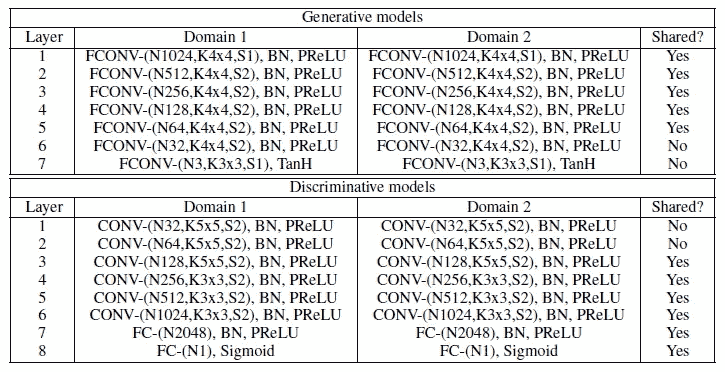**

****人脸生成的网络架构****

*   **(网络体系结构和培训细节在论文的补充材料中。请随意访问报纸。)**

# **2.**实验结果****

## **2.1.数字生成**

**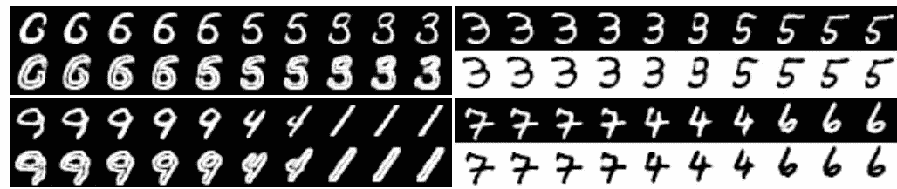**

****左:边 MNIST，右:负 MNIST****

*   ****左(任务 A)** :如图所示，使用相同的输入向量，CoGAN 可以生成具有正常和基于边缘形式的相同数字图像。**
*   ****右(任务 B)** :阳性和阴性 MNIST 的结果相似。**

**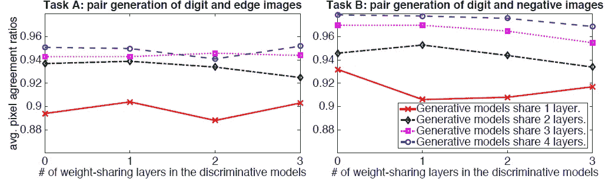**

*   **这些图绘制了任务 A 和任务 b 的具有不同权重分配配置的 CoGANs 的平均像素一致率**。像素一致率越大，配对生成性能越好。****

> **发现**性能与生成模型中的权重共享层数正相关**，但与判别模型中的权重共享层数不相关。**

*   **作为比较，实现了有条件的 GAN ( [CGAN](/@sh.tsang/review-cgan-conditional-gan-gan-78dd42eee41) )。以 0 输入作为进入 [CGAN](/@sh.tsang/review-cgan-conditional-gan-gan-78dd42eee41) 的条件，发生器类似于第一域中的图像；否则，它在第二域中生成图像。**
*   **对于任务 A，CoGAN 获得了 0.952 的平均比率，超过了由 [CGAN](/@sh.tsang/review-cgan-conditional-gan-gan-78dd42eee41) 获得的 0.909。**
*   **对于任务 B，科根取得了 0.967 的成绩，比 [CGAN](/@sh.tsang/review-cgan-conditional-gan-gan-78dd42eee41) 取得的 0.778 好得多。**

## **2.2.人脸生成**

**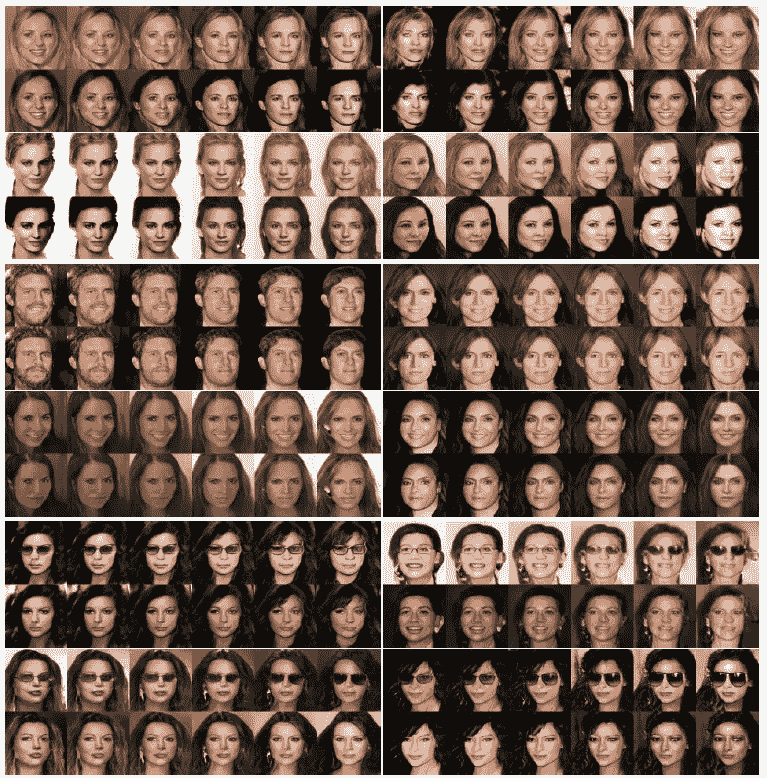**

****使用 CoGAN 生成不同属性的人脸图像。****

*   **从上到下，该图显示了金发、微笑和眼镜属性的人脸生成结果。**
*   **对于每一对，第一行包含具有属性的面，而第二行包含相应的不具有属性的面。**

> ****随着在空间中旅行，人脸逐渐从一个人变成另一个人。这种变形在两个区域都是一致的。****
> 
> **请注意**很难为某些属性(如金发)创建具有相应图像的数据集，因为受试者必须对头发进行染色。****

## **2.3.颜色和深度图像生成**

**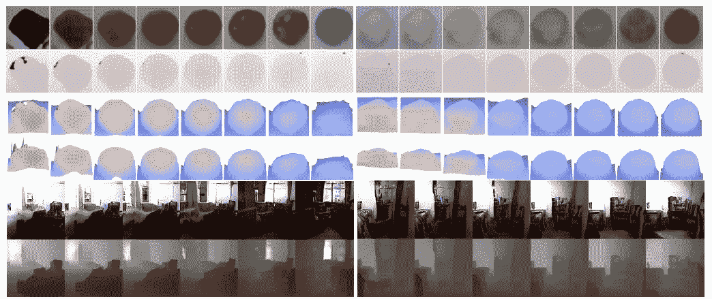**

****使用 CoGAN 生成彩色和深度图像。****

*   **上图显示了 RGBD 数据集的结果:第一行包含彩色图像，第二行包含深度图像，第三和第四行显示了不同视点下的深度剖面。**
*   **下图显示了 NYU 数据集的结果。**

> **CoGAN 不知不觉地恢复了外观与深度的对应关系。**

## **2.4.潜在应用**

**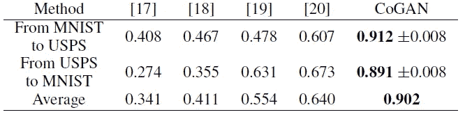**

****无监督领域适应性能比较。****

*   ****无监督的域适应(UDA)** : UDA 涉及适应在一个域中训练的分类器，以在新的域中对样本进行分类，其中在新的域中没有用于重新训练分类器的标记样本。**
*   **(领域适配不是本文的主要贡献。所以，我不深究。如果感兴趣，请随意阅读该文件。)**

**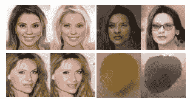**

**跨域图像变换。**

*   ****跨域图像变换**:对于每一对，左为输入；右图是变换后的图像。**
*   **(作者只是想在这部分介绍潜在的应用。如果对细节感兴趣，请参考论文。)**

**后来，作者扩展了 CoGAN，使其具有图像到图像的翻译，并在 2017 年 NIPS 上发表。希望我能在未来的日子里回顾它。**

## **参考**

**【2016 NIPS】【科根】
[耦合生成对抗网络](https://arxiv.org/abs/1606.07536)**

## **生成对抗网络**

****图像合成** [ [甘](/@sh.tsang/review-gan-generative-adversarial-nets-gan-e12793e1fb75) ] [ [CGAN](/@sh.tsang/review-cgan-conditional-gan-gan-78dd42eee41) ] [ [拉普甘](/@sh.tsang/review-lapgan-laplacian-generative-adversarial-network-gan-e87200bbd827)[[DCGAN](/@sh.tsang/review-dcgan-deep-convolutional-generative-adversarial-network-gan-ec390cded63c)][[CoGAN](https://sh-tsang.medium.com/review-cogan-coupled-generative-adversarial-networks-gan-273f70b340af)]
**图像到图像的平移**[[pix 2 pix](https://sh-tsang.medium.com/review-pix2pix-image-to-image-translation-with-conditional-adversarial-networks-gan-ac85d8ecead2)]
**超分辨率**[[SRGAN&SRResNet](/@sh.tsang/review-srgan-srresnet-photo-realistic-super-resolution-gan-super-resolution-96a6fa19490)[ [**摄像头篡改检测**](/@sh.tsang/reading-enhancenet-automated-texture-synthesis-super-resolution-8429635aa75e)[曼蒂尼的 VISAPP’19](https://sh-tsang.medium.com/review-mantinis-visapp-19-generative-reference-model-and-deep-learned-features-camera-f608371c9854) **视频编码**[VC-lap gan](/@sh.tsang/reading-vc-lapgan-video-coding-oriented-laplacian-pyramid-of-generative-adversarial-networks-74daa2d23d3c)[朱 TMM’20](https://sh-tsang.medium.com/review-zhu-tmm20-generative-adversarial-network-based-intra-prediction-for-video-coding-c8a217c564ea)[钟 elec gj’21](https://sh-tsang.medium.com/review-zhong-elecgj21-a-gan-based-video-intra-coding-hevc-intra-9e3486dbca78)**

## **[我以前的其他论文阅读材料](https://sh-tsang.medium.com/overview-my-reviewed-paper-lists-tutorials-946ce59fbf9e)**