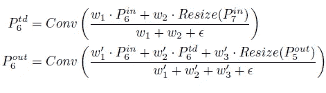

# 回顾— EfficientDet:可扩展且高效的对象检测

> 原文：<https://medium.com/codex/review-efficientdet-scalable-and-efficient-object-detection-ed9ebc70f873?source=collection_archive---------10----------------------->

## 胜过[阿米巴内特](/@sh.tsang/reading-amoebanet-regularized-evolution-for-image-classifier-architecture-search-image-278f5c077a4a) + [NAS-FPN](https://sh-tsang.medium.com/review-nas-fpn-learning-scalable-feature-pyramid-architecture-for-object-detection-f29039f94373) + [AA](https://sh-tsang.medium.com/review-autoaugment-learning-augmentation-strategies-from-data-image-classification-af27dea9a839) ，[ResNet](https://towardsdatascience.com/review-resnet-winner-of-ilsvrc-2015-image-classification-localization-detection-e39402bfa5d8?source=post_page---------------------------)+[NAS-FPN](https://sh-tsang.medium.com/review-nas-fpn-learning-scalable-feature-pyramid-architecture-for-object-detection-f29039f94373)+[AA](https://sh-tsang.medium.com/review-autoaugment-learning-augmentation-strategies-from-data-image-classification-af27dea9a839)， [RetinaNet](https://towardsdatascience.com/review-retinanet-focal-loss-object-detection-38fba6afabe4?source=post_page---------------------------) ， [Mask R-CNN](/analytics-vidhya/review-mask-r-cnn-instance-segmentation-human-pose-estimation-61080a93bf4) ，以及 [YOLOv3](https://towardsdatascience.com/review-yolov3-you-only-look-once-object-detection-eab75d7a1ba6?source=post_page---------------------------)

**型号 FLOPs 与 COCO 精度**

在这个故事中， **EfficientDet:可扩展和高效的对象检测**，(EfficientDet)，由谷歌研究，大脑团队，进行评论。在本文中:

*   首先，**提出了一种加权双向特征金字塔网络(BiFPN)** ，它允许简单和快速的多尺度特征融合。
*   然后，**还提出了一种复合缩放方法**，其可以同时统一缩放所有主干、特征网络和盒/类预测网络的分辨率、深度和宽度。
*   最后，以[**efficient net**](https://sh-tsang.medium.com/efficientnet-rethinking-model-scaling-for-convolutional-neural-networks-image-classification-ef67b0f14a4d)**为骨干**的**形成了一族对象检测器 **EfficientDet** ，始终实现比现有技术好得多的效率，如上所示。**

这是一篇发表在 **2020 年 CVPR** 的论文，被**引用超过 600 次**。([曾植和](https://medium.com/u/aff72a0c1243?source=post_page-----ed9ebc70f873--------------------------------) @中)

# 概述

1.  **先前技术为** [**FPN**](https://towardsdatascience.com/review-fpn-feature-pyramid-network-object-detection-262fc7482610?source=post_page---------------------------)
2.  **双向特征金字塔网络**
3.  **加权 bip pn**
4.  **EfficientDet:网络架构**
5.  **复合缩放法**
6.  **SOTA 比较**
7.  **消融研究**

# **1。**先前技术为 [FPN](https://towardsdatascience.com/review-fpn-feature-pyramid-network-object-detection-262fc7482610?source=post_page---------------------------)

**最先进的**[**FPN**](https://towardsdatascience.com/review-fpn-feature-pyramid-network-object-detection-262fc7482610?source=post_page---------------------------)**s**

*   给定一个多尺度特征列表:

*   其中 *Pin_li* 代表级别 *li* 的特征。
*   目标是找到一个转换 *f* ，它可以有效地聚合不同的特性并输出一系列新特性:

## 1.1. [FPN](https://towardsdatascience.com/review-fpn-feature-pyramid-network-object-detection-262fc7482610?source=post_page---------------------------)

*   [FPN](https://towardsdatascience.com/review-fpn-feature-pyramid-network-object-detection-262fc7482610?source=post_page---------------------------) 采用 3-7 级输入特性:

*   例如，如果输入分辨率为 640×640，那么 *Pin_* 3 表示分辨率为 80×80 (640/ = 80)的特征级别 3，而 *Pin_* 7 表示分辨率为 5×5 的特征级别 7。
*   传统的 [FPN](https://towardsdatascience.com/review-fpn-feature-pyramid-network-object-detection-262fc7482610?source=post_page---------------------------) 自顶向下聚合多尺度特征；

*   其中 Resize 通常是用于分辨率匹配的上采样或下采样操作。

> **常规的自上而下******本来就受到**单向信息流的限制。******

## ****1.2.[FPN 国家科学院](https://sh-tsang.medium.com/review-nas-fpn-learning-scalable-feature-pyramid-architecture-for-object-detection-f29039f94373)****

*   ****最近， [NAS-FPN](https://sh-tsang.medium.com/review-nas-fpn-learning-scalable-feature-pyramid-architecture-for-object-detection-f29039f94373) 采用神经架构搜索(NAS)来搜索更好的跨尺度特征网络拓扑。****

> ****但是在搜索期间需要**数千个 GPU 小时，并且发现的**网络不规则**和**难以解释或修改**，如上图所示。******

## **1.3.帕内特**

*   **为了解决 [FPN](https://towardsdatascience.com/review-fpn-feature-pyramid-network-object-detection-262fc7482610?source=post_page---------------------------) 问题， [PANet](https://becominghuman.ai/reading-panet-path-aggregation-network-1st-place-in-coco-2017-challenge-instance-segmentation-fe4c985cad1b) 增加了**一个额外的自底向上的路径聚合网络**，如上面的(b)所示。而且它还得到了一个比 [NAS-FPN](https://sh-tsang.medium.com/review-nas-fpn-learning-scalable-feature-pyramid-architecture-for-object-detection-f29039f94373) 更**正规的网络**。**

> **[PANet](https://becominghuman.ai/reading-panet-path-aggregation-network-1st-place-in-coco-2017-challenge-instance-segmentation-fe4c985cad1b) 比[**【FPN】**](https://towardsdatascience.com/review-fpn-feature-pyramid-network-object-detection-262fc7482610?source=post_page---------------------------)**和** [**NAS-FPN**](https://sh-tsang.medium.com/review-nas-fpn-learning-scalable-feature-pyramid-architecture-for-object-detection-f29039f94373) 达到了更好的精度，但代价是更多的参数和计算。 [PANet](https://becominghuman.ai/reading-panet-path-aggregation-network-1st-place-in-coco-2017-challenge-instance-segmentation-fe4c985cad1b) 说明**只有一条自顶向下和一条自底向上的路径。****

# **2.双向特征金字塔网络**

****

****提议的 BiFPN****

*   **我们可以从 1.3 版本修改 BiFPN。(b)在 [PANet](https://becominghuman.ai/reading-panet-path-aggregation-network-1st-place-in-coco-2017-challenge-instance-segmentation-fe4c985cad1b) 中使用的 FPN。**

****

****1)只有一条输入边的节点被删除(红色圆圈)****

*   ****首先，去掉只有一条输入边的节点。直觉很简单:如果一个节点只有一条没有特征融合的输入边，那么它对旨在融合不同特征的特征网络的贡献就较小。这导致简化的双向网络。****

****

****2)多余的边缘(紫色箭头)****

*   ****第二，从原来的输入到输出节点如果在同一个级别就增加一条额外的边**，以便在不增加太多成本的情况下融合更多的特征。**

****

****3)可重复多次****

*   ****第三**，与 [PANet](https://becominghuman.ai/reading-panet-path-aggregation-network-1st-place-in-coco-2017-challenge-instance-segmentation-fe4c985cad1b) 只有一条自上而下和一条自下而上的路径不同，每条双向(自上而下&自下而上)路径被视为一个特征网络层，**多次重复同一层**以实现更高级的特征融合。**

# ****3。加权 BiFPN****

*   **由于不同的输入特征在**有不同的分辨率**，它们通常**对输出特征的贡献不相等。****
*   **为了解决这个问题，**为每个输入增加了一个额外的权重**，并让网络学习**每个输入特征**的重要性。**
*   **考虑了 3 种权重融合方法。**

## ****3.1。无界融合****

****

*   **其中 ***wi*** 是一个**可学习权重**，它可以是一个标量(每特征)、一个矢量(每通道)或一个多维张量(每像素)。**
*   **然而，由于标量权重是**无界的**，它可能会**导致训练不稳定。需要有界限的范围。****

## **3.2.基于 Softmax 的融合**

****

*   **一个直观的想法是将 **softmax** 应用于每个权重，这样所有权重都被标准化为值**范围从 0 到 1 的概率。****
*   **然而，额外的 softmax 导致 GPU 硬件上的**显著减速**。**

## **3.3.快速归一化融合**

****

*   **最后，**采用快速归一化融合**，通过在每个 *wi* 后应用一个 Relu 来保证 *wi* ≥ 0。 *ε* = 0.0001 是为了避免数值不稳定。**
*   **每个归一化权重的值也在 0 和 1 之间，但由于这里没有**soft max**运算，因此**比**高效得多，在 GPU 上运行速度比**快 30%。****
*   **例如，上面显示的 BiFPN 的第 6 级的两个融合特征是:**

****

*   **其中 *Ptd* _6 是自上而下路径上第 6 级的中间特征， *Pout* _6 是自下而上路径上第 6 级的输出特征。**
*   **值得注意的是，为了进一步提高效率，**深度方向可分离卷积**用于特征融合。**
*   **在每次卷积后添加批量标准化和激活。**

# ****4。EfficientDet:网络架构****

****

****高效检测:网络架构****

*   ****使用一级**探测器范例。**
*   **采用 ImageNet-pre trained[**efficient net**](https://sh-tsang.medium.com/efficientnet-rethinking-model-scaling-for-convolutional-neural-networks-image-classification-ef67b0f14a4d)**s**作为主干网络。**
*   **提出的 **BiFPN** 作为**特征网络**，从主干网络中提取 3-7 级特征{ *P* 3， *P* 4， *P* 5， *P* 6， *P* 7}，反复应用自顶向下和自底向上的双向特征融合。**
*   **这些融合的特征被**馈送到一个类和盒网络**以分别产生对象类和边界盒预测。与 [RetinaNet](https://towardsdatascience.com/review-retinanet-focal-loss-object-detection-38fba6afabe4?source=post_page---------------------------) 类似，类和盒网络权重在所有级别的要素中共享。**

# **5.复合标度法**

*   **先前的工作通过使用更大的主干、更大的输入图像或者堆叠更多的 [FPN](https://towardsdatascience.com/review-fpn-feature-pyramid-network-object-detection-262fc7482610?source=post_page---------------------------) 层来放大探测器，即单因子缩放。**
*   **最近， [EfficientNet](https://sh-tsang.medium.com/efficientnet-rethinking-model-scaling-for-convolutional-neural-networks-image-classification-ef67b0f14a4d) 联合提升了网络宽度、深度和输入分辨率的所有维度。**
*   **在这里，EfficientDet 提出了一种新的用于对象检测的复合缩放方法，该方法使用简单的复合系数 *φ* 到**联合放大主干网络、BiFPN 网络、类/盒网络和分辨率的所有维度。****

****

****效率检测 D0-D6 的缩放配置****

## **5.1.中枢网络**

*   ****使用**[**efficient net**](https://sh-tsang.medium.com/efficientnet-rethinking-model-scaling-for-convolutional-neural-networks-image-classification-ef67b0f14a4d)**-B0 到 B6**的相同宽度/深度缩放系数，从而可以使用 ImageNet 预训练的检查点。**

## **5.2.BiFPN 网络**

*   ****BiFPN 深度 *D_bifpn* (#layers)线性增加**，因为深度需要四舍五入为小整数。**
*   ****BiFPN 宽度 *W_bifpn* (#channels)呈指数增长**与 [EfficientNet](https://sh-tsang.medium.com/efficientnet-rethinking-model-scaling-for-convolutional-neural-networks-image-classification-ef67b0f14a4d) 类似。具体而言，对值列表{1.2，1.25，1.3，1.35，1.4，1.45}执行网格搜索，并挑选最佳值 1.35 作为 BiFPN 宽度比例因子。**
*   **形式上，BiFPN 的宽度和深度按下式缩放:**

****

## **5.3.盒/类预测网络**

*   ****它们的宽度固定为始终与 BiFPN** 相同(即*W _ pred*=*W _ BiFPN*)。**
*   ****深度(层数)线性增加**使用公式:**

****

## **5.4.输入图像分辨率**

*   **由于在 BiFPN 中使用特征级别 3-7，输入分辨率必须除以 2⁷ =128，因此**分辨率线性增加**:**

****

*   **(阅读 [EfficientNet](https://sh-tsang.medium.com/efficientnet-rethinking-model-scaling-for-convolutional-neural-networks-image-classification-ef67b0f14a4d) 可以更容易理解这一部分。)**

# **6.SOTA 比较**

****

****可可上的 EfficientDet 性能****

*   **上表比较了 EfficientDet 与其他物体探测器，在**单模型单比例**设置下，没有测试时间增加。**
*   **测试了**测试开发(20K 测试图像)**和 **val (5K 验证图像)**的准确性。**
*   **EfficientDet 实现了比以前的检测器更高的**效率，比以前的检测器**小 4×— 9 倍**,并且使用了 **13× — 42 倍的触发器**,在很大的精度范围或资源限制范围内。****
*   **在精度相对较低的情况下， **EfficientDet-D0 可达到与**[**yolov 3**](https://towardsdatascience.com/review-yolov3-you-only-look-once-object-detection-eab75d7a1ba6?source=post_page---------------------------)**相似的精度，但触发器数量减少了 28 倍。****
*   **与[retina net](https://towardsdatascience.com/review-retinanet-focal-loss-object-detection-38fba6afabe4?source=post_page---------------------------)【21】和[Mask R-CNN](/analytics-vidhya/review-mask-r-cnn-instance-segmentation-human-pose-estimation-61080a93bf4)【11】相比，我们的 **EfficientDet-D1** 实现了类似的精度，参数**减少了 8 倍**和**减少了 21 倍 FLOPs。****
*   **在高精度状态下，EfficientDet 也始终**优于最近的**[**NAS-FPN**](https://sh-tsang.medium.com/review-nas-fpn-learning-scalable-feature-pyramid-architecture-for-object-detection-f29039f94373)【8】**和**它在【42】中的增强版本(即带有 [**自动增强**](https://sh-tsang.medium.com/review-autoaugment-learning-augmentation-strategies-from-data-image-classification-af27dea9a839) )具有**少得多的参数和 FLOPs。****
*   **特别是，EfficientDet-D7 在测试开发方面实现了新的最先进的 52.2 AP，在单型号单秤方面实现了 51.8 AP。**

# **7.消融研究**

## **7.1.主干和 BiFPN**

****

****解开主干和 BiFPN****

*   **以 [ResNet](https://towardsdatascience.com/review-resnet-winner-of-ilsvrc-2015-image-classification-localization-detection-e39402bfa5d8?source=post_page---------------------------) + [FPN](https://towardsdatascience.com/review-fpn-feature-pyramid-network-object-detection-262fc7482610?source=post_page---------------------------) 为基线。**
*   **然后主干换成了 [EfficientNet](https://sh-tsang.medium.com/efficientnet-rethinking-model-scaling-for-convolutional-neural-networks-image-classification-ef67b0f14a4d) -B3，用稍微少一点的参数和 FLOPs 提高了大概 3 AP 的精度。**

> **通过用提议的 **BiFPN** 、**进一步替换 [FPN](https://towardsdatascience.com/review-fpn-feature-pyramid-network-object-detection-262fc7482610?source=post_page---------------------------) ，用**少得多的参数和触发器实现了额外的 4 AP 增益**。****

## **7.2.**不同的特征网络****

****

****不同特征网络的比较****

*   **虽然重复 [FPN](https://towardsdatascience.com/review-fpn-feature-pyramid-network-object-detection-262fc7482610?source=post_page---------------------------) + [PANet](https://becominghuman.ai/reading-panet-path-aggregation-network-1st-place-in-coco-2017-challenge-instance-segmentation-fe4c985cad1b) 实现了比 [NAS-FPN](https://sh-tsang.medium.com/review-nas-fpn-learning-scalable-feature-pyramid-architecture-for-object-detection-f29039f94373) 稍好的精度，但它也需要更多的参数和 FLOPs。**

> **提出的 **BiFPN** 达到了与重复[**FPN**](https://towardsdatascience.com/review-fpn-feature-pyramid-network-object-detection-262fc7482610?source=post_page---------------------------)**+**[**PANet**](https://becominghuman.ai/reading-panet-path-aggregation-network-1st-place-in-coco-2017-challenge-instance-segmentation-fe4c985cad1b)类似的精度，但是使用了**少得多的参数和 FLOPs。****
> 
> **通过额外的**加权特征融合**，提出的 BiFPN **进一步以**更少的参数和触发器实现了最佳精度**。****

## **7.3.不同特征融合**

****

****不同特征融合的比较****

> **与基于 softmax 的融合相比，**快速融合**实现了**相似的精度**，但是运行速度**快了 28% — 31%。****

****

****Softmax 与快速归一化特征融合****

*   **在 EfficientDet-D3 的 BiFPN 中随机选择 3 个节点。**

> **尽管变化很快，但对于所有三个节点，提出的**快速归一化融合**方法总是表现出与**基于 softmax 的融合**非常**相似的学习行为**。**

## **7.4.复合缩放**

****

****不同缩放方法的比较****

*   **上图比较了建议的复合缩放与其他替代方法，这些方法在分辨率/深度/宽度的单一维度上进行缩放。**

> ****复合扩展**比其他方法实现了**更高的效率**，表明了通过更好地平衡不同架构维度来联合扩展的好处。**

## **参考**

**【2020 CVPR】【高效检测】
[高效检测:可扩展且高效的对象检测](https://arxiv.org/abs/1911.09070)**

## **目标检测**

****2014** : [ [过食](/coinmonks/review-of-overfeat-winner-of-ilsvrc-2013-localization-task-object-detection-a6f8b9044754?source=post_page---------------------------)][[R-CNN](/coinmonks/review-r-cnn-object-detection-b476aba290d1?source=post_page---------------------------)]
**2015**:[[快 R-CNN](/coinmonks/review-fast-r-cnn-object-detection-a82e172e87ba?source=post_page---------------------------) ] [ [更快 R-CNN](https://towardsdatascience.com/review-faster-r-cnn-object-detection-f5685cb30202?source=post_page---------------------------)][[MR-CNN&S-CNN](https://towardsdatascience.com/review-mr-cnn-s-cnn-multi-region-semantic-aware-cnns-object-detection-3bd4e5648fde?source=post_page---------------------------)][[DeepID-Net](https://towardsdatascience.com/review-deepid-net-def-pooling-layer-object-detection-f72486f1a0f6?source=post_page---------------------------)
**2016 **[[GBD-网/GBD-v1&GBD-v2](https://towardsdatascience.com/review-gbd-net-gbd-v1-gbd-v2-winner-of-ilsvrc-2016-object-detection-d625fbeadeac?source=post_page---------------------------)][[SSD](https://towardsdatascience.com/review-ssd-single-shot-detector-object-detection-851a94607d11?source=post_page---------------------------)][[yolov 1](https://towardsdatascience.com/yolov1-you-only-look-once-object-detection-e1f3ffec8a89?source=post_page---------------------------)
**2017**:[[NoC](/datadriveninvestor/review-noc-winner-in-2015-coco-ilsvrc-detection-object-detection-d5cc84e372a?source=post_page---------------------------)][[G-RMI](https://towardsdatascience.com/review-g-rmi-winner-in-2016-coco-detection-object-detection-af3f2eaf87e4?source=post_page---------------------------)][[TDM](/datadriveninvestor/review-tdm-top-down-modulation-object-detection-3f0efe9e0151?source=post_page---------------------------)[[DSSD](https://towardsdatascience.com/review-dssd-deconvolutional-single-shot-detector-object-detection-d4821a2bbeb5?source=post_page---------------------------)[[yolov 2/yolo 900] [couple net](https://sh-tsang.medium.com/review-couplenet-coupling-global-structure-with-local-parts-for-object-detection-object-d80150c5c850)]
**2018**:[[yolov 3](https://towardsdatascience.com/review-yolov3-you-only-look-once-object-detection-eab75d7a1ba6?source=post_page---------------------------)][[Cascade R-CNN](/@sh.tsang/reading-cascade-r-cnn-delving-into-high-quality-object-detection-object-detection-8c7901cc7864)][[MegDet](/towards-artificial-intelligence/reading-megdet-a-large-mini-batch-object-detector-1st-place-of-coco-2017-detection-challenge-e82072e9b7f)][[stair net](/@sh.tsang/reading-stairnet-top-down-semantic-aggregation-object-detection-de689a94fe7e)][[refined et](https://sh-tsang.medium.com/review-refinedet-single-shot-refinement-neural-network-for-object-detection-object-detection-5fc483449562)][[corner net](https://sh-tsang.medium.com/review-cornernet-detecting-objects-as-paired-keypoints-object-detection-ffb23026291b)]【T78******

## [我以前的其他论文阅读材料](https://sh-tsang.medium.com/overview-my-reviewed-paper-lists-tutorials-946ce59fbf9e)