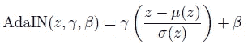

# 综述— MUNIT:多模态无监督图像到图像翻译(GAN)

> 原文：<https://medium.com/codex/review-munit-multimodal-unsupervised-image-to-image-translation-gan-10e2c08a1b6e?source=collection_archive---------4----------------------->

## 使用 MUNIT，从单一图像生成多样式图像

**使用 MUNIT 进行动物图像翻译**

在这个故事中，回顾了由康乃尔大学和英伟达合作的**多模态无监督图像到图像翻译**、【MUNIT】。在本文中:

*   在 MUNIT 中，假设**图像表示**可以分解成一个**内容代码**和一个**样式代码**，其中内容代码**是域不变的，样式代码**捕获特定于域的属性。
*   为了将图像翻译到另一个域，其内容代码**与从目标域的样式空间采样的随机样式代码**重新组合。
*   最后，MUNIT 允许用户通过提供示例样式图像来控制翻译输出的样式。

这是一篇发表在 **2018 ECCV** 的论文，引用超过 **1100 次**。( [Sik-Ho Tsang](https://medium.com/u/aff72a0c1243?source=post_page-----10e2c08a1b6e--------------------------------) @中)

# 概述

1.  **简介&假设**
2.  **概述**
3.  **损失函数**
4.  **理论分析**
5.  **MUNIT:网络架构**
6.  **实验结果**

# **1。简介&假设**

**MUNIT:多模态无监督图像到图像翻译**

*   假设**图像的潜在空间可以分解为内容空间 *C* 和风格空间 *S*** ，如上图所示。
*   然后进一步假设不同域中的**图像共享一个共同的内容空间，但不共享风格空间。**
*   **为了将**图像翻译到目标域，**其内容代码与目标样式空间**中的随机样式代码重新组合。

> 内容代码对翻译过程中应该保留的信息进行编码，而样式代码表示输入图像中不包含的剩余变化。

*   **通过对不同的风格代码**进行采样，我们的模型能够产生**多样化和多模态的输出。**

# 2.**概述**

**弹药:概述**

*   翻译模型由一个**编码器*Ei*T3*和一个**解码器 *Gi*** 组成，用于每个**域 *Xi*** ( *i* = 1，2)。***
*   **(a)** 将每个自动编码器的潜码分解成一个**内容码 *ci*** 和一个**风格码 *si*** ，其中:

*   **(b)通过交换编码器-解码器对来执行图像到图像的转换**。例如，为了**将一个图像 *x* 1 ∈ *X* 1 平移到 *X* 2** ，其**内容潜码*c*1 =*Ec*1(*X*1)被提取**并且一个**样式潜码 *s* 2 被从先前随机抽取**
*   然后用 ***G* 2 产生最终输出图像*x*1→2**=*G*2(*c*1， *s* 2)。
*   注意，尽管先验分布是单峰的，但是由于解码器的非线性，输出图像分布可以是多峰的。

# 3.**损失函数**

## 3.1.双向重建损失

*   为了学习彼此相反的编码器和解码器对，我们使用目标函数来促进在**图像→潜像→图像**和**潜像→图像→潜像**两个方向上的重建:

## 3.1.1.图像重建

*   给定**从数据分布**中采样的图像，我们应该能够在编码和解码之后**重建它:**

## 3.1.2.潜在重建

*   给定**在翻译时从潜在分布**中采样的潜在代码(样式和内容)，我们应该能够在解码和编码后**重建它。**

*   其中 *q* ( *s* 2)为先验 *N* (0，*I*)*p*(*c*1)由*c*1 =*Ec*1(*x*1)和 *x* 1 给出
*   其他损失项***Lx*2 _*recon***、***Lc*2 _*recon***和***Ls*1 _*recon***的定义方式类似。
*   **L1 重建损失**被用作它**鼓励清晰输出图像**。
*   **风格重建损失 *Lsi_recon*** 对**有影响，给定不同的风格码，鼓励不同的输出**。
*   **内容重建损失*Lci _ recon*促使翻译后的图像**保留输入图像的语义内容**。**

## 3.2.对抗性损失

*   GAN 试图将翻译图像的分布与目标数据分布相匹配。**由模型生成的图像应该与目标域中的真实图像没有区别。**

*   其中 *D* 2 是试图在 *X* 2 中区分翻译图像和真实图像的鉴别器。鉴频器 *D* 1 和损耗 *Lx* 1_ *GAN* 定义类似。
*   这是[干](/@sh.tsang/review-gan-generative-adversarial-nets-gan-e12793e1fb75)中相当标准的对抗性输。

## 3.3.全损

*   **编码器、解码器和鉴别器被联合训练**以优化最终目标，该目标是对抗损失和双向重建损失项的加权和

****

*   **其中 *λx* 、 *λc* 、 *λs* 是控制重构项重要性的权重。**

# ****4。理论分析****

*   **一些命题成立。**

## **4.1.命题 1(当损耗最小化时发现优化的编码器和发生器)**

*   **最小化所提出的损失函数导致 1)在编码和生成期间潜在分布的匹配，2)由我们的框架引起的两个联合图像分布的匹配，以及 3)实施弱形式的循环一致性约束。**
*   **假设存在 *E* 1*， *E* 2*， *G* 1*， *G* 2*，则:**

****

*   **然后:**

****

## **4.2.命题 2(潜在分布匹配)**

*   ****如果解码器在生成期间接收到非常不同的潜在分布，则自动编码器训练将无助于**[**GAN**](/@sh.tsang/review-gan-generative-adversarial-nets-gan-e12793e1fb75)**训练。**尽管损失函数不包含明确鼓励潜在分布匹配的项，但它具有隐式匹配它们的效果。**
*   **当达到最佳状态时，我们有:**

****

*   **上述命题表明**在最优性时，编码风格分布与其高斯先验相匹配。****
*   **这表明内容空间变得领域不变。**

## **4.3.命题 3(联合分布匹配)**

*   **该模型学习两种条件分布**

****

*   **它与数据分布一起定义了两种联合分布:**

****

*   **由于两者都被设计成**近似相同的底层节理分布 *p* ( *x* 1， *x* 2)** ，所以最好**与**一致，即:**

****

*   **联合分布匹配为无监督的图像到图像翻译提供了一个重要的约束条件，并且是许多最近方法成功的原因。所提出的模型在最优性上匹配联合分布。当达到最佳状态时，我们有:**

****

## **4.4.命题 4(风格增强的周期一致性)**

*   **联合分布匹配可以通过**周期一致性约束**实现，如 [CycleGAN](https://sh-tsang.medium.com/review-cyclegan-unpaired-image-to-image-translation-using-cycle-consistent-adversarial-networks-1c2602805be2) 所示。然而，这个约束对于多模态图像翻译来说太强了。如果实施循环一致性，转换模型将**退化为确定性函数**。**
*   ****MUNIT 框架在图像风格的联合空间之间承认一种更弱形式的循环一致性**，称为**风格增强循环一致性**，这**更适合多模态图像翻译**。**
*   **当达到最佳状态时，我们有:**

****

*   **直观上，风格增强的循环一致性意味着，如果我们将图像翻译到目标域，并使用原始风格将其翻译回来，我们应该获得原始图像。**
*   ****建议的双向重建损失**暗示了样式增强的周期一致性，但是明确地实施它对于一些数据集可能是有用的:**

****

*   **(如果感兴趣，论文中有更多关于这些命题的细节。)**

# **5. **MUNIT:网络架构****

****

****MUNIT:网络架构****

## **5.1.风格编码器**

*   **样式编码器包括几个**步进 conv** 可选层，接着是一个**全局平均池** (GAP)层和一个**全连接** (FC)层。**
*   ****样式编码器中不使用实例标准化(in)层**，因为 IN 移除了代表重要样式信息的原始特征均值和方差。**

## **5.2.解码器**

*   **解码器**从输入图像的内容和样式代码中重建输入图像。****
*   **它通过**一组残差块**处理内容码，最后通过**几个上采样和卷积层产生重建图像。****
*   **受最近在归一化层中使用仿射变换参数来表示样式的工作的启发[54，72-74]，我们为残差块配备了**自适应实例归一化(AdaIN)**【54】层，其**参数由多层感知器(MLP)从样式代码中动态生成。****

****

*   **其中 *z* 是前一卷积层的激活， *μ* 和 *σ* 是信道均值和标准差， *γ* 和 *β* 是 MLP 产生的参数。**

## **5.3.鉴别器**

*   **使用 **LSGAN 物镜**和**多尺度鉴别器**来指导生成器产生逼真的细节和正确的全局结构。**
*   **(LSGAN 使用最小二乘法作为损失函数，希望我将来能写一个关于它的故事。)**

## **5.4.领域不变感知损失**

*   **感知损失，通常计算为输出和参考图像之间的 VGG 特征空间中的距离。**
*   **使用这种损失的修改版本，其更具有域不变性。**
*   **具体来说，**在计算距离之前，对 VGG 特征**进行实例归一化，以去除包含许多领域特定信息的原始特征均值和方差。**

# **6.实验结果**

## **6.1.**定性比较****

****

****边缘定性对比→鞋子****

*   **下面的每一列显示了一种方法的 3 个随机输出。**
*   **尽管注入了随机性，但[单元](https://sh-tsang.medium.com/review-unit-unsupervised-image-to-image-translation-networks-gan-4a25ced6d078)和[循环](https://sh-tsang.medium.com/review-cyclegan-unpaired-image-to-image-translation-using-cycle-consistent-adversarial-networks-1c2602805be2)(有或无噪声)都无法产生不同的输出。**
*   **没有 *Lx* _ *recon* 或者 *Lc* _ *recon* 的情况下，MUNIT 的画质不尽人意。没有 *Ls_recon* ，模型会遭受部分模式崩溃，许多输出几乎相同(例如，前两行)。**

> **完整的模型产生的图像**既多样又真实**，类似于自行车，但不需要监督。**

****

****更多示例结果****

## **6.2.**定量**比较**

****

****边缘定量评价→鞋/手袋****

*   **人的偏好用于衡量质量，LPIPS 距离用于评估多样性。**
*   **[单元](https://sh-tsang.medium.com/review-unit-unsupervised-image-to-image-translation-networks-gan-4a25ced6d078)和 [CycleGAN](https://sh-tsang.medium.com/review-cyclegan-unpaired-image-to-image-translation-using-cycle-consistent-adversarial-networks-1c2602805be2) 根据 LPIPS 距离产生非常小的分集。**
*   **从 MUNIT 中移除 *Lx_recon* 或 *Lc_recon* 会导致质量显著下降。没有 *Ls_recon* ，质量和多样性都变差。**

> **完整模型获得的**质量和多样性可与完全监督的 BicycleGAN** 相媲美，并且明显优于所有非监督基线。**

****

****动物形象翻译的定量评估****

*   ****初始得分(IS)** 测量所有输出图像的**多样性，**而**条件 IS (CIS)** 测量以单个输入图像为条件的**输出的多样性。****
*   **根据 CIS 和 IS，MUNIT 模型获得最高分。**
*   **特别是，所有基线都获得了非常低的 CIS，表明它们未能从给定的投入中产生多式输出。**

## **6.3.其他数据集**

****

****街景翻译的示例结果****

*   **该模型能够从给定的城市景观图像生成具有**不同渲染(例如，下雨、下雪、日落)**的 SYNTHIA 图像，并且从给定的 SYNTHIA 图像生成具有**不同照明、阴影和道路纹理**的城市景观图像。**

****

****约塞米蒂夏季↔冬季的示例结果(高清分辨率)。****

*   **类似地，它从给定的夏季图像生成具有不同雪量的冬季图像，并且从给定的冬季图像生成具有不同叶子量的夏季图像。**

## **6.4.示例引导的图像翻译**

****

****图像翻译****

*   **每行都有相同的内容，而每列都有相同的样式。生成的鞋子的颜色和生成的猫的外观可以通过提供示例样式图像来指定。**
*   **也可以从参考图像中**提取样式代码，而不是从先前采样样式代码。****

****

****与现有风格转移方法的比较****

*   **还比较了经典的风格转换算法。**
*   **MUNIT 生成的结果**更加真实可信，**因为它使用 [GAN](/@sh.tsang/review-gan-generative-adversarial-nets-gan-e12793e1fb75) s 学习目标域图像的分布。**

## **参考**

**【2018 ECCV】【MUNIT】
[多模态无监督图像到图像翻译](https://arxiv.org/abs/1804.04732)**

## **生成对抗网络**

****图像合成** [ [甘](/@sh.tsang/review-gan-generative-adversarial-nets-gan-e12793e1fb75) ] [ [CGAN](/@sh.tsang/review-cgan-conditional-gan-gan-78dd42eee41) ] [ [拉普甘](/@sh.tsang/review-lapgan-laplacian-generative-adversarial-network-gan-e87200bbd827)[[AAE](https://sh-tsang.medium.com/review-aae-adversarial-autoencoders-gan-e8fda9160542)][[DCGAN](/@sh.tsang/review-dcgan-deep-convolutional-generative-adversarial-network-gan-ec390cded63c)][[CoGAN](https://sh-tsang.medium.com/review-cogan-coupled-generative-adversarial-networks-gan-273f70b340af)][[辛甘](https://sh-tsang.medium.com/review-simgan-learning-from-simulated-and-unsupervised-images-through-adversarial-training-gan-86a7003add50) ] [ [甘比](https://sh-tsang.medium.com/review-bigan-adversarial-feature-learning-gan-535eb76be2ca) ] [ [阿里](https://sh-tsang.medium.com/review-ali-adversarially-learned-inference-gan-6e4677667914)
**图像到图像的翻译** [**超分辨率**](https://sh-tsang.medium.com/review-pix2pix-image-to-image-translation-with-conditional-adversarial-networks-gan-ac85d8ecead2)[SRGAN&SRResNet](/@sh.tsang/review-srgan-srresnet-photo-realistic-super-resolution-gan-super-resolution-96a6fa19490)[EnhanceNet](/@sh.tsang/reading-enhancenet-automated-texture-synthesis-super-resolution-8429635aa75e)[ESR gan](/towards-artificial-intelligence/reading-esrgan-enhanced-super-resolution-generative-adversarial-networks-super-resolution-e8533ad006b5)
**模糊检测**[DMENet](https://sh-tsang.medium.com/review-dmenet-deep-defocus-map-estimation-using-domain-adaptation-blur-detection-20fdcaf5e384)
**摄像头篡改检测**[曼蒂尼的 VISAPP’19](https://sh-tsang.medium.com/review-mantinis-visapp-19-generative-reference-model-and-deep-learned-features-camera-f608371c9854) **视频编码【T55****

## **[我以前的其他论文阅读材料](https://sh-tsang.medium.com/overview-my-reviewed-paper-lists-tutorials-946ce59fbf9e)**