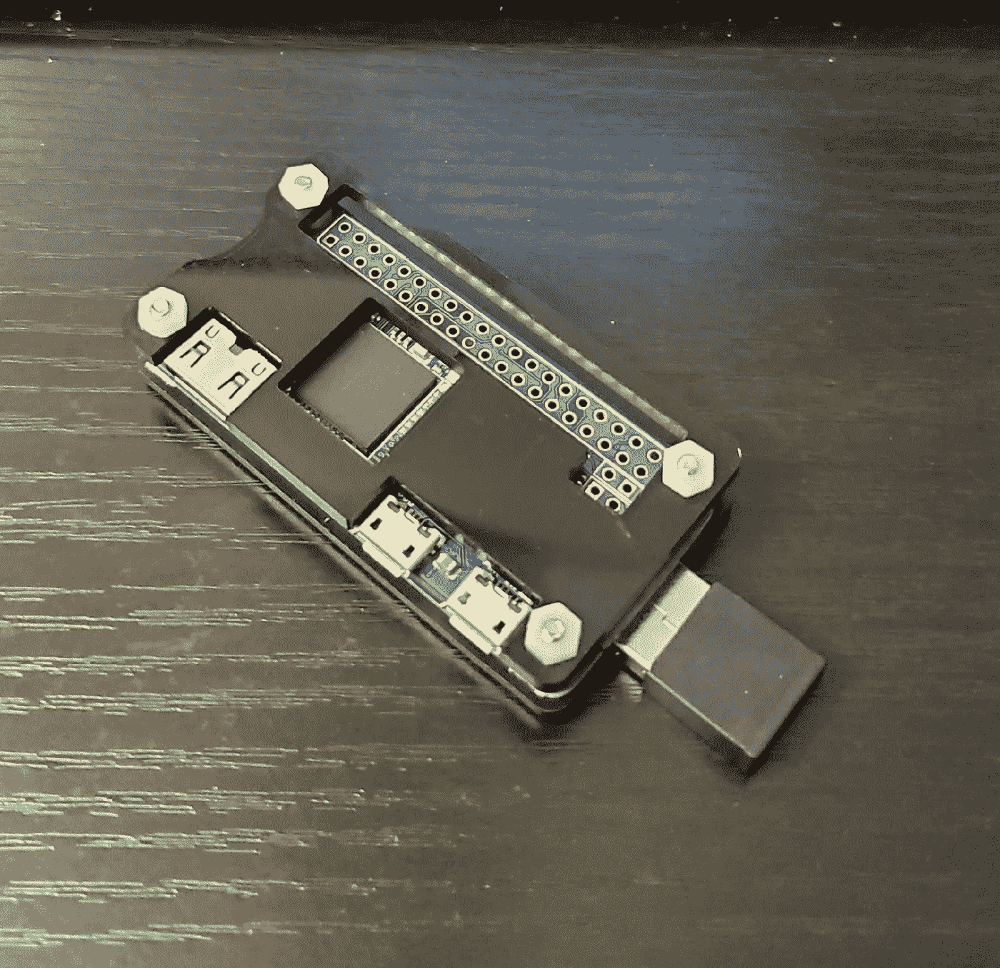

# 重访树莓派零密码小偷

> 原文：<https://medium.com/codex/revisiting-the-raspberry-pi-zero-password-thief-d3b023b602f4?source=collection_archive---------2----------------------->

## 改进工具，更深入地研究漏洞，并防范它。



回到黑色

```
**This article is informational only.  Do not break the law.**
```

# 让工具变得更好

我最讨厌的是[原始密码窃贼](/codex/raspberry-pi-zero-password-thief-cb2bea8d6dc0)的样子。与商业相比…