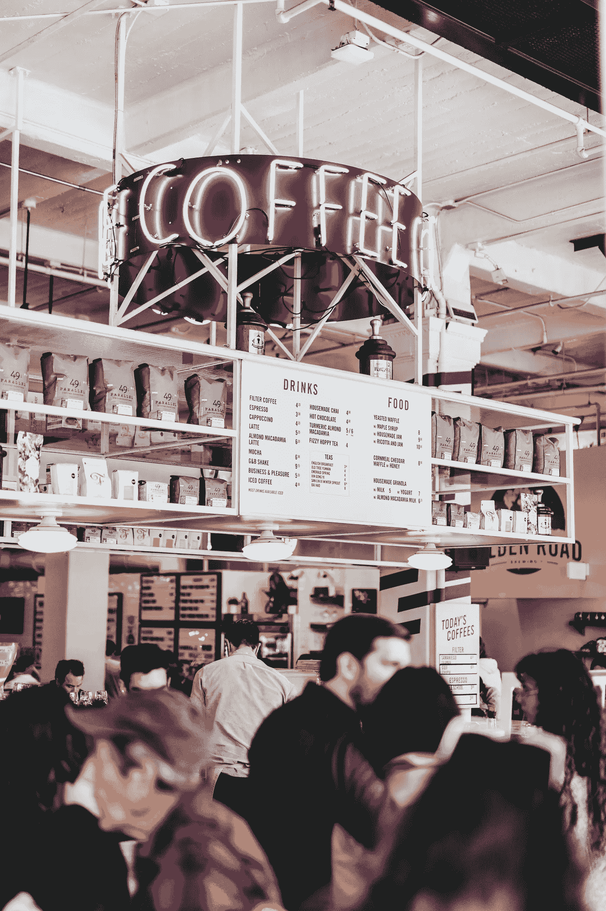
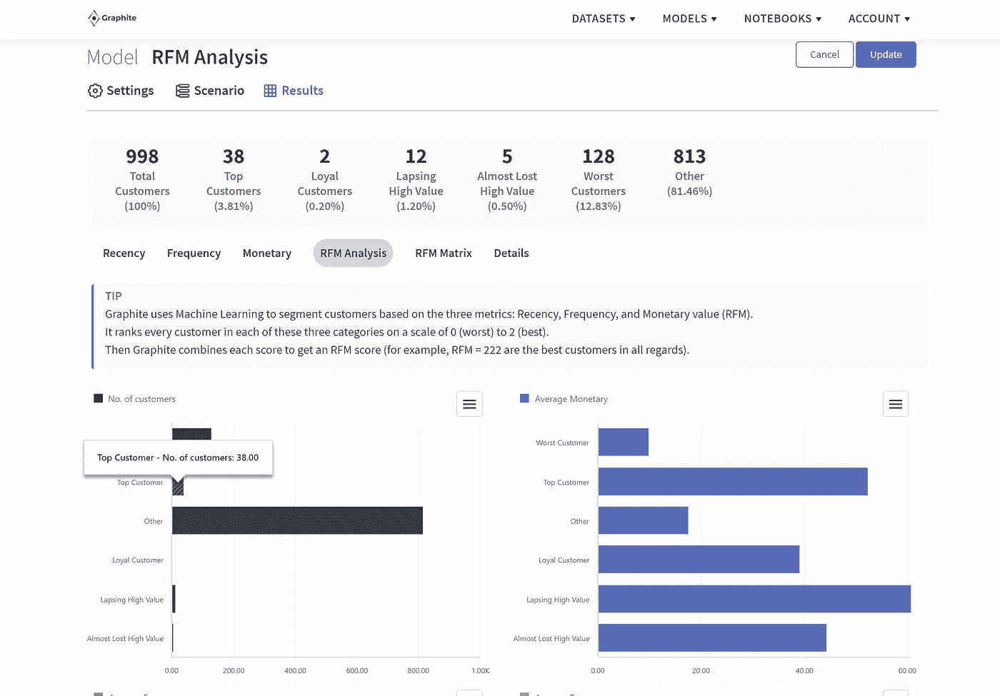

# RFM 分析及其在客户价值评估中的作用

> 原文：<https://medium.com/codex/rfm-analysis-and-its-role-in-customer-valuation-559b5e8e6ab1?source=collection_archive---------17----------------------->

## "与其关注竞争，不如关注客户."—斯考特·库克

每个营销人员都知道顾客是上帝。新时代的营销人员知道从其他人中筛选出最好的是必要的。

转移对重要客户的注意力，或者对他们一视同仁，会危及客户关系。与最好的客户建立忠诚的关系，或将潜在客户转化为回头客，是扭转任何业务的关键。

但是你怎么能根据客户给公司带来的价值来评估客户呢？进入 RFM 分析，一个流行的和经过验证的客户估价方法。

据推测，RFM 分析是由简·罗尔夫·布尔特和汤姆·万斯比克在 1995 年的一篇文章中引入的，它一直是营销人员理解客户的最爱。

来源:图片由内森·杜姆劳拍摄，[unsplash.com](https://unsplash.com/photos/VUR5Yv8eQkU)

# 什么是 RFM 分析？

RFM 分析是新近性、频率和货币价值分析的首字母缩写，它使聪明的营销人员能够区分他们的客户群。这项技术借鉴了帕累托原则，根据该原则，一家企业 80%的收入来自 20%的客户。

RFM 分析基于三个关键因素对客户进行量化:

●最近——这一方面表明客户与企业的接触时间有多近。它包括当前的网站访问，以检查产品/服务或购买。

●频率表示顾客购买商品或访问网站以了解商品信息的频率。

●货币价值——这是对客户消费能力的衡量。这包括客户每次访问的平均花费或给定时间段内的总交易价值。

RFM 分析帮助营销人员发现:

●忠诚的客户

●可能很快会购买的客户

●为企业创造最多收入的客户，包括新老客户

●定期购买但可以转化为忠实回头客的客户。

●一次性客户

# RFM 分数

顾客在所有三个方面都被单独评分。总得分是所有三个分数的平均值。最佳客户在三个特定领域的得分都很高，并且 RFM 得分也很高。

通常，在计算平均值时，三个单项分数的权重相等。但这取决于你所从事的商业类型。

考虑一家零售企业。对于顾客来说，在短时间内，比如一个月内，进行多次购买是很常见的。零售购买的交易价值可能不会很高。在这种情况下，可以通过给新近性和频率更大的权重来计算理想的 RFM 分数。

来源:unsplash.comT2【Headway】图片

# 为什么 RFM 分析很重要？

RFM 分析帮助企业更好地了解他们的客户，并以定制的方式与他们互动。它可以帮助您:

●为您的客户找出并利用有针对性的沟通方式(内容+渠道)

●发展、维持和改善客户关系

●试用您的产品定价

●跨各种客户类别进行追加销售和交叉销售。

简而言之，RFM 分析可以在盈利能力和客户保持方面给你的企业带来切实的变化。

来源:图片由作者提供，RFM 石墨分析结果注

# 基于 RFM 分析的客户细分

根据客户的 RFM 分析得分，可以将客户分为以下几类:

# 最佳客户

这样的客户会定期购买你的产品或服务。他们也往往有很好的消费能力，购买大量商品。他们最有可能尝试你的最新产品，甚至在他们的同行中推广你的业务。

# 潜在的忠诚者

最近重复购买但不经常购买的客户属于这一类。如果通过忠诚计划、折扣等培养得好。，这些客户有可能在未来成为忠诚者。

# 新加入者

一些客户在 RFM 分析中得分很高，但并不经常购买。从长远来看，这样的“新进入者”对你的企业是有利可图的。通过各种方式与他们接触，增加他们访问你网站的频率。

# 面临危险的顾客

过去经常购买大宗商品，但最近停止购买的客户就属于这一类。

# 几乎失去客户

这些客户曾经是你的最佳客户，但随着时间的推移，他们的兴趣逐渐下降。你必须和他们沟通，理解他们的回心转意，尽一切努力赢回他们的心。

# 结论

RFM 分析是一种万全之策，可以让营销人员在实践中做出明显的改变，以帮助留住客户。

[Graphite Note](https://graphite-note.com/) 致力于为这些营销人员提供借助预测分析构建的数据故事，以创建一个省时、专业的解决方案来满足他们的数据分析需求。

最初发表于[石墨笔记博客](https://graphite-note.com/rfm-analysis-and-its-role-in-customer-valuation/)。