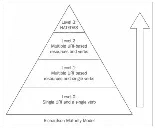

# REST APIs 的 Richardson 成熟度模型

> 原文：<https://medium.com/codex/richardson-maturity-model-for-rest-apis-8c9eaeaa4a6?source=collection_archive---------2----------------------->

## [法典](http://medium.com/codex)

## RMM 如何帮助我们构建更好的 API


我研究 REST APIs 已经有一段时间了，不可避免的会接触到很多关于 Leonard Richardson 开发的 **Richardson 成熟度模型** ( **R.M.M.** )的文章和推荐。这让我思考为什么它很重要，以及我们如何应用它的原则来制作一个易于使用(和理解)的 API。

经过一些研究和使用(实现或使用)REST APIs，这些 API 符合 RMM 的最高级别和其他远非如此的级别，我有一些结论想在本文中分享。

我喜欢来自维基百科的理查森成熟度模型的定义:

> RMM 可以用来确定 web 服务架构遵守 REST 原则的程度。它将 Web API 分为四个级别(从 0 到 3 ),每一个更高的级别都对应于对 REST 设计的更完全的遵循。下一级也包含上一级的所有特征。”

简而言之，RMM 告诉我们一个 REST API 的成熟度级别，符合最后一个级别的被认为是“ *Restful API* ”。

描述 RMM 的成熟度级别及其关键点是很重要的。



来自:[https://restfulapi.net/richardson-maturity-model/](https://restfulapi.net/richardson-maturity-model/)

# 0 级

这是最底层，描述了一个 web API *，它有一个通过 HTTP 的 URI* 和一个接受服务支持的所有操作的方法*(通常是‘POST’)。因此，没有正确使用 HTTP 协议，它被用作客户端和服务器之间远程交互的隧道机制。*

*没有明确定义的资源，消息传递以“xml”、“json”或其他文本格式完成。典型的 SOAP web 服务属于这一类，这被称为'*POX 的沼泽*'(普通的旧 XML)方法。*

*举个例子，它可以是一个服务，有一个像*/movie service*这样的端点，在这里你可以检索关于一部电影或其演员的信息，甚至插入、更新、删除一些用 xml 描述的电影数据；所有这一切都是通过使用适当的 xml 有效负载发出 POST 请求来实现的。*

# *一级*

*在这个层面上，*资源*被引入。现在，服务有许多 URIs(仍然通常使用 HTTP POST 方法)，每个 URI 标识一个资源，所以现在每个资源都可以单独寻址。现在，可以通过特定的 URI 访问单个资源，而不是单个端点。*

*例如，我们现在可以使用*/movie service*和 */actorsService* 端点来请求对“电影”和“演员”资源的操作。*

# *第二级*

*这里，API 开始使用 *HTTP 动词/方法*，以及 HTTP 状态代码。这一级充分利用了 HTTP 作为应用层协议的全部潜力。*

*通常，GET 方法用于从给定的资源获取数据，而 POST、PUT 和 DELETE 方法用于突变操作。*

*因此，对于由其 URI 标识的给定资源，可以提供完整的 CRUD(创建、检索、更新和删除)操作。*

*在这一层，HTTP 协议用于设置所请求操作的含义，请求体将不再携带操作信息。因此，该 API 比以前的级别显示出更高的成熟度。*

*例如，我们可能有一个 */movie* 端点(URI)，在这里可以使用 GET 方法读取数据，并使用 POST/PUT/DELETE 动词创建/更新/删除资源条目。HTTP 200 响应状态代码可用于指示操作正常，而 400 状态代码可用于通知这是一个错误的请求。*

# *第三级*

*这是理查森模型的最后一个也是最成熟的。这一级引入了*超媒体*表示，也称为 *HATEOAS* (超媒体作为应用程序状态引擎的首字母缩写)。*

*HATEOAS 是嵌入在资源响应消息中的元素，它驱动 API 客户端的交互。*

*通过使用 HATEOAS，这种级别鼓励容易发现，并使响应易于自我解释。因此，服务引导消费者通过一系列资源，结果导致应用程序状态转换。*

*在第三层开发的 API 通常被认为是完全 RESTful 的 API。*

*例如，想象一个 */movie* 端点(URI)，在那里创建了一个新的电影资源，由 id = 10 标识(通过 POST 请求创建)。响应可以包含表示当前状态和进一步操作的链接，如下所示:*

```
*// json response representation
{
   "movie": {
      "id": 10,
      "name": "Back to the Future",
      "releaseYear": 1985
      "**links**": **[**
         *link: {
            "rel": "self",
            "uri": "/movie/10"
         },
         link: {
            "rel": "comments",
            "uri": "/movie/10/comments"
         }*
      **]**
   }
}* 
```

*在上面的例子中，我们被告知检索到的电影资源的 URI 是' */movie/10* '，在这里我们可以使用 http 动词(PUT、GET 等)请求操作；并告知我们可以在 URI '*/movie/10/comments*'请求操作该电影的评论资源。*

# *结论*

*当我第一次看到“成熟模型”时，我首先想到的是:“哦，不，不要再这样了！”。在过去，我曾参与过试图遵循某种“成熟度模型”(比如“ [CMMI](https://pt.wikipedia.org/wiki/CMMI) ”)的开发过程，这并不是一次好的经历。太多的官僚作风和当时很少的航运法规。*

*但是通过研究 RMM，我意识到它是一种简单的规则，可以确保 HTTP 协议以其全部的能力和特性被使用。*

*简言之，Restful API 实现必须是这样的:*

> *REST =基于资源的 URI +充分利用 HTTP 规范+超媒体(HATEOAS)*

*当然也有缺点，因为我已经看到了一些关于超媒体表示(HATEOAS)的争议。在“json”请求体中，没有像“xml”中的“xsd”那样的先前模式验证。*

*作为一种标准化，它节省了客户开发人员理解 API 的资源和操作的时间。*

*在我看来，遵循这种模型可以避免构建描述 API 的庞大而密集的开发人员门户。列出“资源”、一些请求/响应示例和 swagger/openapi 文档的简单门户应该足够了。*

*RMM 有几个级别，在大多数情况下，级别 2 对于良好的开发人员体验来说已经足够了。*

*即使 API 在底层，到达下一层也只需几步，并不困难！*

*所以我的看法是，可以用 Richardson 成熟度模型作为指南，简化开发 REST APIs 的过程，帮助开发者设计出成熟直观的 Restful API。*

# *资源和进一步阅读材料:*

*   *[马丁·福勒的理查森成熟度模型](https://martinfowler.com/articles/richardsonMaturityModel.html)*
*   *[REST API 教程:Richardson 成熟度模型](https://restfulapi.net/richardson-maturity-model/)*
*   *[了解你的 API 有多 RESTful:RMM 概述](https://developers.redhat.com/blog/2017/09/13/know-how-restful-your-api-is-an-overview-of-the-richardson-maturity-model/)*