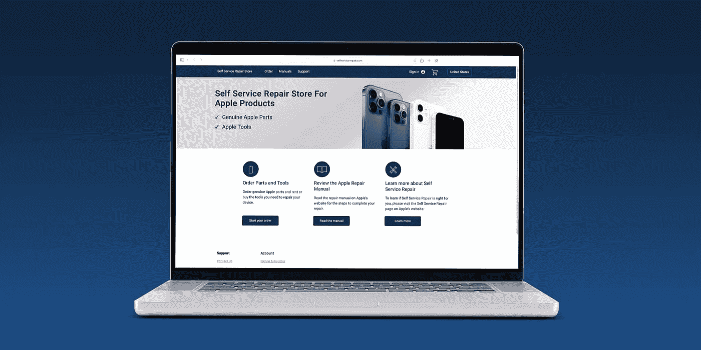
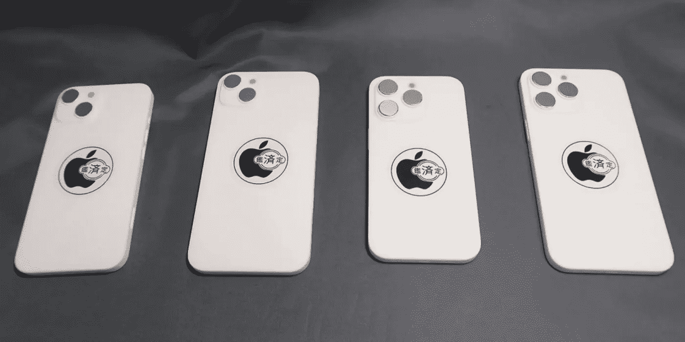
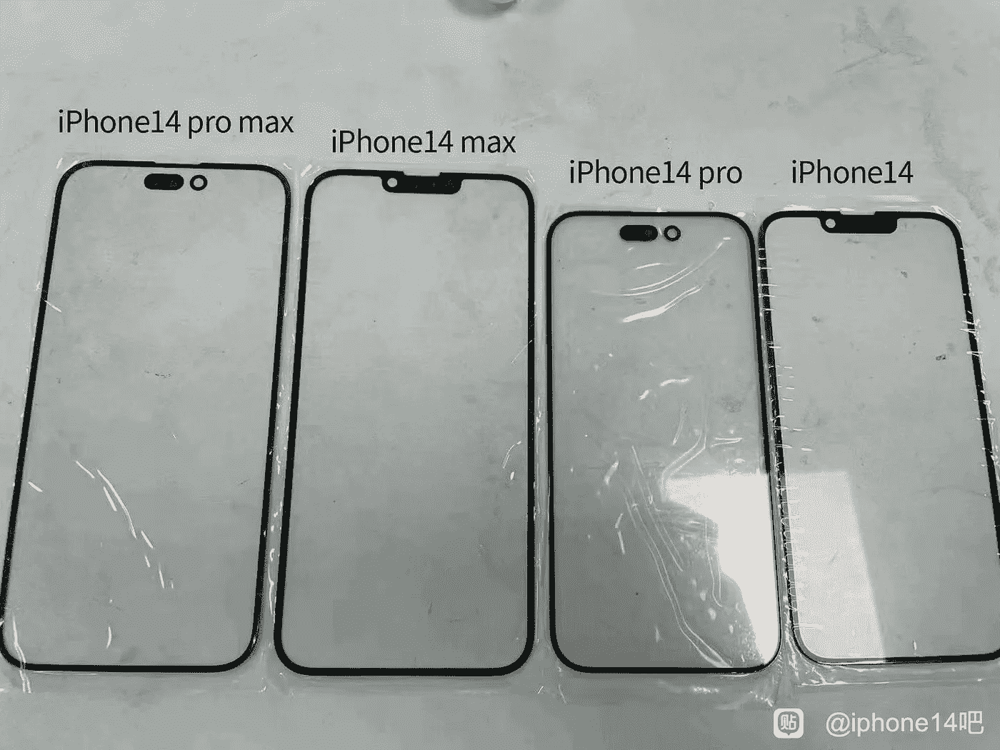
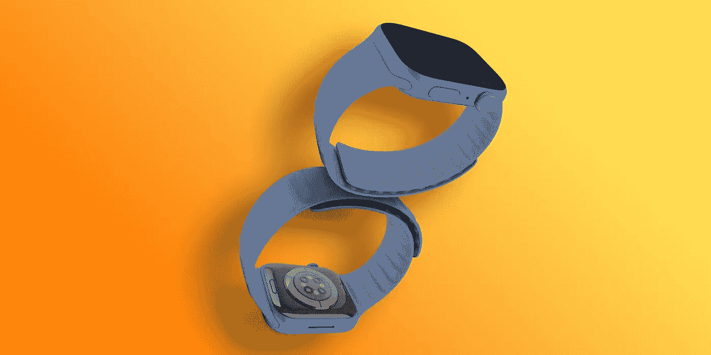
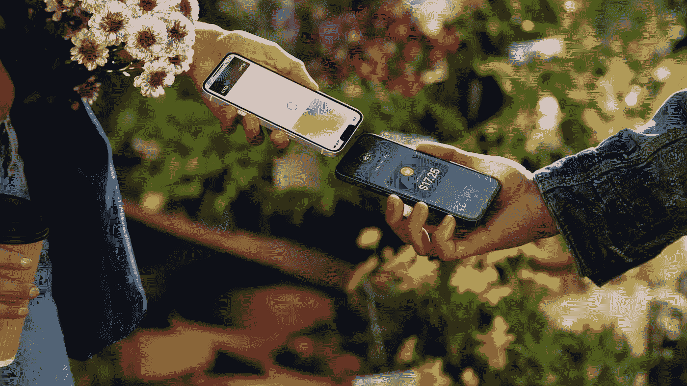
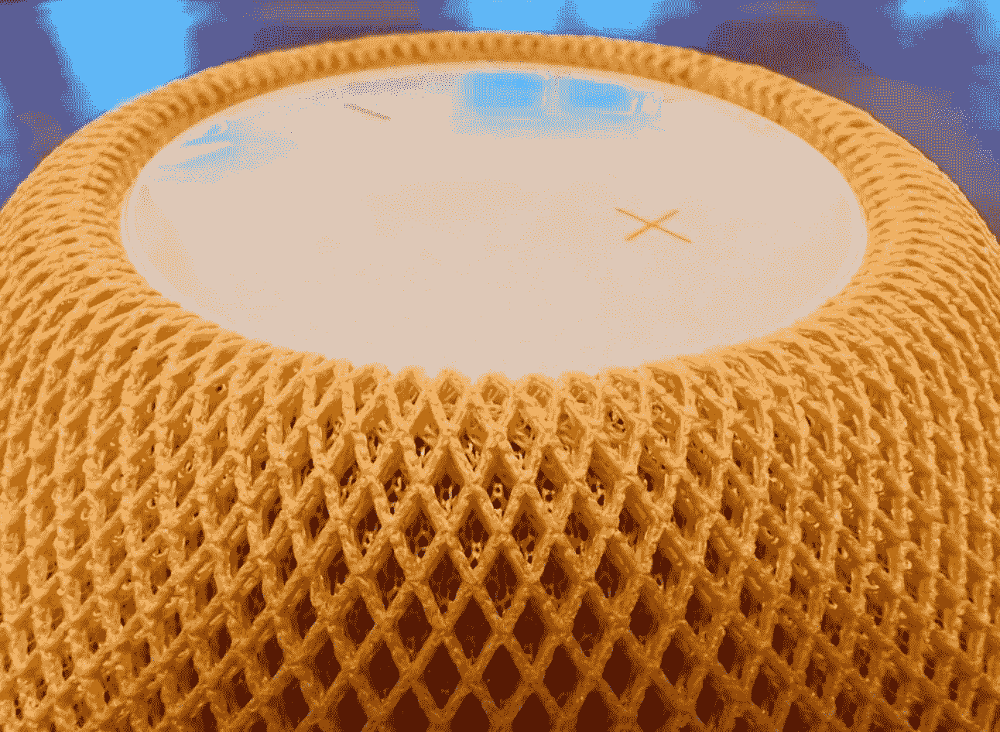
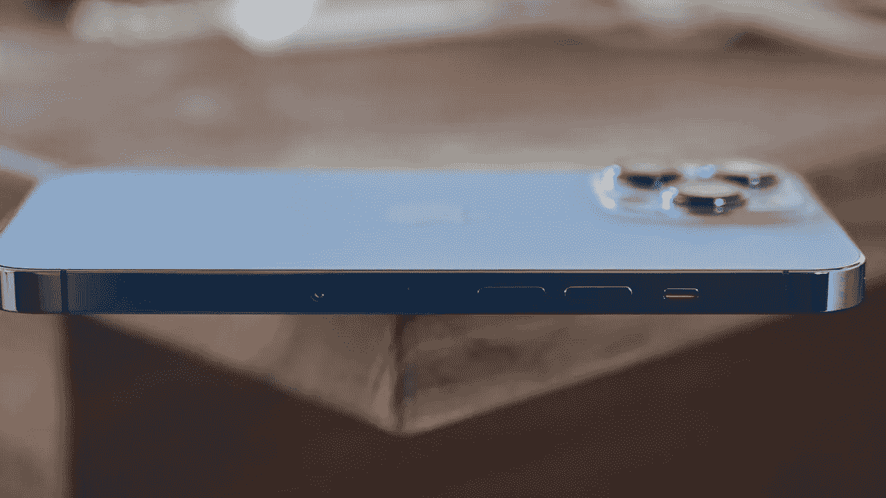
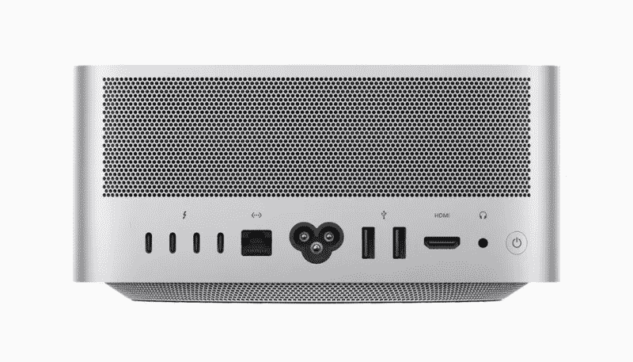
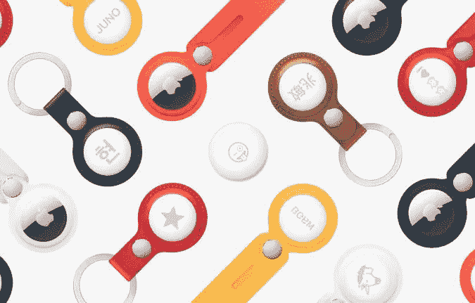
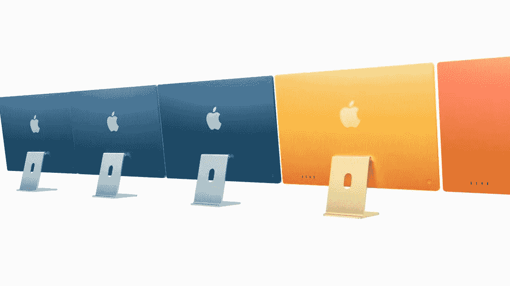

# 维修权利成为现实，iOS 16 新闻&更多关于 iPhone 14

> 原文：<https://medium.com/codex/right-to-repair-gets-real-ios-16-news-more-on-iphone-14-6fee2039d7bc?source=collection_archive---------7----------------------->

## 苹果视图回合-2022 年 4 月 25 日至 4 月 29 日

***本周为您带来大量内容，包括关于 iPadOS 16、iPhone 14 和新娱乐系统*** 的故事

负十六播客

## 它实际上在这里

维修权成为现实

本周，期待已久的[自助维修店](https://www.selfservicerepair.com/home)开门营业。在 2021 年末宣布时，我们几乎开始认为它已经消失得无影无踪了。只要你拥有 iPhone 12 或更高版本，你现在就可以维修包括显示器、电池&摄像头在内的组件。你花 49 美元从苹果公司租了一个工具包，为期一周。这些工具包包括苹果自己使用的相同工具，并配有必要的压力机、螺丝钻头和保护盖。价格各不相同，但举例来说，一个新的 iPhone 屏幕将花费你 269 美元。举个例子，让苹果公司修理你的屏幕要花 279 美元。从表面上看，这只是节省了 10 美元，但有趣的是，当您退回损坏的零件时，您将获得赊账。我们在这里谈论的同一个屏幕，将在你的钱包应用程序中还给你 33.60 美元，苹果将回收这些部分。因此，在我们的例子中，你会比让苹果公司修理你坏掉的 iPhone 13 屏幕节省 46.85 美元。终于——现在我们有了骨胳上的肉，我可以看到它会大受欢迎，尤其是在演职员表生效的情况下。

## **哦太好了！**

工作室展示——仍然存在问题

如果你经常阅读我的博客或观看我的视频，你会知道我已经订购了 MacBook Pro 和 Studio Display。发布时，每个人都在抱怨显示器上 1080p 网络摄像头的质量。苹果公司坚持说他们已经意识到了这一点，他们将推出一个固件更新来解决这个问题。反馈给苹果的故障包括图像模糊、褪色和图像“噪音”。本周，该更新向测试版开发者推出，但消息并不乐观。[杰森·斯内尔](https://twitter.com/jsnell)承认，虽然中央舞台更容易使用，噪音也更少，但糟糕、褪色的图像质量没有丝毫改善。看来问题是出在硬件而不是软件上。他们对广角摄像头的选择似乎是问题所在，修复可能与传感器有关。解决这个问题的唯一两个可能的解决方案是使用更高分辨率的传感器，这样裁剪的图像至少是 1200 万像素。另一个解决方案是一个更大的传感器来捕捉更多的光线——这将有助于减少图像中的噪声。但愿到六月份我的水雷装船时，我会有更好的硬件上船。

 [## iPad 真的坏了吗？

### 还是我们只是用错误的方式看待它？

medium.com](/codex/is-the-ipad-really-broken-18968b593073) 

## iPhone 14 外壳谣言

iPhone 14 保护套

今年的 iPhone 将在不到六个月的时间内与我们见面，随着苹果供应商准备就绪，泄漏正在从供应链中出现。Mac Otakara 本周发布的图片让我们更近距离地了解了将要发生的事情。正如我们所知，今年将只有两种屏幕尺寸选择。我们将有 6.1 英寸和 6.7 英寸的选择，没有迷你。鉴于屏幕尺寸与目前的阵容相同，希望您能够将外壳换成在 14 上使用。可悲的是，由于我们的老朋友，相机颠簸，似乎不是这样。不仅仅是磕碰的错，现在手机整体厚度都超过 11 mm 了 ***魔鬼总是在细节里，诶！***

## 屏幕坏了

iPhone 14 正面玻璃图片

最初发布在中国社交网站[百度](https://tieba.baidu.com/p/7814326771)上的一份泄露文件向我们展示了今年手机的正面玻璃。它证实了我们听到的和怀疑的。两款非专业手机仍将按照 13 的要求保留凹槽，但两款专业手机将采用新的药丸和孔设计。据我们所知，pro 手机也将有一个略小的边框。 ***我想，这将是一个证明，但它看起来并不那么糟糕。***

## 让我们谈谈美元

预计 iPhone 14 将涨价

如果你认为今年 pro 系列的无凹口设计会成为大新闻，那就再想想吧。这将是代价。[马克·古尔曼](https://twitter.com/markgurman)透露，尽管非专业手机比前几代手机共享的功能更少，但由于尺寸选择有限和组件成本上升，我们可能会看到一些大幅提价。 ***不出意料的话。***

## **手表时间**

苹果手表 8——期待更新

今年夏天，我们也可以期待下一代 Apple Watch 的推出。谣言很少，但这里有四个我认为值得一提。屏幕尺寸不会变。这似乎不符合今年的设计职权范围，所以仍然只有 41 毫米和 45 毫米的选择按照 7 系列。一个体温传感器已经被证实[彭博新闻](https://www.bloomberg.com/) & [郭明志](https://twitter.com/mingchikuo)。不过，正如我已经报道过的，它只能用于女性测量她们的排卵周期。更好的芯片应该是今年手表的核心，新的 S8 SoC。这种芯片通常会更快，也为活动监控带来了重大更新。最后，睡眠追踪应用将会有所改进。苹果在 7 上包含了它，但与第三方产品相比，它很差。然而，与睡眠跟踪的持续战斗是电池寿命。我们甚至在睡梦中也被监控。会不会没完没了！

 [## 这会是迄今为止最好的 MacBook Air 吗？

### 为什么 M2 MacBook Air 可以改变一切

medium.com](/codex/will-this-be-the-best-macbook-air-yet-eaf621d8dfaf) 

## 苹果再次陷入困境

更多的麻烦——这次是欧盟

今年早些时候，我报道过苹果将在 iOS 16 上实现非接触式支付。这是通过手机内的 NFC 芯片完成的，但似乎苹果正在限制其访问。欧盟担心该公司正在不公平地阻止 PayPal 和 Venom 等公司访问芯片。这将意味着其他金融提供商无法使用 Apple Pay 体验。不仅如此，苹果还面临着向第三方应用商店开放其 iPhone 并允许 iMessage 成为跨平台消息服务的压力。 ***我其实很同情他们。他们创造技术和硬件，资本主义的方式当然是让他们收获回报。***

## 该给你妈妈治病了

母亲节就要到了

在美国，母亲节临近。你别忘了，你日记的日期是 5 月 8 日星期天。在美国，如果你使用 Apple Pay，会有很多优惠活动。鲜花、香水和个性化礼物可以打折。我会在这里留下推广[的链接。善待她——你只有一个！](https://www.macrumors.com/2022/04/19/apple-mothers-day-gift-guide-2022/)

 [## iPhone 14——最新独家新闻

### 颜色，相机，电缆，什么都没有！

medium.com](/codex/iphone-14-the-latest-scoop-f1ffb021d571) 

## HomePod 新闻

HomePod 会卷土重来吗？

上周，我报道了 HomePod 开始成为收藏家的物品。下一代有望与众不同，甚至可能取一个全新的名字。看起来它可以整合 HomePod、苹果电视和 FaceTime 摄像头。我猜苹果公司会把这看作是他们家用产品系列的中心，然后会把大量的(改进的)HomePod Mini 分散开来。可能会有一个真正的 HomePod 替代者，但这似乎还有一段路要走。首先将是一个家庭娱乐系统，其次是 HomePod 迷你规格泵，然后，最后是原始 HomePod 的新迭代。我有一辆 HomePod Mini，非常喜欢。带上更多的装备。

## 增长在继续

对苹果公司来说，更多的经济好消息

安卓和苹果，这似乎不是一场公平的战斗。新的研究表明，在过去五年中，Android 的市场份额下降了 8%，而苹果 iOS 的市场份额增长了 6%。研究公司 [StockApps](https://stockapps.com/blog/android-loses-8-of-its-global-os-market-share-in-five-years/) 报告称，Androids 有史以来最高的市场份额是 2018 年的 77.32%。截至 2022 年 1 月，这一比例已降至 69.74%。同期，iOS 市场份额从 19.4%增长到 25.49%。Android 市场份额的损失可以归结为操作系统领域竞争的加剧。在类似的新闻中， [Counterpoint Research](https://www.counterpointresearch.com/global-pc-shipments-q1-2022/) 声称，与 2021 年同期相比，Q1 的个人电脑出货量下降了 4.3%，但苹果的 MacBook 销量却上升了 8%。全球笔记本电脑销量整体下降，这归因于供应链问题。 ***我需要一瓶苹果成功丸！***

 [## wi-fi 去哪了？

### 苹果有许多依赖 wi-fi 的产品，但他们不再有路由器。为什么？

medium.com](/codex/where-did-the-wi-fi-go-15ecea31a89e) 

## **iPadOS 16**

iPadOs 16 的变化

几乎可以肯定的是，iPadOS 16 将会在六月的 WWDC 发布。下一代操作系统将在第二代 iPad Pro 10.5 之前的 iPad 上得到支持。泄露的信息很少，但热门的门票似乎是新的多任务功能和改进的 Notes 应用程序正在路上。通知在过去几年里被玩弄过，但看起来苹果仍然不满意。用户多年来一直想要更好的多任务处理体验，似乎正在努力。例如，Windows 将是真正改善大屏幕用户 iPad 体验的最安全的选择。虽然该公司使使用幻灯片和分割视图变得更容易，但操作系统仍然没有出现。iPad 用户喜欢的其他选择是让专业应用程序进入 iPad，并且能够像 Mac 一样登录其他用户帐户。 ***我写了整整一个博客关于*** [***这个***](/codex/is-the-ipad-really-broken-18968b593073)

## 那是什么声音？

一些 Mac Studio 用户的问题

似乎在发布一个月后，许多 Mac Studio 用户报告了一种似乎来自机器风扇的高音调“呜呜声”。显然，该噪声是除风扇噪声之外的噪声，由于其高音调频率，很难忽略。大多数投诉来自 M1 Max 工作室的用户，而不是 M1 超芯片。这两台机器有完全独特的散热器，Ultra 有一个大得多的铜散热器，我们认为这有助于防止风扇频繁启动。一些用户退回了他们的机器，但在更换机器时报告了同样的问题。新科技，谁会拥有它！

## **声音很大**

航空标签—现在更容易找到

在无数关于滥用空中标签的报告之后，你可能还记得，在二月份，苹果公司承诺将它们发出的噪音变大，以便更容易定位和找到它们。该计划于本周开始实施，但实施时间非常错开。只有 1%的用户在周二，也就是发布的当天收到了固件更新。另外 10%将在 5 月 3 日更新，25%将在 5 月 9 日更新，更新将在 5 月 13 日完成。 ***看似复杂的铺开。我想他们有他们的理由。***

## 最后

在今年新闻 M2 芯片的预期发布之前，彭博社马克·古尔曼报道称，苹果已经在计划一款采用 M3 芯片的 iMac。由于 M2 可能只是 M1 的小升级，我预计 M3 基础芯片也是如此。然而，最令人惊讶的是，古尔曼确信 iMac Pro 将会出现。至于 24 英寸的 M3 iMac，别指望它会很快出现。我怀疑明年年底将是我们看到它的最早时间。不过，除了芯片，预计不会有其他重大变化。它永远不会静止不动，嗯！

如果我错过了什么新闻，请告诉我，我会在下周报道——当然，这要归功于你自己！

## 在你走之前

你订阅媒体了吗？

我只是高端博客网站 Medium 的众多作者之一。这是如此好的价值，你可以在这里加入 https://medium.com/membership

加入我的幕后邮件[列表](https://www.talkingtechandaudio.com/)

最初发表于 2022 年 4 月 29 日 https://www.talkingtechandaudio.com/blog。