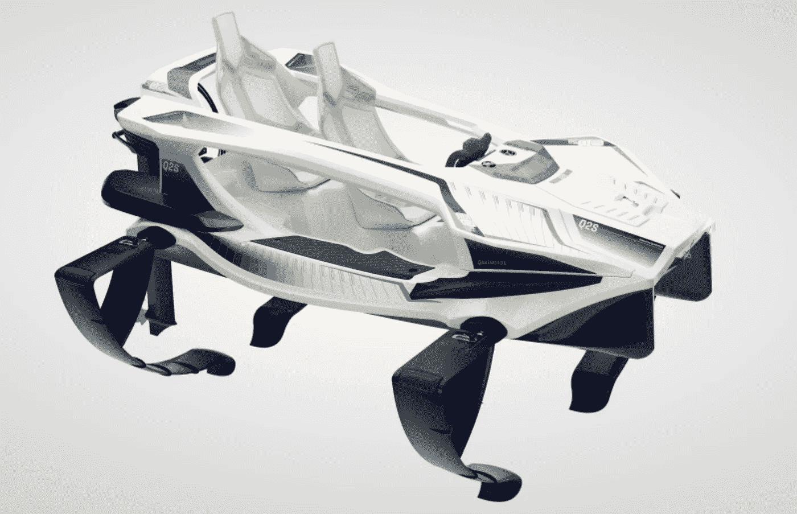

# 在四分之一英尺的水面上升起！

> 原文：<https://medium.com/codex/rise-above-the-open-water-in-a-quadrofoil-da12766effb2?source=collection_archive---------8----------------------->

## Q2S Quadrofoil 中又一个昂贵的水上玩具！

[Q2S(由 Quadrofoil 提供的介质)](https://quadrofoil.com/q2s.html)

每年夏天，当天气开始变热时，我就开始考虑开阔水域和我们用来穿越它的船只。天气热的时候，人们往往会涌向水边凉快凉快。有什么比找到新的船只来利用它更好的体验水的方式呢？经过几年的酝酿，这个…