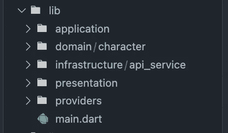

# river pod+state notifier+Freezed+Flutter 中的 DDD—从 API 获取数据

> 原文：<https://medium.com/codex/riverpod-statenotifier-freezed-ddd-in-flutter-fetching-data-from-the-api-ba232c7d1144?source=collection_archive---------2----------------------->

极小的

你好，我的朋友们。在本文中，我将教你如何从 API 中获取一些数据(我将使用“rickandmortyapi ”,因为它很好)。

我强烈建议你阅读我的第一篇文章，在那里，我展示了 Riverpod，所以你可能需要它。 [*如果你读的时候不明白，那么你也可以查看我的 YouTube 频道*上的视频教程。](https://youtu.be/hc7zZTEqFyA)有好看的视频非常了解 Riverpod。另外，你可以查看上面这篇文章的视频教程。现在，我们可以开始我们的主要话题了。

首先，对您的**public spec . YAML**文件实现必要的包:

添加包后，让我们移动代码部分…

# 文件夹结构

对于这个项目，我们将再次使用 DDD 建筑。我喜欢这个建筑，因为它很整洁。在这里，您可以看到文件夹结构:

> 注意:我们现在有一个基础设施文件夹，在我的第一篇文章中没有基础设施文件夹，因为我们没有使用它。

让我们从基础结构文件夹开始。

# 基础设施文件夹

在这个文件夹中，我们还有 api_service 文件夹。

这里我们只创建了 ApiService 类，以及一个从 API 获取数据的函数。这个文件的目的只是获取数据(我不使用 toJson 或 fromJson，因为我使用“Dio”包。

在基础设施文件夹之后，我们可以移动到我们的 **Providers** 文件夹，我们将为 ApiService 类创建必要的提供者。

# 提供商文件夹

首先，我需要在这里说，我将显示提供者只属于 ApiService 类。因此，对于这个标题，我将只显示 **api_provider.dart** 文件和**characters _ datas _ provider . dart**文件。

这是我们的 *api_provider.dart* 文件。它只有一行代码。我们使用普通的提供者，因为我们只想得到 ApiService 类，仅此而已。

> 只需将 Provider 用于上述简单的事情。

接下来，我们有了*characters _ datas _ provider . dart*文件。这里我们使用 FutureProvider，因为我们想获取数据，它是异步代码。它的类型是字符模型列表。我们很快就会知道它是什么。它在**域**文件夹中。

我们使用 *ref.read* 而不是 *ref.watch* 函数，因为它是未来函数，而不是流函数。我创建了一个空列表，因为在从 API 获取字符或数据后，我只是将数据添加到列表中的类型 **CharacterModel** 。最后，添加完数据后，我只是返回我的列表，就这样。

> 将 FutureProvider 用于未来流程。我还使用了 autoDispose 方法，因为我不想手动处理它。

我在上面告诉过你，我们还有一个提供者，实际上是 **search_provider.dart** 文件，我会在必要的时候解释它。

# **域文件夹**

在启动应用程序文件夹之前，我们需要创建一个域文件夹。我确信你的代码会给出一些错误，比如没有 CharcaterModel 类等等。所以，让我们来解决它。此外，我们将在应用程序文件夹中使用它。

创建模型之后，让我们运行构建运行程序的代码。

> 颤振包 pub run build_runner watch —删除—冲突—输出

运行这段代码后，它会为我们创建一个冻结的文件。

# 应用程序文件夹

要开始创建业务逻辑，我们需要 3 样东西:状态、事件和状态通知程序。

让我们从创建一个国家开始。

这里是我们的州。在创建了一个*事件*文件之后，我们将运行构建运行程序的代码，所以请耐心等待。

这也是我们的事件文件。我们只有 2 个事件，当我们搜索某些东西时，我们需要它，当我们单击搜索按钮时，我们也需要另一个名为 *updateListItems* 的事件。现在，运行下面的代码来创建*冻结的*文件。

> 颤振包 pub run build_runner watch —删除—冲突—输出

所以对于应用程序文件夹的最后一件事，我们还需要创建我们的 *StateNotifier，*然后我们可以更新状态。

就这样了，伙计们。现在我们可以移动到最后一个文件夹，它位于演示文件夹中。我们还需要创建 search_provider，以访问上述文件(搜索状态、事件、通知等。)

## 搜索提供商

在这里，我们再次将 *StateNotifierProvider* 用于特定的状态。此外，我们使用手表而不是读数，因为我们的网速可能很慢，所以这意味着，当我们等待时，它可能是空的。此外，你可能意识到我不仅仅返回了 *SearchNotifier* ，我还返回了 *SearchNotifier* 的具体函数及其事件。

当我调用 *searchProvider* 时，我想获取数据。所以，我们来举个例子:

想象你关闭了应用程序。第一次打开后，你会去取。另一个例子是:假设你的应用程序中有 3 页。第一页是主页，就像我的 Rick 和 Morty 应用程序一样。其他的例如与用户的简档相关。因此，您将转到个人资料页面。之后，你想回到主页。现在，您可能想要更新来自 API 的数据。所以，在设置好一切之后，我们也可以使用两个点来创建我们的 StateNotifier，然后调用一个特定的函数。

# 演示文件夹

实际上，这里我只想处理 Consumer、ConsumerWidget 和 ProviderScope 小部件，因为本教程的目的不是小部件。它与 Riverpod 有关。所以，我们开始编码吧。

## main.dart 文件

> 如果您使用 Riverpod，那么您必须用 ProviderScope 包装所有的小部件。不要忘记。

## 搜索 _bar.dart 文件

这里你可能意识到我们没有使用 ConsumerWidget。我们只是用消费者。两个都可以用。

这是我们的搜索栏小部件的*消费者部分。*

此外，您可以使用 ref.refresh(PROVIDER)方法来刷新状态。我在教程视频中解释了更多的细节。

## 瑞克 _ 和 _ 莫蒂 _ 物品.镖文件

在这个文件中，我们用 *ConsumerWidget* 扩展了我们的类。我们没有使用 *StatelessWidget* ，因为我们想在构建之上观察我们的状态。上面我说了，**可以为 null** ，那么当它为 null 的时候，那么我们展示具体的文字:*“没有任何字符”*比如。

这就是我的全部。欢迎在评论区提问。此外，你可以从[这里](https://github.com/alperefesahin?tab=repositories)浏览我用 Riverpod 创建的应用程序。我强烈建议从[这里](https://youtu.be/hc7zZTEqFyA)看这个教程的视频。

感谢您的阅读，敬请关注！