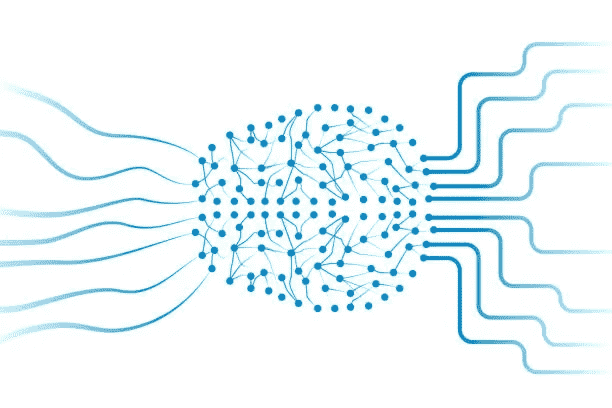
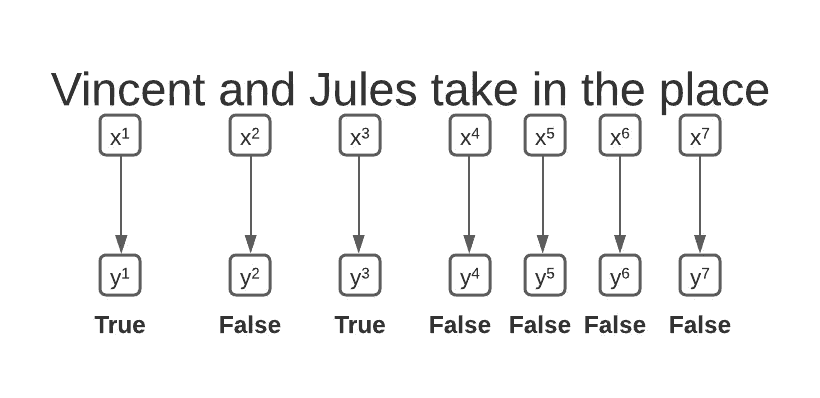
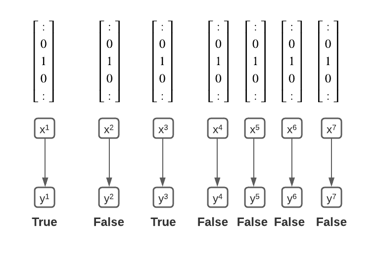
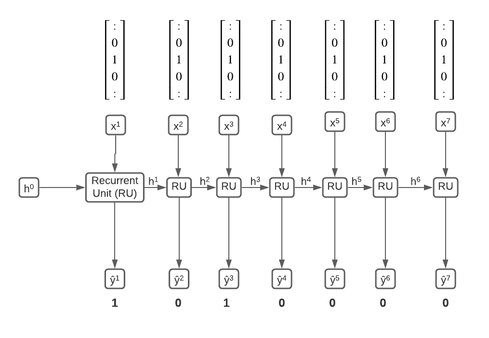
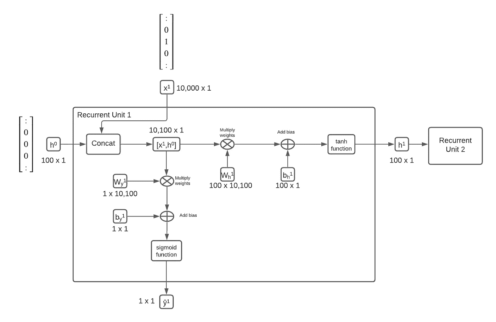

# 自然语言处理的 RNNs

> 原文：<https://medium.com/codex/rnns-for-natural-language-processing-d7242e6e0842?source=collection_archive---------6----------------------->

在过去的十年中，用于解决自然语言问题的深度学习模型的开发取得了显著进展。目前的技术水平使用复杂的大规模神经网络，具有数亿个参数。然而，为了理解最先进的体系结构，本文将提供一个更小的神经网络的背景，以便理解前沿技术。

# 递归神经网络(RNN)

*什么事？*

递归神经网络对于处理顺序输入非常有用，几乎所有的 NLP 任务都使用顺序输入。顺序输入是一系列输入，其中输入的顺序包含重要性或意义。检查任何语言的文本，很明显，改变单词的顺序可以彻底改变句子的意思。与前馈神经网络不同，递归神经网络保持一个隐藏状态，并在处理序列中的每个新输入时更新这一内部状态——这使 rnn 能够了解输入排序的重要性。

*它有什么用处？*

自然语言处理中的递归神经网络有许多实际应用，例如实体识别、情感分析或机器翻译等等。在本文的上下文中，为了理解更复杂的 RNNs，将介绍最基本形式的 RNNs，如长短期记忆网络(LSTMs)，门控循环单元(gru)，注意模型和变压器。

*它是如何工作的？*

让我们考虑实体识别的一个任务:确定句子中哪些单词是名称。作为一个例子，考虑句子“文森特和儒勒采取的地方”。对于这个句子中的每个单词，输出应该是这个单词是否是一个名称。

由于 RNNs 只能接收数字或向量作为输入，而不是文本的字符表示，因此每个单词都需要转换为唯一的向量。在这个例子中，我们将使用一个热点编码向量。要复习单词嵌入，请查看这篇文章:

 [## 单词嵌入

### 将单词编码为向量，以便计算机理解和推理

medium.com](/@matthewkramer_20144/word-embeddings-173d67c7a295) 

现在，每个输入都是一个 0 的独热向量，只有一个 1 条目:

让我们来看看一个递归网络如何寻找这个用例

每个输入都有自己的小神经网络——在图中标记为循环单元。递归单元有两个输入:输入单词的一键编码向量，以及一个隐藏状态——在图中显示为 h^t。隐藏状态是嵌入到网络中的另一个向量，它对以前的单词和预测的上下文进行编码，以便以后的递归单元可以使用该上下文来学习单词的排序如何影响输入的含义。例如，考虑句子“文森特和儒勒采取的地方。”当神经网络试图预测“Jules”是否是一个名字时，隐藏状态会对前面的两个词“Vincent”和“and”进行编码，以便意识到“Jules”这个词更有可能是一个名字。

每个递归单元也有两个输出:一个预测和下一个递归单元的隐藏状态。

递归单元是一个独立的神经网络，其结构可以根据使用情况而变化。递归单元的内部可能变得有点数学密集，理解所有细节并不太重要。简而言之:

1.  输入 x 向量和隐藏状态 h 向量连接在一起。
2.  为了产生当前预测ŷ，级联向量乘以一组学习到的权重并添加到偏差，然后通过激活函数，通常是 sigmoid 函数。
3.  为了产生下一个隐藏状态 h，级联向量乘以一组单独学习的权重，并添加到单独的偏差，然后通过激活函数，通常是双曲正切函数。

下图显示了上图中第一个循环单元的情况。

该图中的隐藏状态向量具有 100 的维度，但是这可以是任何值，例如 200，或者甚至 1000。输入向量的维数取决于词汇量，在这种情况下，假设词汇量为 10，000。

在训练期间，第一隐藏状态，h⁰可以被初始化为 0 的向量或随机数。

*有哪些局限性？*

这种简单的递归神经网络方法有许多缺点，这就是为什么当前最先进的模型使用更先进的体系结构来试图减轻这些限制中的一些。

1.  一个通常被称为“消失梯度”的问题。对于较长的输入序列，隐藏状态向量开始失去序列中较早单词的上下文。这是由于训练算法和激活函数的性质导致梯度接近 0。关于这个问题的更深入的数学分析，请看 https://youtu.be/qhXZsFVxGKo 的
2.  并行是很难的。对于新的预测，网络中的每个递归单元要求前一个递归单元在它之前计算隐藏状态。在训练期间，梯度和损失必须以与隐藏状态如何通过网络传播相反的方式通过网络反向传播，从而使得训练也难以并行化。

门控循环单元(GRU)和长短期记忆(LSTM)试图弥补消失梯度的限制，而变压器试图通过使网络高度并行化来解决第二个限制。

# 有用的资源

*   https://www.coursera.org/learn/nlp-sequence-models 吴恩达关于序列模型的课程(点击‘审计课程’可免费观看所有视频)