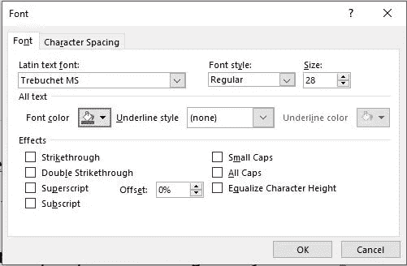

# 罗伯特的 API 文件编写顺序规则

> 原文：<https://medium.com/codex/roberts-rules-of-order-for-api-documentation-writing-a2d52bfba41c?source=collection_archive---------0----------------------->

罗伯特·德尔伍德
首席 API 文档作者

下面是一组编写 API 文档的指南。API 文档编写是一个令人兴奋的领域，会得到你的朋友和同事的尊重和钦佩。但不太受关注。也就是说，直到程序员不能让他们的应用程序工作。

许多人认为写作是机械的，机器生成的文档已经足够好了。不是的。想想看，谁编写机器生成的文档？实际上，这是一门艺术。很多时候，新作家被教授写作的技巧，却忽略了写作的要点。重点是传达信息。如果开发人员能够理解文档，他们会喜欢它。所以用一种有用的方式传达信息是一门艺术。

当开始编写 API 文档时，要学会满足读者的期望。剩下的就水到渠成了。以下指南会有所帮助。他们被称为*罗伯特的 API 文档编写顺序规则*。或者仅仅是*罗伯逊*。

1.  **永远做一个初学者。API 指南的秘密在于总是能够像初学者或第一次阅读文档的人那样查看文档。许多经理认为任何使用 API 的人都已经足够先进，你可以跳过基础材料。他们错了。我甚至可以开始引用我自己，见下面的“你的老板错了”。不要跳过任何东西。有足够多种类的编程，你不能假设每个人都知道一切。精通 C#或 Java 的程序员可能不知道 npm。**
2.  你在为自己记录。写下向自己解释的文件。假设这是一份你工作中需要的参考指南，并包括相关细节。例如，把它看作是你每三个月或六个月才使用一次的程序。三个月之后，你可能会记住大致的想法，但是你会忘记一些小细节。那些小细节才是最重要的。六个月后，你甚至会忘记应用程序的名称。此外，如果你不知道它是什么，或者你不知道下一步该做什么，并且记住你处于一个所有开发人员都在你周围的理想状态，它需要被记录。如果你有什么问题，他们也会有同样的问题。停下来，立即记录下来。不要害怕偏离时间表，或者为了记录你不知道的事情而增加额外的页面。
3.  记得你的第一次。大多数人第一次做的事情只做一次。我们每天都要做第一次的事情。API 文档作者需要学会像第一次做一样去做事情。记住你遇到了什么问题，什么让你沮丧，你是如何解决这些问题的。
4.  **API 文档必须是每个人的一切**。你有一份新手和 grognard 都看过的文件。这并不意味着它必须对每个群体同等重要。这意味着它不能只针对一个群体。自满和管理将焦点转向有经验的开发人员。这是很自然的事情。当你自己对产品感到舒适时，你就做出假设。这时错误就开始出现了。抵制它。包括那些对你的产品不熟悉的人，还记得你刚开始时遇到的问题。把这些都记录下来。
5.  **迎合他们的懒惰**。要想被你的程序员所喜爱，你必须诉诸一种情感。这不是钦佩或尊重。是懒惰。程序员天生懒惰。他们喜欢一件事只做一次。做能节省他们时间的事情。这意味着提供代码来复制。他们在页面上的时间越少，他们就越喜欢你。将常用参考资料放在折页上方，这样他们就不用向下滚动了。理解 API 参考指南不仅仅是指令，它是一个代码库。做一个足够好的代码样本，他们会多次回来复制它，因为他们不需要记住它。
6.  **按部就班。**参考指南以外的文档，包括分步说明。
7.  **知道自己知道什么。这是最重要的规则。你必须理解你所知道的事情。这是当你假设你知道听众可能不知道的事情。当人们花时间在他们的手艺、爱好或工作上时，他们自然会熟悉这些概念以及行话、行话或隐语。这些是工艺的专门化。这让他们不用一直解释他们已经知道的想法。同样，其他爱好者也开始理解这些术语和概念。那两个人有效地相互交流。他们都有相同的秘密解码环。问题是，当外行人阅读这些材料时。这是作为一个技术作家的典型例子。新人是不会懂的。这是我特别不喜欢首字母缩写词的一个原因。行话本身还不错。我们只需要确保我们定义了那些术语或概念。这在恐怖电影中经常发生，当逃跑的目标受害者撞上小镇警长，然后开始语无伦次地说着外星人、射线枪和 SueEllenBeth 之类的话。我们观众完全知道他在说什么，因为我们刚刚在屏幕上看到了。小镇警长克莱特斯对此一无所知。他需要背景。太多的时候，作者会做出假设，并会遗漏重要的信息或步骤，因为作者知道下一步该做什么。当你回顾程序时，注意你实际采取的步骤，看看你是否因为知道要做而没有包括这些步骤。这些额外的步骤需要记录。**
8.  **知道自己不知道的事。**这是知道你知道什么的反义词。这一次，观众可能知道你不知道的事情。举个例子，我正在阅读一个天气预报，其中一个部分开始使用我不知道的术语。也许观众们知道，这对他们来说是有意义的。实际上，他们可能也没有，我认为这只是一个写得很差的部分。但是你明白这一点。这在我们的技术写作中出现得不多，但是即使在你一无所知的事情上也有可能写出技术材料。把不知道的记在心里，学习术语。
9.  **知道自己不知道的事情。**这是第二个最重要的规则。你必须理解读者不知道或不想知道什么，然后把这些信息包括进去。这两个步骤很容易被忽略，因为作者对材料很熟悉。这些是对以前的补充。记住这些永远是一个初学者，你是在为自己记录，记住你的第一次，你会对需要包含的内容有一个专业的理解。
10.  **你的老板错了。很少有老板管理过一个 API 文档作者，更不用说一个团队了。那些不听 API 文档作者意见的人，根据他们有限的编程或有限的 API 经验做出决定。因此，他们将 API 文档项目视为技术写作项目。他们得到科技写作项目结果，这是一场灾难。这些不是科技写作项目，你不能说服老板们他们是错的。但我们在这里不只是服从命令。我们在这里分享我们的经验和见解。套用史蒂夫·乔布斯的话:“你不会雇佣有经验的 API 文档作者来告诉他们该做什么。你雇佣有经验的 API 文档作者，这样他们就能告诉你该做什么。”我记得我曾经读过的一些东西。一个 API 文档作者欠他老板的不仅是他的行业，还有他的判断力。如果他为了老板的意见而做出牺牲，那他就是背叛了老板。**
11.  **定义每个术语。**这意味着要定义每个术语。不是一些。不是大多数、许多、很多或大量。定义每个术语。这包括像什么是文档这样的术语。没有什么是有失你身份的。定义两个相似项目之间的差异。当需要对两个项目进行区分时，你可以编造条件。第一个制造出可以戴在手腕上的手表的人，有权创造一个新名词:手表。在那之前已经有了计时装置，但是现在我们需要一个更精确的术语来描述它。选择准确描述概念的术语，并始终如一地使用这些术语。定义它的行为意味着你学会了这个术语，学会了它的上下文，并能有见地地谈论它。当你定义了一个术语，你就拥有了它。
12.  **常见而晦涩的概念。我有两类 API 概念:通用概念和模糊概念。普通概念是那些用户或读者可能已经知道的概念。它们仍然需要在某个地方被定义。但是在使用它们的时候，它们可能不需要很长的解释。
    晦涩的概念是指用户或读者可能不知道的概念。它可能只是一个鲜为人知的想法，或者是你的产品独有的概念。当提到一个模糊的概念时，也包括一行、两行或三行关于这个概念的内容。在这里定义它。不要跳过它，不要让他们链接到它，或者在其他地方查找。添加您为什么会使用它，以及使用它的例子。这对于可重复使用的文本来说是好的，但是在每次出现时都要包括这个。这个想法是用最少的工作量尽可能多地帮助用户。
    举个简单的例子，下面是 Word 中的字体对话框，见*图 1:页面底部一个晦涩难懂的题目*的例子。所有的项目都可以理解，除了一个。什么是*均衡字符高度*？我认为这是一个模糊的概念，作为对读者的一种服务，包括一个简短的描述。即使其他项目没有描述。**
13.  我们在这里是为了他们的方便，而不是我们的。这里的“他们”是受众开发者。尽你所能为他们做些事情，即使这对你来说很难。我们在这里尽可能方便他们，让他们有一个良好的体验。这意味着编写包含错误处理和类型检查的代码示例。在一个地方收集材料(比如枚举、对象和返回值)，添加链接而不是“查看文档”
14.  我们在这里是为了他们的方便，而不是我们的。这里的“他们”是公司开发人员。尽你所能为他们做些事情，即使这对你来说很难。我们需要编写代码示例，在提问之前做好功课，一般来说可以节省时间。否则，我们只是给他们制造工作。
15.  **是关于代码的。为什么会是别的？**API 都是关于代码的。所以包含尽可能多的代码，尽可能多的例子，尽可能多的片段是有意义的。每个调用都应该有一个代码示例。你还需要知道行话、技术术语，甚至他们的幽默。要和程序员交谈，你必须尽可能多地了解编程。他们会发现误用或错误的术语，你会失去他们的信任。
16.  例子就是一切。这个怎么说都不为过。如果我认为我只使用代码示例编写 API 参考指南，我会这样做。对每个调用使用代码示例。您可以使用多个代码示例。例如，在介绍电话时，尽可能提供最小的示例，以便他们可以立即复制并粘贴。之后，他们会将参数值更改为自己的值。然后提供一个全面的示例，仅展示该呼叫。最后，包含一个使用调用的实际例子，但是在一个解决问题的更大的上下文中。我最喜欢的 MSDN 页面是解释拖放编程的页面。这里有一个技巧，两种机制必须从一开始就协同工作，编写这样的草稿很难调试。
    这一页有我见过的最完美的例子之一。几乎不需要修改代码，您就可以将它复制并粘贴到您的项目中，它会在第一次编译。我把那个页面加为书签，每次需要拖放的时候就去那里。因为它太简单了，所以我经常想用它。这是一个很好的例子。让程序员回到代码样本的文档中，而不是参考资料。不幸的是，由于它是一个如此好的样本，微软已经删除了该页面，但这是我罕见的先见之明，在我自己复制该页面之前。
17.  你永远写不完。编辑，编辑，编辑。经常回顾你的工作。一直都是。永远。你复习得越多，就越好。首先，它发现语法问题。第二，因为你今天比昨天知道的更多，所以增加、更新或改正材料。三个月后再回到材料上。到那时，你可能已经忘记了次要的细节，那些对程序员来说很重要的细节。但用不了多久你就会忘记一切。换个思路，换个代码，没什么不好。
18.  **坚持不懈地复习。这类似于从未完成写作，而是无情地审查程序。当你写它们的时候，几天、几周或几个月后再回头去看。但这也意味着在你浏览页面时检查它们。虫子是阴险的，它们越多，你看得就越多。调整文本。老板会告诉你不要这样做，但不要理会他们。尽一切可能改进文档。**
19.  我们是客户的拥护者，而不是开发商的拥护者。公司付给你工资，但你是为客户工作。API 文档作者处于一个独特的位置来为客户辩护。我们拥有开发人员、UX 团队，甚至项目经理都没有的外部客观性。例如，开发人员太靠近代码，太专注于代码，所以总是看不到客户看到的问题。当我们记录 API 的时候，如果你看到一些没有意义的，不清楚的，或者你认为需要改变的东西，写一个标签并修复它。一个例子是，我认为所有的 API 都应该是不区分大小写的，我开了一张票，总是将这一点应用于 true/false。这是一个客户端程序员不经常做的细节，而且会把它们弄糟。另一个例子是错误消息。消息必须对用户清晰，包括错误、类型、确切位置，然后提供下一步该做什么的建议。
20.  **如果它还没坏，那就把它坏了。**总的来说，编写人员，特别是 API 文档编写人员被放在不同的组中，我们没有得到我们需要的工具。这意味着如果我们没有工具，我们必须去要求它们。因此，不断地向我们的工具公司抱怨以修复错误，并让我们提出修改建议。我们需要拒绝现状工具和公司，并期望他们写出符合我们最独特需求的工具和公司。如果他们没有，那么我们需要社区站出来创造新的。我们没有理由必须使用现状或不合标准的工具。
21.  **如果我不喜欢，那就是错的。**我们 API 文档作者是 API 文档编写的专家。人们期望我们纠正不正确的事情。所以，如果不适合我们，就需要改变。
22.  每个人都为我工作。我需要信息。他们有信息。我要从他们那里得到它。不要害怕向别人询问信息，尤其是如果他们来自另一个群体。不要担心正式的沟通渠道。当然，不要对此无礼，也理解大家都很忙，但是可以随时询问信息。这扩大了你的人脉，获得了不同的视角，并被介绍给更多的人。错误在于没有得到信息。
23.  他们讨厌你。事实很简单，作家是开发者的烦恼。开发人员必须停止他们正在做的事情，回答他们认为有失身份的问题。或者审查他们认为可以用一半时间做得更好的代码。但这一切都在意料之中(【https://www.youtube.com/watch?v=T3dDRnTults】)。他们期待着。你期待它。你期待他们期待它。我们是每个人都必须忍受的普通讨厌的人。每个人都明白。
    我们失分的地方是当我们问一些我们应该知道的问题，或者让这些问题发挥作用。先做作业。在编译器里玩代码，谷歌一下，问问初级开发人员，然后逐步完善。做能节省他们时间的事情。比如编写代码样本，创建一个异常列表，或者简单地解释复杂的解决方案。
24.  如果你很优秀，99%的时候你都会失败。总是尝试新的想法。如果你很优秀，99%的时候你都会失败。但是你会得到一个可行的主意。也许不是最初的想法，而是从那个想法衍生出来的想法。就是这个想法。是的，现状作家 100%都会失败。也就是说，如果他们只尝试了两个想法并且失败了，他们 100%的失败了，而且没有任何表现。如果你尝试了 100 个想法，其中一个成功了，你以 99%的失败率赢了。就我个人而言，如果我能得到 100 分中的 1 分，我就很幸运了，但我认为我最终会找到我想要的。
25.  没有简单到不能变复杂的过程。不要那样做。我们通过让事情变得简单来获得价值，而不是通过让事情变得复杂来膨胀自己。这里没有马基雅维利。
26.  这是技术写作。我们不应该去猜是什么意思。要明确，要清楚。如果两者都不是，那就重写。
27.  **相似的物品应该有相似的行为。**一致性好。如果两个项目是相似的，他们应该采取类似的行动和阅读。例如，对于切换标志参数，它们都应该读作“指示是否可以下载该项目”。如果为真…，如果为假…”而不是让另一个人说“是=你可以下载，否意味着用户不能复制文件。”测验:找出上一个例子中不一致的地方。
28.  **冗余澄清含义**。重复文本向用户确认信息。这并不是提倡将文档放在两个地方。这提倡按钮名称、它所带来的后续对话框以及对话框上的文本描述重复相同的标题或目的。
29.  我将明确表示缩写:不要使用它们。就是不用。首字母缩略词很棘手，因为有些是如此显而易见，似乎不需要解释。但这种情况非常罕见。这意味着，大多数不会为读者所熟知，尤其是如果它们是你的产品所独有的。例如，控制中心 iOS 页面引用了 *MDM* 。WTH 是 MDM？很少有人会知道这意味着什么。1)在任何时候，任何情况下，都要把它们拼写出来。2)甚至不要考虑在页面第一次出现时就把它们拼写出来。请记住，API 参考指南的用户可以在任何时候从任何页面开始阅读。它们在那里读取许多参数中的一个参数，或者只是一个参数的一个值。他们通过文档搜索、互联网搜索、交叉引用或仅仅通过扫描页面来访问页面。关键是他们不会从页面顶部往下顺序阅读。在 API 参考指南中，第一次出现没有任何意义。这也是一个技术作者在编写 API 文档时必须要做的区别之一。但是我跑题了。回到我的观点:谁说读者会“只知道”缩写是什么意思，谁就是婊子。
30.  **既无羞耻也无尊严。任何一种都会让你慢下来。尽你所能获取信息。你没有羞耻心，所以你可以问任何人任何事情，看看网络，或者窥探任何你可以窥探的地方。你没有尊严，所以说“我不知道”具体来说，作家，但其他人也一样，希望被视为所有方面的专家，不需要别人告诉他们任何事情。我们没有，也不应该。让人们给你他们的观点。这会使产品更好。**
31.  你完全知道我所知道的。我所知道的关于给定主题的一切都将被记录下来。如果有错误或遗漏，那是因为那是我写的时候对题目的理解。
32.  **对我们来说没有优雅的变化。优雅的变化是使用同一事物的不同术语来达到诗意的效果，这样读者就不会感到厌烦。如果你像我一样是廉价爱情小说的狂热爱好者，你会明白的。技术文档不能像业余爱好者使用辞典一样阅读。但我们不是文学社团。我们就像技术作家。所以我们必须使用确切的术语来表示确切的事物。我们每次都必须用确切的术语来指代完全相同的事物。记住，我刚刚说过要定义每个术语。不要用几种方式来指代一个项目。比如:*把文档放在文件夹里。之后删除目录中的文件。*文件夹/目录，文档/文件。这是最简单的。不，不，不，不。定义一个术语，并始终如一地使用它。**
33.  不要忘记这是技术文档。我们将介绍技术概念和流程。明确一点。使用精确的术语。没有昵称，cutsie 名字，简短的版本，或拉丁文。完整。列出选项时，不要使用*等*，或*等*。如果只是提到这些，请记住，这会让他们更熟悉这些术语。
34.  **学理论，剩下的都是实现细节。太多时候，技术作者被给予需求列表，假设坚持需求就是质量的定义。这就是 1985 年的菲利普·克罗斯比。你可以在招聘广告中看到这一点。候选人需要了解 Flare、DITA 和 REST 或 SOAP。所有好的东西，真的。但是要了解读者的期望并满足他们的期望。他们想要什么信息以及他们要去哪里看才是目标。这是 API 文档编写的挑战和乐趣。你如何做到这一点只是机械或死记硬背的细节，你可以查找这些。**
35.  **安心。** API 文档需要给读者信心，他们所做的事情是正确的，一路上的每一步，也看得出这是技术写作。我们不应该去猜它的意思。内心的平静是一种需要存在的无形元素。这就像从一封电子邮件中得到阅读确认，当你与他们交谈时，有人点头，或者在道路中间的一个标志，确认你仍然在正确的道路上。
36.  **预见问题。**很多问题都有逻辑题自动附加。你在研究中发现的一些问题。不管怎样，明显的问题出现了。很可能，如果你有问题，他们也会有同样的问题。因此，预测这些问题，并在文档中解决它们。不要做 FAQ，那只是另一个让他们看的地方。将它们嵌入到文档中。
37.  读者会忽略他们已经知道的东西。文档必须是每个人的一切，但这并不意味着一切都是平等的。对于第一次阅读的读者来说，核心文本仍然必须在那里。之后，他们会仔细挑选他们需要的信息。也许只是一个特定的参数，或者一个代码示例。信息不能太多。不要因为他们只读了一遍，就认为它没有价值。读者会跳过他们不需要的信息。你不会浪费他们的时间。
38.  **仅链接到新页面**。当使用链接时，总是只链接到一个新页面。如在
    <a href = " https://www . w3schools . com/"**target = " _ blank "**>访问 w3 schools！这将打开新的一页。更重要的是，它保持了原始页面的完整性。很多时候，在互联网上，条条大路通罗马，你找不到回到第一页的路。作为一个好的规则，永远不要让用户离开你的页面。打开它周围的页面。他们可以关闭那些不再需要的，但仍然能够找到它们开始的地方。
39.  被动语态也可以。使用被动语态，不要让任何人告诉你不是这样。对于 API 文档，它是可访问的，原因有几个。我们不知道是谁在做这个动作。我们不关心是谁在做这个动作。只要行动发生。
    *我们关注的是什么在起作用，而不是谁在起作用。这份文件是一份足够传统的科学论文，我们可以侥幸逃脱。我们不是一个文学社团，我们也没有写有趣的文档。我们在写事实文件。
40.  不要使用卷曲。cURL 不是一个文档设备。开发人员不会在他们的应用程序中使用 REST 调用。开发人员不会这样测试 REST 调用。不要用。

图 1:一个模糊主题的例子。请注意，“均衡字符高度”似乎不合适，因为它的意思并不明显。帮读者一个忙，添加一些评论来帮助他们，即使其他项目没有评论。

要查看完整的故事，请访问 [Roberts_Rules_of_Order](http://writeonce.org/roberts_rules_of_order.php) 。要了解更多，请访问我的网站[WriteOnce.org](http://writeonce.org)。