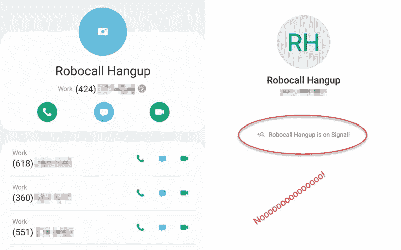

# Robocaller 出现在聊天应用中

> 原文：<https://medium.com/codex/robocaller-shows-up-in-chat-app-341fe6821afa?source=collection_archive---------23----------------------->

两个电话诈骗犯走进一家酒吧，一边喝酒一边哀叹他们收入的下降。

“人们甚至不再接电话了，”第一个电话骗子说。"我们可能不得不寻找另一个不正当的行业."

“拿着我的啤酒，”第二个骗子说。

然后发生了这件事。

作者图片

第一个截图来自我的联系人列表。每当我收到来自同一个号码的不止一个电话，留下一个空的语音邮件或只是挂断，我就把这个号码添加到这个被阻止的联系人条目中。多年来，联系人条目已经积累了几十个号码，我再也不会被它们中的任何一个打扰了。

因为这是我的业务号码，我是一名独立顾问，我过去常常接电话，以便潜在客户可以，你知道，与我交谈。那次初次接触似乎是我当时业务发展战略的重要组成部分。

但是接电话的唯一好处是你可以知道电话推销员在推销什么。我过去常常按类别屏蔽它们，比如“汽车保修自动呼叫”和“度假自动呼叫”。我有 13 个这样的联系人条目，可以屏蔽 100 多个号码。尽管我很喜欢将垃圾电话来源号码汇总成黑名单的服务，但我无法让自己用我的联系人列表、位置数据和通话数据来换取这种服务。手动屏蔽它们对我来说很有效。

最终我意识到我拒绝的工作比我接受的多，所以我试着给潜在客户设置一个“你必须留下语音邮件才能和我说话”的网关。现场不接电话并没有影响我的生意，但它确实改善了我的生活。甚至到了这种地步，多年来我第一次对电话的爱恨情仇。

除此之外，从今天开始，我想知道这种情况会持续多久。你看，今天是第一次那些手机垃圾邮件发送者跨越到另一个应用程序。有问题的消息应用程序通知了我，因为(*当然是*)它可以访问我的联系人列表，并且(*当然是*)它会将新成员的电话号码与现有成员的联系人列表进行交叉索引，然后通知所有人。

“恭喜恭喜！你的关系网正在扩大！我们发现了这一点，并让您知道，这难道不好吗？”

不，你不是。为什么？

*   因为您使用了我的联系人列表中为您的服务增值的部分(条目的存在)，但忽略了为*我*增值的部分(条目的阻止状态)。
*   因为你试图通过扩大我的网络来增加你的服务的价值，打破了一个应该增强隐私的应用程序的价值主张，在这种情况下，网络越小越好。
*   因为没有选项可以将我的号码从其他用户看到的联系人匹配或应用内联系人列表中排除。
*   因为你给了一个电话骗子逃避相当于禁止令的智能手机的手段。
*   因为如果我禁用了“联系人加入时通知”选项，我就失去了阻止联系人的机会，以免他们在消息应用程序中向我发送垃圾邮件。

但我的主要反对意见是，垃圾邮件发送者可以通过注册这个应用程序来立即丰富他们的数据。这样做可以验证他们的列表条目，用当前的联系信息更新它们，并提供用户已经设置为公开的姓名和任何其他配置文件信息。

骗子和机器人有很多方法获取你的个人信息。
注册一个增强隐私的应用不应该是其中之一。

到目前为止，没有垃圾邮件发送者实际上试图使用聊天应用程序来联系我，也不清楚这个特定的垃圾邮件发送者是否加入了应用程序内垃圾邮件呼叫，以收集联系数据，或供他们自己使用。但是，用于自动呼叫的始发号码被广泛列入黑名单，很难用作个人号码。“什么可能性更大？”测试表明这里发生了更邪恶的事情。例如，由于我从来不现场回答，我的号码的有效性可能会受到质疑，这使得它不那么有价值。但一旦被我的“隐私增强”应用程序验证，他们知道这个数字是好的，所以可能会更努力地逃避我的封锁。

虽然这很大程度上是猜测，但我可以肯定的一件事是，与我一直享受的手机恋情不同，我们与手机垃圾邮件发送者玩的打地鼠游戏还没有结束。