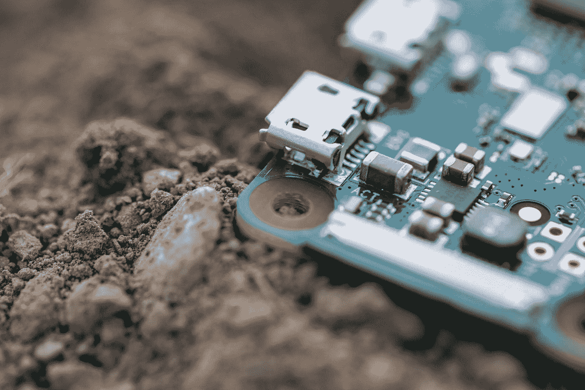

# 机器狗在一小时内学会走路

> 原文：<https://medium.com/codex/robot-dog-learns-to-walk-in-one-hour-1d2c27cd834a?source=collection_archive---------10----------------------->

## 拯救人类的算法和编程

照片由 [Raphael Wild](https://unsplash.com/@veloradio?utm_source=medium&utm_medium=referral) 在 [Unsplash](https://unsplash.com?utm_source=medium&utm_medium=referral) 上拍摄

这是 CrunchX 的第 25 版，这里是我们认为值得花时间的故事和资源。

# 1.蒂姆·霍顿斯提供免费咖啡和甜甜圈来解决数据隐私侵犯索赔

快餐连锁店 Tim Hortons 有一个非正统的计划来解决多个隐私集体诉讼:一个免费的甜甜圈和一杯咖啡。在法院批准之前，受该组织数据收集做法影响的用户除了删除其不当收集的数据之外，还将获得免费商品。由 Brandon Vigliarolo 撰写，由 [Antony Terence](https://medium.com/u/e178959c822?source=post_page-----1d2c27cd834a--------------------------------) 编辑选择。点击此处阅读文章:

[https://www.theregister.com/2022/07/30/in_brief_security/](https://www.theregister.com/2022/07/30/in_brief_security/)

# 2.微软、苹果、谷歌和亚马逊与被盗的巴西雨林黄金有关

世界上超过三分之一的黄金被用于电子产品，难怪其中一些来源可疑。PCWorld 和路透社报道称，非法开采的黄金已经从亚马逊雨林流入微软、苹果、谷歌和亚马逊生产的设备中。由迈克尔·克莱德在 PCWorld 上撰写，安东尼·特伦斯编辑选择。点击此处阅读文章:

[https://www . PC world . com/article/820211/Microsoft-apple-Google-and-Amazon-linked-to-stopped-gold . html](https://www.pcworld.com/article/820211/microsoft-apple-google-and-amazon-linked-to-stolen-gold.html)

# 3.Shell 脚本将多行注释放在 Bash/KSH 下

几乎每个人都知道如何在 shell 脚本中编写注释，尤其是 bash，如果您没有对脚本进行注释，那么您真的应该……然而，尽管大多数人只是在每行的开头使用哈希来进行多行注释，但是还有其他一些不太常见的方法——Vivek Git 的教程向您展示了一些可能让您成为工作中的话题的方法！由 Vivek Gite 撰写的关于网络城市的文章和由 Stuart Woolley 博士编辑的精选文章。点击此处阅读文章:

[https://www . cyber Citi . biz/FAQ/bash-comment-out-multi-line-code/](https://www.cyberciti.biz/faq/bash-comment-out-multiple-line-code/)

# 4.htmlq

我以前提到过非常有用的 Linux 命令行实用程序 jq——解析 javascript，切片，并使您的脚本闪闪发光。人们通常不知道它的相关实用程序 HQ——一个命令行 HTML 解析器，允许您从原始 HTML 中提取值。如果你像我一样，这些年来一直在使用正则表达式和 HTML，你会发现 hq 就像一股新鲜空气，会很快将它集成到你的工作流程中。工作人员由[的斯图尔特·伍利博士](https://medium.com/u/a435b5883828?source=post_page-----1d2c27cd834a--------------------------------)挑选。点击此处查看 GitHub 资源库:

[https://github.com/mgdm/htmlq](https://github.com/mgdm/htmlq)

# 5.企业如何在 COVID 期间和之后为数据经济做好准备

公司正在收集和处理大量数据，因此数据驱动型组织的趋势是显而易见的。此外，数据是流动的，因此公司可以快速适应全球危机，如正在进行的 COVID-疫情。因此，在接下来的几个月和几年中，数据的影响会越来越大。由 [Christianlauer](https://medium.com/u/2696f801a31a?source=post_page-----1d2c27cd834a--------------------------------) 撰写并发表在 ET CIO 和社论选集上。点击此处阅读文章:

[https://CIO . economic times . India times . com/news/big-data/how enterprises-can-prepare-for data-economy during-and-after-covid/92865652](https://cio.economictimes.indiatimes.com/news/big-data/howenterprises-can-prepare-fordata-economyduring-and-after-covid/92865652)

# 6.从更年期到焦虑:解决女性健康问题的新技术

在过去五年中,“女性科技”一词的影响越来越大，指的是解决妇女健康问题的数字产品。据预测，到 2027 年，这个油田的价值将达到 600 亿美元。因此，仅仅触及了表面，在不久的将来会创造出什么样的应用和技术是令人兴奋的。由 Helena Pozniak 在《卫报》上撰写，由 Christianlauer 编辑选择。点击此处阅读文章:

[https://www . the guardian . com/careers/2021/may/21/we ve-勉强触及表面——女性健康科技的下一步是什么](https://www.theguardian.com/careers/2021/may/21/weve-barely-scratched-the-surface-whats-next-for-womens-health-tech)

# 7.机器狗在一小时内学会走路

研究人员创造了一种狗脊髓的人工代表，并成功地对它进行了编程，因此它可以在一个小时内学会如何流利地行走。这篇文章深入探讨了这些研究人员如何使用和编程他们的算法来实现这一特定目的。由马克斯·普朗克智能系统研究所撰写，由[克里斯蒂安劳](https://medium.com/u/2696f801a31a?source=post_page-----1d2c27cd834a--------------------------------)编辑选择。点击此处阅读文章:

[https://www . science daily . com/releases/2022/07/220718122229 . htm](https://www.sciencedaily.com/releases/2022/07/220718122229.htm)

# 8.在农业中，对技术的不断追求

某些研究人员预测，机器人和人工智能将很快彻底改变农业领域。事实上，现在有几种技术可以帮助优化作物结果，如内置人工智能的机器人，可以帮助识别实际作物中的杂草，检测植物病害，或计算最理想的浇水量……由汤姆·约翰逊在 Undark 上撰写，由 [Christianlauer](https://medium.com/u/2696f801a31a?source=post_page-----1d2c27cd834a--------------------------------) 编辑选择。点击此处阅读文章:

[https://un dark . org/2022/05/04/in-farming-a-constant-drive-for-technology/](https://undark.org/2022/05/04/in-farming-a-constant-drive-for-technology/)

# 9.倡导者、教育家和作者立场

提倡什么好？你应该提倡一些让你流泪的做法吗？Martin 回顾了这个话题，并解释了如何以开放的心态进行宣传。任何开发水平的好读物。由 Martin Fowler 撰写和出版，Milo ivko VI 编辑选择。点击此处阅读文章:

【https://martinfowler.com/articles/authorial-stance.html? UTM _ source = substack&UTM _ medium = email

# 10.我从谷歌软件工程中学到的

软件工程和编程有什么区别？随着时间的推移编程是软件工程。你可以从这篇文章中读到其他的价值金块，这适用于所有规模的团队。撰写并发表在《Swizec.com》上，由[米洛舍维奇](https://medium.com/u/3ee57b082bb?source=post_page-----1d2c27cd834a--------------------------------)编辑选择。点击此处阅读文章:

[https://swi zec . com/blog/what-I-learn-from-software-engineering-at-Google/](https://swizec.com/blog/what-i-learned-from-software-engineering-at-google/)

# 结束语

这些是我们本周的精选。希望你发现了一些新的、鼓舞人心的、惊人的、知识渊博的科技新闻。非常感谢您花时间阅读本版 CrunchX。下周请留意下一期。

## 问候，

法典小组