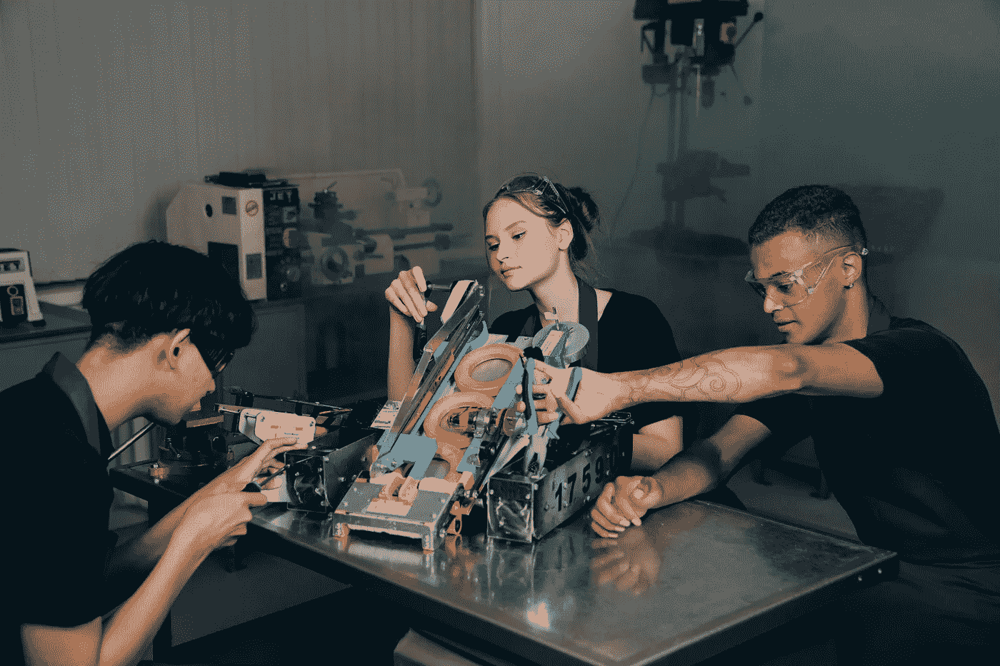

# 机器人有机体——机器人是活的

> 原文：<https://medium.com/codex/robotic-organisms-robots-are-alive-a33f49db40e1?source=collection_archive---------12----------------------->

## 可编程细胞有机体可能是机器人的未来

米哈伊尔·尼洛夫摄于[佩克斯](https://www.pexels.com/photo/people-sitting-at-the-table-9242834/?utm_content=attributionCopyText&utm_medium=referral&utm_source=pexels)

# 遗传工程

基因工程，或称基因改造，是一种对生物的 DNA 进行永久性改变的技术。因此，植物和动物可以变得更健壮，更抗病。近年来，这项技术已经…