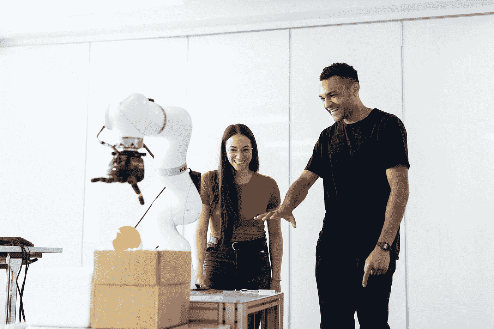
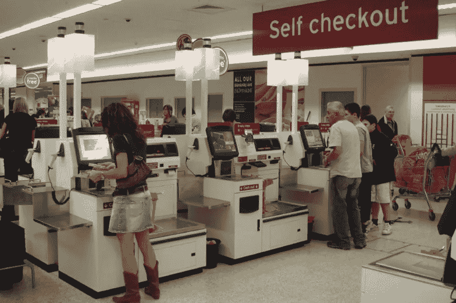
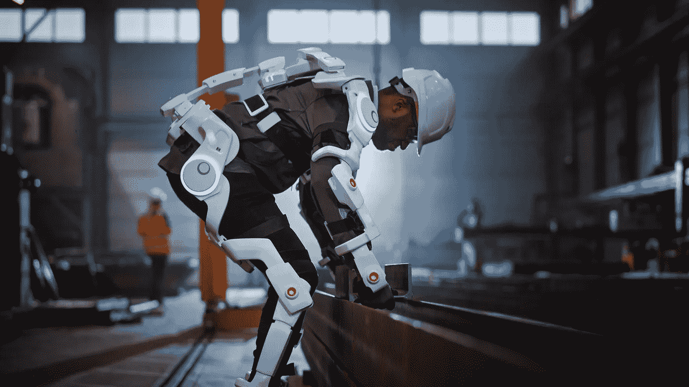
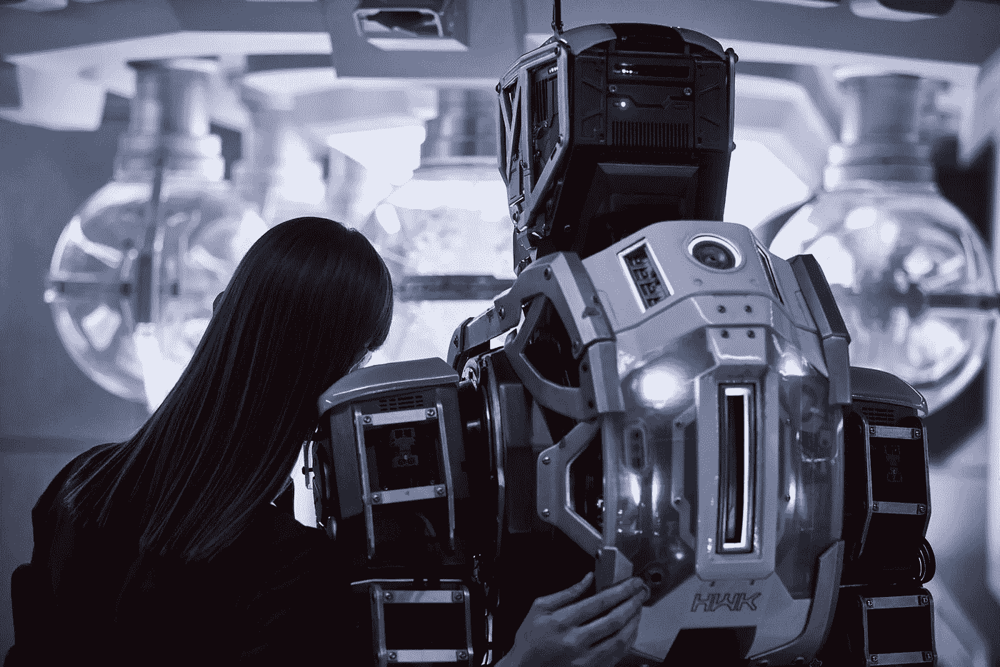

# 机器人本该取代我们的工作，但是…

> 原文：<https://medium.com/codex/robots-were-supposed-to-take-our-jobs-but-98bc5921dc76?source=collection_archive---------26----------------------->

在她的文章中，机器人应该会取代我们的工作。相反，它们让它们变得更糟”对于 Vox，艾米丽·斯图尔特给出了工人如何努力与机器人一起工作的不同例子。过度监控，减少即兴发挥和创造力:**在工作场所，我们能和机器人一起进行有意义的工作吗？**

照片由[在](https://unsplash.com/@thisisengineering?utm_source=medium&utm_medium=referral) [Unsplash](https://unsplash.com?utm_source=medium&utm_medium=referral) 上绘制

# 购物体验中的机器人

事实上，今天机器人被用来代替人类完成基本任务，对公司没有真正的附加值。以杂货店为例，或者任何其他可以找到自助服务技术的购物体验。也许公司不再需要人工支付，但是自助服务机也很贵。顾客使用(有时很难使用)机器自己扫描商品，独自付款，然后离开。不再有社交，不再有浪费时间的风险(理论上！).但仍有一名员工在这里检查顾客是否需要机器方面的帮助。在市场营销中，我们将这位客户称为为公司“工作”的“客户-员工”，因为他开发了新的技能来完全自主地与自助服务机器进行交互。对一些顾客来说，在服务化过程中以这种方式参与会更有趣或更有吸引力。但对于工人来说，回报就没那么多了:他们监控人机交互，并在需要时提供帮助。

购物的自助服务技术

# 工作场所中的机器人和工人

在这篇文章中，真正的威胁来自(过度)监控工作场所的员工，以及(在那些允许在家工作的时代)在家的员工！

> “他描述了孟加拉国的一名远程工程师，他受到一个程序的监控，该程序每 10 分钟给他拍三张照片，以确保他在自己的电脑前”

另一个例子是，一名员工学会了多次向消费者说“对不起”，以确保遇到基于人工智能的移情监视器。机器人监视人类，以确保他们的行为像…机器人！(抱歉！)

在他们的学术论文中， [Smids，Nyholm 和 Berkers (2019)](https://link.springer.com/content/pdf/10.1007/s13347-019-00377-4.pdf) 讨论了工人使用机器人进行有意义工作的威胁和机会。有意义的工作提高了工作满意度和员工福利，现在被认为是员工的一项权利。他们将有意义的工作定义为允许工人:

*   追求一个目标
*   有社会关系
*   锻炼技能，增强自我发展
*   拥有自尊和认可
*   拥有自主权

帮助建筑工人的外骨骼[(链接)](https://northsearegion.eu/exskallerate/news/report-envisions-exoskeletons-as-impactful-part-of-construction-s-future/)

机器人对公司来说有很多好处，比如节约成本、提高效率、改善结果，还能提升雇主的创新形象。在工作场所，可以区分 4 种类型的机器人:

*   **预编程机器人**在明确定义和控制的环境中(如制造)
*   **人类控制下的遥控机器人**(如无人驾驶飞机、手术机器人)
*   **自主机器人**能够“感知”它们的环境并有目的地行动(例如送货机器人)
*   **“增强”机器人**与人体连接或集成(例如外骨骼)

所以，机器人是多样化的，我们不能简单地说“它们会抢走我们的工作”。有一点是肯定的:工人需要新的技能来设计、编程、维护以及与机器人互动。

电影《我是母亲》(2019)中的“女儿”和“母亲”

# 机器人工具论 VS 关系转向:如何设计我们与机器人的未来关系？

今天，他们是不同的思想流派争论人类与机器人的互动，应该如何考虑机器人？对于机器人的**工具论**，机器人不能成为工人的“同事”，它们应该是被人拥有(购买&出售)和控制的“奴隶”(Bryson，2018)。所以，我们应该设计拟人化的机器人。

但对于另一个学派来说，机器人可以是同伴(对于老年人、残疾人……)和同事。在**关系转折**中，机器人应该不仅仅是工具。它们在某种程度上旨在互动和创造关系(Grunkel，2018)。的确，人类和机器人不需要相同的环境来互动和创造。机器人需要可预测的环境，关注数据。人类需要一个更加个性化的环境来发挥创造力和建立社会关系。也许你看过电影《我是母亲》(2019)，通过一个机器人对一个人类的教育问题，这种“母亲”(机器人)和“女儿”(人类)之间的二元性是非常呈现的。

## 来源:

Smids，j .，Nyholm，s .，和 Berkers，H. (2020 年)。工作场所的机器人:对有意义工作的威胁还是机遇？。*哲学&技术*， *33* (3)，503–522。