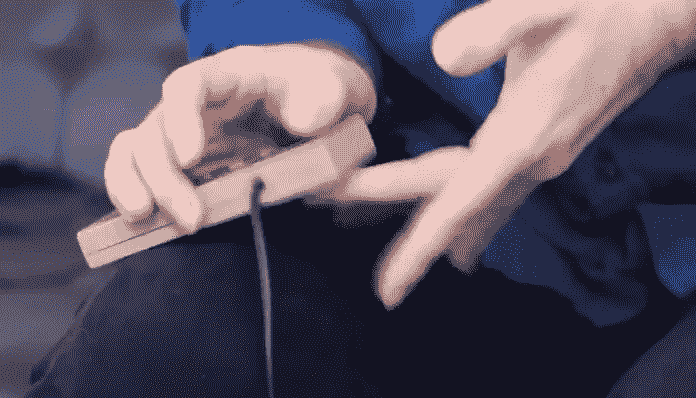

# 像 NES 俄罗斯方块滚动破纪录者一样滚动新的想法

> 原文：<https://medium.com/codex/roll-with-new-ideas-like-nes-tetris-rolling-record-breakers-e88aeae12c4b?source=collection_archive---------27----------------------->

## 有没有更好的办法？

从[滚动到](https://kotaku.com/nes-tetris-players-call-it-rolling-and-theyre-setting-1846767518)

> “任何一年，如果你没有毁掉你最喜欢的一个想法，那这一年很可能是浪费了。”—查理·芒格

我想到上面这句话来激励自己更加豁达。令人惊讶的是改变是如此的困难…