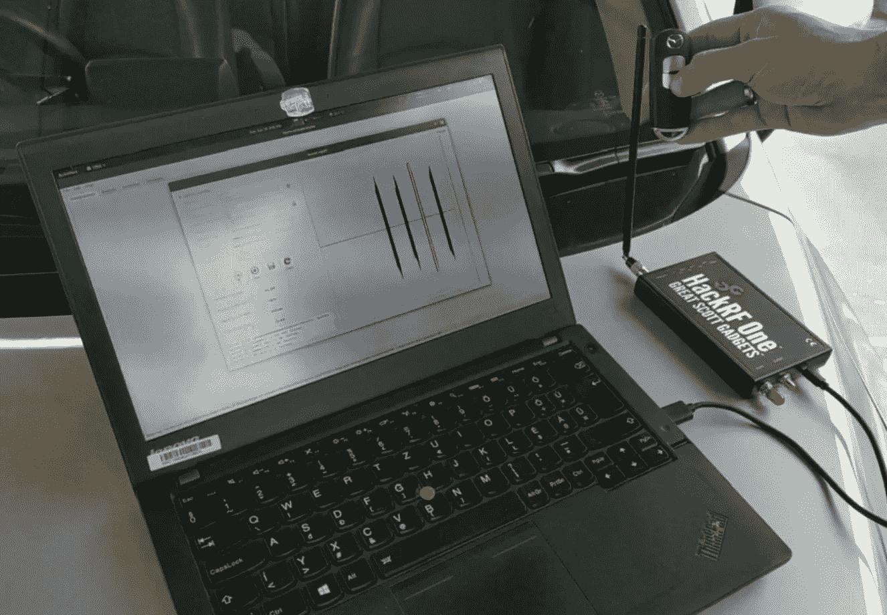

# 回滚-针对汽车遥控无钥匙进入系统的一种新的时间不可知重放攻击

> 原文：<https://medium.com/codex/rollback-a-new-time-agnostic-replay-attack-against-the-automotive-remote-keyless-entry-systems-df5f99ba9490?source=collection_archive---------1----------------------->

## 来自新加坡的网络安全研究人员在 BlackHat USA 2022 上展示了他们可以用你可能想象到的最简单的密钥卡信号重放攻击解锁你的新车

