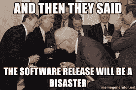
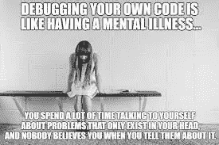
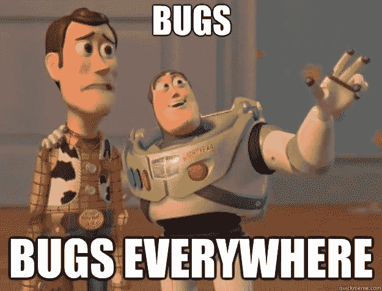
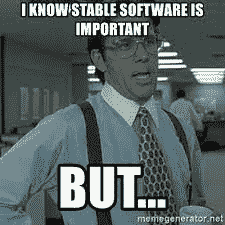
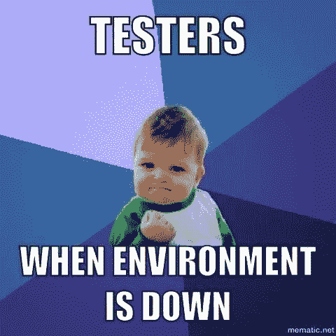

# 滚动发布 vs 稳定发布软件…选哪个？

> 原文：<https://medium.com/codex/rolling-release-vs-stable-release-software-which-one-to-choose-9859e058d65d?source=collection_archive---------3----------------------->

## 我们没有意识到这一点，但是作为一个软件用户，这在你的生活中起着巨大的作用。它可能会浪费时间却没有任何回报，或者变得高效并让你的生活变得更好。

软件必须不断让自己变得更好，不断改进，因此每次都有新的版本。有些更新只是“安全改进”或“性能改进”(拜托 Android…我想知道是什么)，有些是前端或后端的合法改进。对于软件开发人员和他们的用户来说，我们需要关注两种更新过程，这样他们/你才能做出正确的决定。

尽管有更多类型的发布周期或更新周期，出于简化本文的目的，我们将只关注两种最通用和最简单的周期。我将对其余的类型做更多的文章。

# 首先…为什么发布周期对软件开发人员/用户很重要？

因为对于你的使用和体验来说，它意味着生或死。一个喜欢稳定的人可能不想使用突破性的软件，同时，一个喜欢突破性软件的人也不想使用稳定的旧软件。这只是麻烦之一——你的个人偏见和选择。

另一个问题是可靠性。你们中的一些人可能不会觉得当软件在工作中要求更新时，只要软件提供实际有用的更新，而你们中的一些人可能根本不想要软件更新，更喜欢在较大的提交和更改中发生几次。

如果你是软件开发人员，这一点尤其重要，因为让你的软件具有突破性并暴露于错误中，或者让它非常稳定并让其功能变得不明显，这两种情况都会影响软件本身的用户体验，我认为这是你不希望的。

# 软件滚动发布

这是一个发布周期，其中软件没有具体的发布日期或发布时间表。它缓慢、温和但持续地释放，间隔很短，如每隔几周/几天。你在这里得到的好处是，这只是一个短而快速的过程，你应该每周做几次，你也可以跳过一些更新，然后考虑到更新非常小。

如果你想让软件处于前沿，每样东西都是最新最棒的形式，你想让它不时给你惊喜，这种方法对你很有效。

# 软件稳定发布

顾名思义，这不会给你一个非常“最新”的体验，但它会给你一个稳定的体验，有更少的错误，更多的修正和“改进”，而不是“一直都是新的”。这不仅意味着它不会在一段时间内用软件更新来烦你，而且还会耗尽他实际更新的时间。因为它每 6 个月或每年更新一次，所以它有稳定的、数量非常多的软件更新提交和功能。

这对于那些不想与他们使用的软件有任何关系的人来说非常有用。他们只是想让软件为他们工作，仅此而已。对于用户不了解或不太关心的服务器和其他后端软件来说，这也是一个完美的循环。

# 个人？

我是这样一种人，如果我得到了一个重要的软件更新，我知道我会有新的东西…也许是新的设计，用户界面等。我觉得我现在想在我的工作流程和软件的外观上有一个更好的改变，这样我就不会感到无聊了。所以我可能就是那个翻滚的家伙。你是什么？请在评论区告诉我。

如果你想支持我的媒体/YouTube 内容，你可以用我的 Patreon。此外，我已经决定为我的 Patreons 发布 premium Patreon only 视频，这是另一个获得一些视频内容的地方。我希望你喜欢这篇文章，我会在下一篇文章中见到你。

你好厉害:)

> 法丁吉克