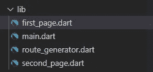

# 颤振中的路线和导航

> 原文：<https://medium.com/codex/routes-and-navigation-in-flutter-75f15eb2d7fe?source=collection_archive---------2----------------------->

路由是你的应用中最常用的东西之一，用来构建任何有意义的东西。然而，页面之间的导航混乱时会很可怕。这听起来不妙。

路由有多种选择。在这里你学习了所有人的第一选择和**干净代码**。

# 视频教程

# 让我们进入主题

这里我们有两页，**第一页**和**第二页。**我们的应用程序将按如下方式运行:

> **第一页**包含一个按钮**转到第二页。**点击按钮，app 进入**第二页。**我们还将**将数据**从**第一页**传递到**第二页。**

在执行之前，路由的**正确的方式**，我们需要有一些页面之间导航。并且设置它们，执行我们想要离开的基本导航方式是不错的。

首先，我们在 **lib** 文件夹中创建新文件。在其中，创建新文件 **first_page.dart.**

它将看起来如下:


当点击按钮时，在 ***上按下*** 方法，我们将 **MaterialPageRoutes** 直接推送到导航器。

```
 Navigator.of(context).push(
                  MaterialPageRoute(
                    builder: (context) => const SecondPage(
                        data: 'Hello there from the first page!'),
                  ),
 )
```

> 这个 **MaterialPageRoutes** 创建了很多**样板代码。随着应用程序变得越来越大，我们拥有的页面越来越多，情况变得越来越糟糕，我们可能会在所有地方定义的所有路线中迷路。**
> 
> 如果你不得不**只允许登录的用户**进入某些特定的页面，或者**用户导航时需要执行的某种其他逻辑**，这就会变成真的。

这是导航的基本方法。

# 更好的导航方式

现在，我们将尝试使用**新方法**来执行相同的任务，但方式稍好一些，即使用**命名例程。**

```
...
// Pushing a named route
Navigator.of(context).pushNamed(
  '/second',
  arguments: 'Data from first page!',
);
...
```

我们有两个选项来导航命名的路线，而不使用包。

*   第一种是最简单的——只需在 ***MaterialApp*** 小部件上指定一张路线地图，并带有路线名称的键。但是一旦我们必须在页面之间传递一些数据，并运行 come logic，这个选项就没有用了，因为我们不能在 map 的文字中传递动态的附加数据。
*   第二个选项只是指定返回路线的函数。通过这样做，我们仍然可以获得使用命名路由的好处，还可以选择将数据传递到其他页面。我们也可以给这个函数添加逻辑。

## 创建路由器

现在我们在 lib 文件夹中创建新文件 **route_generator.dart** 。

不过，**将你的代码**分成多个类和独立的函数是有好处的，所以让我们创建一个 *RouteGenerator* 类来**封装**路由逻辑。

然后，您需要在根小部件 *MaterialApp* 上指定的函数被称为***ongenerate route***。

```
 MaterialApp(
      title: 'Flutter Demo',
      theme: ThemeData(
        primarySwatch: Colors.blue,
      ),
      initialRoute: '/',
      onGenerateRoute: RouteGenerator.generateRoute,
    )
```

**SecondPage.dart**

用这个运行你的代码并测试它。通过传递带有参数的错误数据类型和不存在的命名路由进行检查。此外，通过创建一个新页面并导航到该页面来试验代码。

我们最终的文件夹结构如下:



文件夹结构

# 结论

在**中，你已经学会了如何在你的 Flutter 应用中导航，这是一种更好的适合大型应用的方式。**我们已经创建了一个 **RouteGeneration** 来**管理所有的路由逻辑，避免代码重复。创建许多具有特定目的的更小的类总是简化代码的更好方法，当用于路由时，这个原则仍然适用。**

# 让我们连接起来

我们可以成为朋友。在[脸书](https://www.facebook.com/nabin.dhakal.714/)、 [Linkedin](https://www.linkedin.com/in/nabindhakal/) 、 [Github](https://github.com/nbnD) 、 [Youtube](https://www.youtube.com/channel/UCW6oYt_3QSl7J2HSHNqwXWw) 和 [Instagram](https://www.instagram.com/nbn_d_/) 上查找。

拜访:[颤振结](https://flutterjunction.com/)

**投稿:** [BuyMeACoffee](https://www.buymeacoffee.com/nabindhakal)

**获取完整代码:**

[](https://github.com/nbnD/routing_example) [## GitHub - nbnD/routing_example

### 一个新的颤振项目。这个项目是颤振应用的起点。一些帮助您入门的资源…

github.com](https://github.com/nbnD/routing_example) 

摇摆中的路线