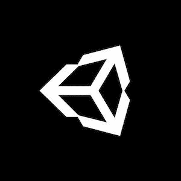

# RTS 插曲#4:改善生命条(Unity/C#)

> 原文：<https://medium.com/codex/rts-interlude-4-improving-the-healthbars-unity-c-48ee8d663e09?source=collection_archive---------2----------------------->

## 让我们暂时离题，在我们的 RTS 游戏中利用着色器的力量！

[*【⬅️】教程#49:优化技巧&窍门*](/codex/making-a-rts-game-49-optimisation-tips-tricks-unity-c-d4d70001e58c)*|*[*TOC*](https://mina-pecheux.medium.com/making-an-rts-game-in-unity-91a8a0720edc)*|*[*教程#50:实现技术树 1/3 ➡️*](https://mina-pecheux.medium.com/making-a-rts-game-50-implementing-a-technology-tree-1-3-unity-c-1c516ba78712)

*📕* [*获取 Gumroad 上的电子书和奖励资料！*](https://mpecheux.gumroad.com/l/rrylr)🚀 [*在我的 Github 上找到这个教程系列的代码！*](https://github.com/MinaPecheux/UnityTutorials-RTS)

